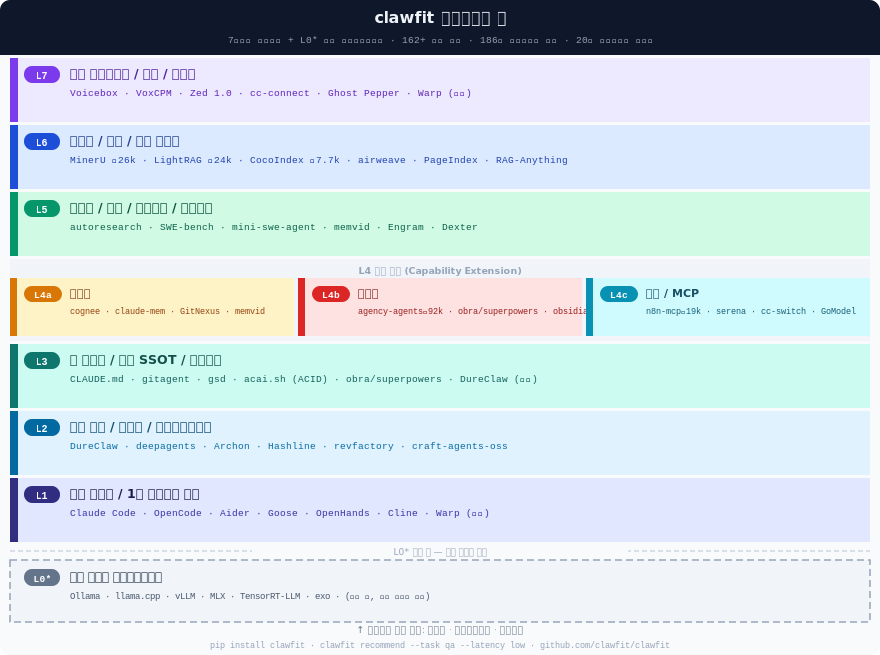

# clawfit

> AI 에이전트 + LLM + 하드웨어 추천 엔진 — **162+ 도구**, **7레이어 생태계 맵**, **192개 리서치워치 문서**, **10차원 스코어링**

[](LICENSE)
[](pyproject.toml)
[](tests/)
[](https://github.com/hongsw/clawfit)

**다른 언어로 읽기:** [English 🇺🇸](README.md)

---

## clawfit이 뭔가요?

`clawfit`은 하나의 실용적인 질문에 답합니다:

**주어진 태스크, 레이턴시 목표, 예산, 네트워크 환경, 팀 성숙도에서 어떤 에이전트 + 모델 + 하드웨어 조합이 가장 적합한가?**

세 가지를 하나로 통합합니다:

1. **추천 엔진** — (에이전트, LLM, 하드웨어) 조합을 6개 가중 차원으로 스코어링. 하드 필터가 불일치를 제거하고, 소프트 멀티플라이어가 세부 조정.

2. **에코시스템 맵** — 7레이어 분류체계, 162+ 도구를 별 개수와 함께 추적. GitHub Trending / GeekNews / HN을 매일 자동 스캔, 186개 리서치워치 문서.

3. **조직 적합도 진단** — 10문항 인터랙티브 설문으로 조직의 제약 벡터를 구축, 우선순위화된 멀티 레이어 도구 스택 반환.

---

## 🗺 에코시스템 맵 — 7레이어 + 기반 서브스트레이트



> **맵 vs 레지스트리**: 맵은 162+ 도구를 인식 목적으로 추적. **추천 레지스트리** (20개: 4 에이전트 × 11 LLM × 5 하드웨어)는 `clawfit recommend`가 스코어링하는 검증된 엔트리.

---

## ⚙️ 추천 엔진 축 구조

```
                    ┌──────────────────────────────────────────────────┐
   태스크 ────────▶ │              하드 필터                            │ ◀── 네트워크 (온라인/오프라인)
   code-gen/qa/...  │  태스크 일치 · 레이턴시 · 예산 · 네트워크        │     하드웨어 (클라우드/엣지/로컬)
                    │  상태유지성 · 하드웨어 타입                       │
   레이턴시 ──────▶ │──────────────────────────────────────────────────│
   low/mid/high     │              스코어링                             │ ◀── 예산 ($/1k 토큰)
                    │  레이턴시 일치   ×0.50                            │
   성숙도 ────────▶ │  비용 일치       ×0.25  (성숙도 시 ÷×0.80)       │
   1~11단계         │  LLM 선호도      ×0.15                            │
                    │  성숙도 적합도   ×0.15  (기준값 대체)             │
                    └────────────────────┬─────────────────────────────┘
                                         │
                                  fit_score 0–1.0
                                  (에이전트, LLM, 하드웨어) 조합
```

---

## 📊 숫자로 보는 clawfit

| 지표 | 수치 |
|------|------|
| 에코시스템 맵 추적 도구 (7레이어) | **162+** |
| 리서치워치 신호 문서 | **186개** |
| 추천 레지스트리 LLM | **11개** |
| 추천 레지스트리 에이전트 패턴 | **4개** |
| 추천 레지스트리 하드웨어 프로필 | **5개** |
| 자동화 테스트 | **29개** |
| 분류 레이어 (L0–L7) | **8개** |
| 스코어링 차원 수 | **6개** (레이턴시×3 + 비용 + 선호도 + 성숙도) |
| 추적된 스캔 날짜 | **24일** (2026-03-31 → 오늘) |

---

### 누구를 위한 것인가?

| 당신이 ... | clawfit이 주는 것 |
|------------|-----------------|
| 에이전트 스택을 고르는 개발자 | 태스크 + 제약에 맞는 스코어링된 (에이전트, LLM, 하드웨어) 조합 |
| 로컬 vs 클라우드를 결정하는 DevOps | 네트워크 / 하드웨어 / 비용 하드 필터 — 추측 불필요 |
| AI 도구 전략을 평가하는 CTO | 162+ 도구 7레이어 생태계 맵, 매일 업데이트 |
| 에이전트 생태계를 매핑하는 연구자 | 186개 증거 문서 + 별 개수 포함 분류체계 |
| 현재 동향을 파악하려는 누구든 | 매일 스캔: GitHub Trending + GeekNews + HN, 자동 커밋 |

> [!IMPORTANT]
> **에코시스템 맵 — 여기서 시작하세요**
>
> `clawfit`이 실제로 무엇을 매핑·비교·추적하는지 이해하려면:
>
> ## **[에코시스템 맵 바로가기: `docs/reference-levels.md`](https://github.com/hongsw/clawfit/blob/main/docs/reference-levels.md)**
>
> 현재 AI 도구 생태계의 전체 구도를 가장 빠르게 파악할 수 있습니다:
> - 기본 에이전트 런타임 (Claude Code, OpenClaw, Goose, Aider, pi-mono, ATLAS...)
> - 하네스 / 래퍼 레이어 (oh-my-*, DureClaw, SuperClaude, Archon...)
> - 리서치 루프 시스템 (autoresearch, mdarena, cq...)
> - MCP / 메모리 / 툴 에코시스템 (claude-mem, korean-law-mcp, rtk...)
> - 스킬팩 & 페르소나 레이어 (career-ops, caveman, Polysona...)
> - 휴먼 인터페이스 / 생성형 UI (pi-generative-ui, Ghost Pepper...)

---

## 🔥 지금 가장 뜨거운 것들 (2026-05-05)

| 신호 | 왜 중요한가 | 레벨 |
|------|------------|------|
| **[agency-agents](https://github.com/msitarzewski/agency-agents) ⭐92.4k** | 144+ 전문 Claude 에이전트 페르소나 (Engineering, Design, Sales, Marketing…) Shell 스크립트. Claude Code, Cursor, Aider, Windsurf 모두 지원. MIT. L4b 맵 추가. | L4b |
| **[Kimi K2.6](https://moonshotai.github.io/Kimi-K2/) 🆕** | Moonshot AI 1T/32B MoE, SWE-Bench Verified 80.2%, 300 에이전트 스웜 / 4,000 스텝, Modified MIT, $0.95/M. llms.json 추가 (11개 LLM). | LLM |
| **[MemPalace](https://github.com/MemPalace/mempalace) ⭐51k** | 공간 은유 기반 메모리 시스템 + 29개 MCP 도구. ⚠️ "최고 벤치마크" 주장 논란 — 96.6%는 ChromaDB 기준선 점수 (MemPalace 자체 로직 아님, issue #875). | L4a |
| **[TradingAgents](https://github.com/TauricResearch/TradingAgents) ⭐67k** | 오늘 +2,181★. 도메인 특화 멀티 에이전트 프레임워크 중 최다 별. 금융 애널리스트→리스크→실행 역할 계층. | L1 |
| **[ruflo](https://github.com/ruvnet/ruflo) ⭐41k** | Claude Code용 멀티 에이전트 스웜 오케스트레이션. +2,594★/일 피크. 100+ 에이전트, SONA 학습, mTLS 페더레이션. | L2 |
| **[cc-switch](https://github.com/hongsw/cc-switch) ⭐52.8k** | 크로스 CLI 프로바이더 전환기: Claude Code, Codex, Gemini, OpenCode를 하나의 SSOT로 통합. | L3/L4c |
| **[n8n-mcp](https://github.com/czlonkowski/n8n-mcp) ⭐19.8k** | 1,650+ n8n 워크플로우 노드를 Claude 도구 사용으로 브리지하는 MCP 서버. | L4c |
| **[cocoindex](https://github.com/cocoindex-io/cocoindex) ⭐7.9k** | 장기 에이전트용 증분 데이터 파이프라인 엔진. Rust 코어, 델타 전용 재처리 (10× 비용 절감). | L6a |
| **[local-deep-research](https://github.com/LearningCircuit/local-deep-research) ⭐4.8k** | 셀프호스팅 멀티-LLM 자동 리서치 웹앱, LangGraph 에이전틱 모드 + 20개+ 검색 엔진. +171★/일 — 5k 임박. | L5 |
| **[DeepSeek V4-Pro](https://huggingface.co/deepseek-ai/DeepSeek-V4-Pro)** | SWE-Bench 80.6, MIT, $0.44/M, 1M ctx — 오픈웨이트 최고 코딩 모델. V4-Flash는 M5 MacBook 오프라인 가동. | LLM |

전체 분석: [`docs/research-watch/`](docs/research-watch/) (192개 문서) · 전체 맵: [`docs/reference-levels.md`](docs/reference-levels.md)

---

## 🧑‍💼 한국 AI 전문가 팀 리뷰 (2026-05-05)

7레이어 + L6a/L6b 분리를 포함한 에코시스템 맵을 4인 한국 AI 전문가 페르소나가 독립 검토했습니다.

| 검토자 | 역할 | 핵심 평가 | 주요 제안 |
|--------|------|----------|----------|
| **강민준** | 대기업 CTO | "L6a/L6b 분리는 엔터프라이즈 구매 판단에 직결된다. RAG 인프라 vs 에이전틱 KB는 벤더 선택이 다르다." | `governance_need: strict` 컴플라이언스 승수 필터 추가 |
| **이지수** | KAIST AI 연구자 | "쓰기 주체 / 읽기 주체로 L4a·L6b를 구분하는 조작적 정의가 반드시 필요하다. 지금 분류는 직관적이지만 경계 사례를 처리 못 한다." | 조작적 정의 문서화 — **완료**: `docs/reference-levels.md`에 반영 |
| **박성현** | MLOps 엔지니어 | "하드웨어 프로필에 VRAM이 없으면 L0* 기반 오프라인 추천이 절반짜리다. fp16 TFLOPS도 모델 선택에 필수." | `hardware.json`에 `vram_gb`, `fp16_tflops`, `cost_per_million_tokens_est` 필드 추가 |
| **최수현** | AI 전문 VC | "스타 개수보다 일별 증가 속도가 시그널이다. ruflo +2,594★/일, TradingAgents +2,181★/일 — 이게 투자 판단 근거." | 뜨거운 것 테이블에 `+★/일` 속도 컬럼 추가 |

> 이지수 연구자의 조작적 정의는 이미 [`docs/reference-levels.md`](docs/reference-levels.md) L6b 섹션에 반영되었습니다. 나머지 제안(거버넌스 필터, 하드웨어 필드, 속도 컬럼)은 다음 마일스톤에서 처리 예정입니다.

---

## 변경 이력

| 날짜 | 변경 내용 |
|------|----------|
| 2026-05-05 | 데일리 스캔 11개 문서: agency-agents ⭐92.4k L4b, Kimi K2.6 → llms.json, MemPalace ⭐51k L4a(벤치마크 논란), local-deep-research ⭐4.8k L5, cloudflare/vibesdk L2, flue L2 샌드박스, manifest L4c 라우팅. L6a/L6b 공식 분리(v0.4). 찰떡AI L6b 추가. 한국 전문가 리뷰 섹션 추가. 29/29 테스트. |
| 2026-05-04 | 데일리 스캔: ruflo ⭐38.8k L2, TradingAgents ⭐65k, ouroboros Agent OS, cocoindex L6, n8n-mcp L4c (1,650+ 노드). n8n-mcp + CocoIndex → reference-levels.md. 5개 research-watch. |
| 2026-05-03 | 데일리 스캔: DeepSeek V4-Pro (SWE-Bench 80.6, $0.44/M), xAI Grok 4.3 (83% 저렴), MS Agent Framework v1.0 (AutoGen+SK 통합), acai.sh ACID 스펙 주도 개발, TradingAgents 57.7k★. 스코어링 성숙도 가중치 버그 수정. 9개 docs. |
| 2026-04-30 | 데일리 스캔: Warp 오픈소스 +11,955★/일 기록, Zed 1.0 안정화, Mistral Medium 3.5 → llms.json, NVIDIA OpenShell L1, memvid L4a 이식형 바이너리, cc-connect L7 3번째 데이터포인트, hongsw/harness L2. research-watch 7개 추가. |
| 2026-04-28 | GitHub 스타 전체 최신화. 분류 목록·테이블 스타순 정렬. 04-21~04-28 데일리 스캔: cc-switch 52.8k★, cmux 15.6k★, GitNexus 31.5k★, dirac TB2 리더, Engram+wuphf L4a, DureClaw L3 SSOT 확인. research-watch 12개 추가. |
| 2026-04-20 | Thunderbolt Mozilla AI 클라이언트 L7, OpenMythos 루프 트랜스포머 신호, Qwen3.6-35B-A3B 오픈웨이트 에이전틱 코딩. |
| 2026-04-12 | DureClaw 하이라이트 추가. 신규 도구 8개 (50→58). 태스크 분류 확장: +orchestration, +education, +legal-research. exec 역할 스코어링 수정. |
| 2026-04-12 | 데일리 스캔: Strix 보안 에이전트, GBrain 개인 지식 베이스 |
| 2026-04-11 | 데일리 스캔: superpowers 145k★, Archon 하네스 빌더, rowboat 메모리 네이티브, Twill.ai 클라우드 위임 |
| 2026-04-08 | Claude Mythos Preview 모델, GLM-5.1 장기 태스크, NVIDIA PersonaPlex, Addy Osmani agent-skills |
| 2026-04-07 | hongsw stars 8개 리포 추가: career-ops, claude-peers-mcp, polysona, pi-generative-ui, dureclaw. 한국어 재작성. 전체 수치 검증. |
| 2026-04-06 | reference-levels.md v0.3: L4 → 4a/4b/4c 세분화. research-watch 19개. 하네스팀 (`.claude/agents/`). |
| 2026-03-31 | 에코시스템 맵 v0.2: 7레이어 분류체계, research-watch 스캔 시작 |

---

## 빠른 시작

### 설치

**방법 A — pipx (권장: 가상환경 없이 전역 설치)**

```bash
pipx install git+https://github.com/hongsw/clawfit
```

> pipx가 없으면: `brew install pipx` 또는 `pip install pipx`

**방법 B — 개발용 editable 설치**

```bash
git clone https://github.com/hongsw/clawfit.git
cd clawfit
python3 -m venv .venv && source .venv/bin/activate
pip install -e .
```

---

### 조직 적합도 진단 — 우리 팀에 맞는 도구 스택 찾기

10개 질문에 답하면 팀에 최적화된 멀티 레이어 도구 조합을 추천합니다.

**TUI** (권장 — 화살표로 탐색, 오른쪽 패널에 결과 실시간 업데이트):

```bash
clawfit tui
```

```
 ████████████░░░░░░  5/10  [USECASE]
 ──────────────────────────┬──────────────────────────────
 AI로 주로 무엇을 하고     │ 4단계 — 도구 활용 에이전트
 싶으신가요?               │
                           │ [PRIMARY] L1 Base runtime
  ○ 코드 작성/리뷰         │    45% Claude Code
  ● 정보 조사 및 요약      │    39% Aider
  ○ 문서 Q&A               │    38% Goose
  ○ 데이터 분류            │
  ○ 데이터 분석            │ [PRIMARY] L4c Tool-use infra
  ○ 콘텐츠 요약            │    41% Serena
                           │    35% Context7
 ─ answered ─              │
  팀 규모: 소규모 팀       │ NEXT STEP
  역할: 개발자             │ meta-wrapper(L2) 도입을
                           │ 고려해보세요...
 ──────────────────────────┴──────────────────────────────
  ↑/↓ 이동   Space/Enter 선택+다음   ← 뒤로   → 앞으로   q 종료
```

| 키 | 동작 |
|----|------|
| `↑` / `↓` | 옵션 이동 |
| `Space` / `Enter` | 선택 + 다음 질문으로 자동 이동 |
| `←` / `h` | 이전 질문으로 |
| `→` / `l` | 다음 질문으로 (이미 답변한 경우) |
| `1` ~ `9` | 해당 번호 질문으로 바로 이동 |
| `q` / `ESC` | 종료 (터미널에 최종 결과 출력) |

**CLI (답변을 JSON으로 미리 입력):**

```bash
clawfit diagnose --answers '{
  "team_size": "small",
  "primary_role": "developer",
  "current_ai_usage": "coding_agent",
  "primary_task": "code-gen",
  "output_destination": "team",
  "frequency": "daily",
  "data_sensitivity": "internal",
  "monthly_budget": "medium",
  "governance_need": "soft",
  "growth_horizon": "deepen"
}'
```

답변 옵션값 참고:

| 질문 ID | 선택 가능한 값 |
|---------|--------------|
| `team_size` | `solo` / `small` / `mid` / `large` |
| `primary_role` | `developer` / `researcher` / `pm` / `exec` / `mixed` |
| `current_ai_usage` | `none` / `chat` / `coding_assistant` / `coding_agent` / `multi_agent` / `building` |
| `primary_task` | `code-gen` / `research` / `qa` / `classification` / `data-analysis` / `summarization` / `orchestration` / `education` / `legal-research` |
| `output_destination` | `personal` / `team` / `internal_product` / `external` |
| `frequency` | `occasional` / `daily` / `continuous` |
| `data_sensitivity` | `public` / `internal` / `confidential` / `regulated` |
| `monthly_budget` | `free` / `low` / `medium` / `high` |
| `governance_need` | `none` / `soft` / `hard` |
| `growth_horizon` | `stable` / `expand` / `deepen` |

**웹 UI** (브라우저에서 실시간 필터링):

```bash
clawfit serve          # http://localhost:7771 자동 오픈
clawfit serve --port 8080
```

---

### 제약 조건을 이미 알고 있다면 — 직접 추천

```bash
clawfit recommend --task qa --latency low --budget 0.01
```

```bash
clawfit recommend \
  --task code-gen \
  --latency medium \
  --budget 0.01 \
  --hardware cloud \
  --network online \
  --statefulness session \
  --maturity 5 \
  --top 5
```

> `--maturity 5` = 서브에이전트 운영 단계. 전체 11단계 정의는 [성숙도 × 레이어 맵](docs/pages/maturity-layer-map.md) 참고.

**실행 예시 출력:**

```
순위 1  fit_score: 0.900
  agent:    react-agent
  llm:      gpt-4o         (openai, $0.003/1k, latency: medium)
  hardware: cloud-serverless
  arch:     cloud-api
  why:
    - ReAct Agent는 medium 레이턴시로 'code-gen'을 지원
    - GPT-4o는 태스크 및 비용 프로파일에 적합
    - GPT-4o는 ReAct Agent의 선호 LLM

순위 2  fit_score: 0.900
  agent:    react-agent
  llm:      claude-sonnet  (anthropic, $0.003/1k, latency: medium)
  hardware: cloud-serverless
  arch:     cloud-api

순위 3  fit_score: 0.850
  agent:    react-agent
  llm:      kimi-k2-6      (moonshot, $0.00095/1k, latency: medium)
  hardware: aws-cpu-medium
  arch:     cloud-api
```

### 레지스트리 확인

```bash
clawfit list agents
clawfit list llms
clawfit list hardware
clawfit profile
```

---

## 스코어링 모델

10차원 가중 스코어링 + 하드 멀티플라이어:

| 차원 | 가중치 | 측정 대상 |
|------|--------|----------|
| task_fit | 0.22 | 도구의 태스크 목록이 사용자의 주요 태스크와 일치하는가? |
| maturity_fit | 0.18 | 사용자의 AI 성숙도 단계(1-11)에 적합한 도구인가? |
| role_fit | 0.15 | 사용자의 역할(개발자/경영진/연구자/DevOps)에 맞는 도구인가? |
| layer_relevance | 0.12 | 도구의 에코시스템 레이어(L1-L7)가 프로파일의 레이어 가중치와 일치하는가? |
| team_size_fit | 0.09 | 사용자의 팀 규모(solo/small/mid/large)에 설계된 도구인가? |
| network_fit | 0.08 | 필요한 네트워크 환경(online/offline/hybrid)에서 작동하는가? |
| latency_fit | 0.06 | 요구되는 레이턴시 티어를 충족하는가? |
| feature_fit | 0.05 | 필요한 기능(거버넌스, 팀 공유, 오프라인)을 지원하는가? |
| complexity_fit | 0.04 | 설치 복잡도가 팀 성숙도에 적합한가? |
| budget_fit | 0.01 | 가격 티어가 예산과 맞는가? |

**하드 멀티플라이어** (가중합 이후 적용):
- 오프라인 필요 + 온라인 전용 도구 → **x0.25**
- 역할 불일치 (역할 겹침 없음) → **x0.75**

---

## 지원 태스크 카테고리

| 태스크 | 설명 |
|--------|------|
| `code-gen` | 코드 생성, 리뷰, 리팩토링 |
| `research` | 정보 수집, 문헌 조사, 심층 분석 |
| `qa` | 질의응답, 문서 Q&A |
| `summarization` | 대규모 콘텐츠 요약 |
| `data-analysis` | 데이터 처리, 시각화, 통계 분석 |
| `orchestration` | 멀티 에이전트 조율, 크로스 머신 태스크 분배 |
| `education` | 개인화 학습, 튜터링, 퀴즈 생성 |
| `legal-research` | 법률 문서 검색, 판례 분석, 규정 준수 |

---

## 작동 방식

파이프라인은 의도적으로 단순하고 검사 가능합니다:

1. **레지스트리 로딩** — 20개 추천 엔트리 (4 에이전트 × 11 LLM × 5 하드웨어) + 162+ 생태계 맵 로드
2. **프로파일 구축** — 10개 설문 답변 → OrgProfile 변환
3. **스코어링** — 10차원 + 하드 멀티플라이어로 각 도구 평가
4. **레이어 그루핑** — 에코시스템 레이어(L1-L7)별 그룹화, 성숙도 단계별 우선순위
5. **추천 출력** — 근거가 포함된 우선순위화 멀티 레이어 스택 반환

---

## 리포지터리 구조

```text
clawfit/
├─ .claude/agents/          ← 하네스팀 서브에이전트 (5개)
├─ clawfit/
│  ├─ cli.py                ← argparse CLI (recommend, list, tui, serve, diagnose)
│  ├─ org_scorer.py         ← 10차원 스코어링 엔진
│  ├─ tui.py                ← curses TUI (분할 화면 실시간 프리뷰)
│  ├─ server.py             ← stdlib HTTP 서버 (localhost:7771)
│  ├─ diagnose.py           ← 인터랙티브 CLI 설문
│  ├─ filters.py            ← 하드 제약 필터링
│  ├─ scoring.py            ← 카테시안 프로덕트 스코어링 (에이전트 × LLM × 하드웨어)
│  ├─ recommend.py          ← 공개 API: recommend() → list[dict]
│  ├─ schemas.py            ← 데이터클래스: Agent, LLM, Hardware, Recommendation
│  ├─ loader.py             ← registry/*.json 로더
│  ├─ data/
│  │  ├─ tools_registry.json  ← 에코시스템 도구 (org_fit 10필드)
│  │  └─ org_questions.json   ← 10문항 설문, 3 페이즈
│  └─ registry/             ← agents.json, llms.json, hardware.json
├─ docs/
│  ├─ reference-levels.md   ← 에코시스템 맵 v0.3 (7레이어 분류체계)
│  ├─ research-watch/       ← 150개+ 신호 분석 문서 (데일리 자동 스캔)
│  └─ pages/                ← ecosystem-overview, ecosystem-axes, maturity-layer-map
├─ data/
│  └─ tools_registry.json   ← clawfit/data/ 미러
├─ tests/
│  ├─ test_filters.py
│  └─ test_recommend.py
└─ pyproject.toml
```

---

## 에코시스템 리서치 레이어

clawfit은 더 넓은 AI 도구 생태계를 추적합니다:
- [`docs/reference-levels.md`](docs/reference-levels.md) — 정식 7레이어 에코시스템 맵
- [`docs/pages/ecosystem-axes.md`](docs/pages/ecosystem-axes.md) — 분류 로직, 경계 규칙, 예제
- [`docs/research-watch/`](docs/research-watch/) — 186개 도구/트렌드 분석 (매일 자동 스캔)
- [`docs/pages/maturity-layer-map.md`](docs/pages/maturity-layer-map.md) — 성숙도 단계(1-11) × 도구 레이어(L1-L7) 매핑

### 7레이어 구조 (주요 항목 별 개수 기준 정렬)

| 레벨 | 이름 | 주요 도구 (★ = GitHub 별 개수) |
|------|------|-------------------------------|
| L0* | 추론 서브스트레이트 (동반 축) | Ollama · vLLM · llama.cpp · MLX · TensorRT-LLM · exo |
| L1 | 기본 런타임 | Claude Code · Aider · Goose · OpenHands · Cline · TradingAgents ★67k |
| L2 | 메타 래퍼 / 오케스트레이션 | ruflo ★40k · DureClaw · MS Agent Framework ★10k · Archon |
| L3 | 팀 하네스 / 실행 SSOT | CLAUDE.md · acai.sh · gitagent · gsd |
| L4a | 메모리 / 영구 컨텍스트 | GitNexus ★31k · cognee · claude-mem · memvid ★15k |
| L4b | 스킬팩 & 매니저 | superpowers ★145k · agency-agents ★92k · obsidian-skills |
| L4c | 도구 사용 / MCP | cc-switch ★52k · n8n-mcp ★19k · serena ★23k · GoModel |
| L5 | 리서치 / 평가 / 벤치마크 | autoresearch · SWE-bench · Engram · memvid |
| L6 | 데이터 / 지식 인프라 | CocoIndex ★7.9k · MinerU · LightRAG · PageIndex · airweave |
| L7 | 휴먼 인터페이스 | Voicebox · Ghost Pepper · Zed 1.0 · cc-connect |

---

## Python API

```python
from clawfit.recommend import recommend

results = recommend(
    task="research",
    latency="high",
    network="online",
    top_n=3,
)

print(results[0])
```

---

## 테스트 실행

```bash
python -m pytest tests/ -v
```

---

## 기여하기

특히 다음 영역의 기여를 환영합니다:
- 레지스트리 확장 (완전한 org_fit 메타데이터가 포함된 신규 도구)
- 스코어링 로직 개선
- 벤치마크 참조 및 증거
- research-watch 신호 분석

이슈 또는 PR을 열어주세요: 무엇을 추가하는지, 어떤 증거가 뒷받침하는지, 비교 모델에 어떻게 맞는지를 포함해주세요.

---

## 라이선스

MIT
