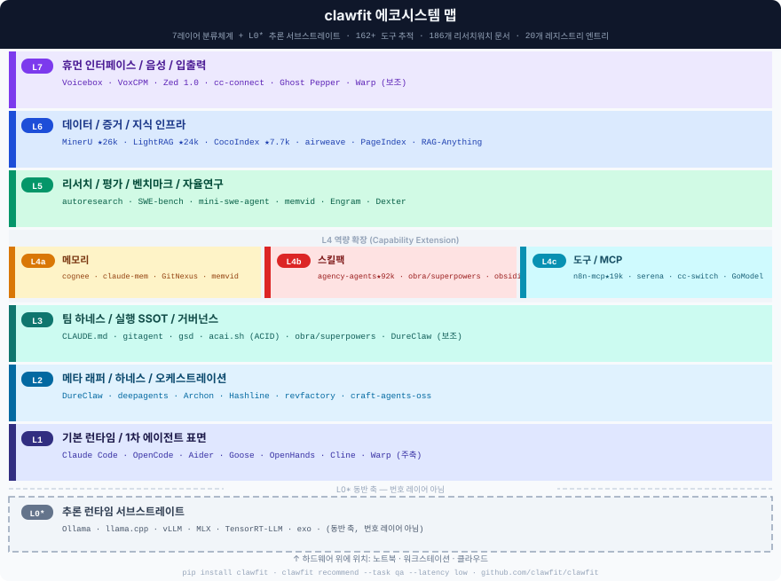

# clawfit

> AI 에이전트 + LLM + 하드웨어 추천 엔진 — **162+ 도구**, **7레이어 생태계 맵**, **503개 리서치워치 문서**, **10차원 스코어링**

[](LICENSE)
[](pyproject.toml)
[](tests/)
[](https://github.com/hongsw/clawfit)

**다른 언어로 읽기:** [English 🇺🇸](README.md)

---

## clawfit이 뭔가요?

`clawfit`은 하나의 실용적인 질문에 답합니다:

**주어진 태스크, 레이턴시 목표, 예산, 네트워크 환경, 팀 성숙도에서 어떤 에이전트 + 모델 + 하드웨어 조합이 가장 적합한가?**

세 가지를 하나로 통합합니다:

1. **추천 엔진** — (에이전트, LLM, 하드웨어) 조합을 6개 가중 차원으로 스코어링. 하드 필터가 불일치를 제거하고, 소프트 멀티플라이어가 세부 조정.

2. **에코시스템 맵** — 7레이어 분류체계, 162+ 도구를 별 개수와 함께 추적. GitHub Trending / GeekNews / HN을 매일 자동 스캔, 186개 리서치워치 문서.

3. **조직 적합도 진단** — 10문항 인터랙티브 설문으로 조직의 제약 벡터를 구축, 우선순위화된 멀티 레이어 도구 스택 반환.

---

## 🗺 에코시스템 맵 — 7레이어 + 기반 서브스트레이트



> **맵 vs 레지스트리**: 맵은 162+ 도구를 인식 목적으로 추적. **추천 레지스트리** (20개: 4 에이전트 × 11 LLM × 5 하드웨어)는 `clawfit recommend`가 스코어링하는 검증된 엔트리.

---

## ⚙️ 추천 엔진 축 구조

```
                    ┌──────────────────────────────────────────────────┐
   태스크 ────────▶ │              하드 필터                            │ ◀── 네트워크 (온라인/오프라인)
   code-gen/qa/...  │  태스크 일치 · 레이턴시 · 예산 · 네트워크        │     하드웨어 (클라우드/엣지/로컬)
                    │  상태유지성 · 하드웨어 타입                       │
   레이턴시 ──────▶ │──────────────────────────────────────────────────│
   low/mid/high     │              스코어링                             │ ◀── 예산 ($/1k 토큰)
                    │  레이턴시 일치   ×0.50                            │
   성숙도 ────────▶ │  비용 일치       ×0.25  (성숙도 시 ÷×0.80)       │
   1~11단계         │  LLM 선호도      ×0.15                            │
                    │  성숙도 적합도   ×0.15  (기준값 대체)             │
                    └────────────────────┬─────────────────────────────┘
                                         │
                                  fit_score 0–1.0
                                  (에이전트, LLM, 하드웨어) 조합
```

---

## 📊 숫자로 보는 clawfit

| 지표 | 수치 |
|------|------|
| 에코시스템 맵 추적 도구 (7레이어) | **162+** |
| 리서치워치 신호 문서 | **186개** |
| 추천 레지스트리 LLM | **11개** |
| 추천 레지스트리 에이전트 패턴 | **4개** |
| 추천 레지스트리 하드웨어 프로필 | **5개** |
| 자동화 테스트 | **29개** |
| 분류 레이어 (L0–L7) | **8개** |
| 스코어링 차원 수 | **6개** (레이턴시×3 + 비용 + 선호도 + 성숙도) |
| 추적된 스캔 날짜 | **25일** (2026-03-31 → 오늘) |

---

### 누구를 위한 것인가?

| 당신이 ... | clawfit이 주는 것 |
|------------|-----------------|
| 에이전트 스택을 고르는 개발자 | 태스크 + 제약에 맞는 스코어링된 (에이전트, LLM, 하드웨어) 조합 |
| 로컬 vs 클라우드를 결정하는 DevOps | 네트워크 / 하드웨어 / 비용 하드 필터 — 추측 불필요 |
| AI 도구 전략을 평가하는 CTO | 162+ 도구 7레이어 생태계 맵, 매일 업데이트 |
| 에이전트 생태계를 매핑하는 연구자 | 186개 증거 문서 + 별 개수 포함 분류체계 |
| 현재 동향을 파악하려는 누구든 | 매일 스캔: GitHub Trending + GeekNews + HN, 자동 커밋 |

> [!IMPORTANT]
> **에코시스템 맵 — 여기서 시작하세요**
>
> `clawfit`이 실제로 무엇을 매핑·비교·추적하는지 이해하려면:
>
> ## **[에코시스템 맵 바로가기: `docs/reference-levels.md`](https://github.com/hongsw/clawfit/blob/main/docs/reference-levels.md)**
>
> 현재 AI 도구 생태계의 전체 구도를 가장 빠르게 파악할 수 있습니다:
> - 기본 에이전트 런타임 (Claude Code, OpenClaw, Goose, Aider, pi-mono, ATLAS...)
> - 하네스 / 래퍼 레이어 (oh-my-*, DureClaw, SuperClaude, Archon...)
> - 리서치 루프 시스템 (autoresearch, mdarena, cq...)
> - MCP / 메모리 / 툴 에코시스템 (claude-mem, korean-law-mcp, rtk...)
> - 스킬팩 & 페르소나 레이어 (career-ops, caveman, Polysona...)
> - 휴먼 인터페이스 / 생성형 UI (pi-generative-ui, Ghost Pepper...)

---

## 🔥 지금 가장 뜨거운 것들 (2026-07-28)

| 신호 | 왜 중요한가 | 레벨 |
|------|------------|------|
| **Bun Zig→Rust — 64개 Claude Code 인스턴스 동시 실행** | 535,496줄을 11일, $165k로 마이그레이션. 64개 병렬 에이전트, ~50개 동적 워크플로. 100% CI 통과 후 병합. 역대 최대 규모 AI 보조 코드 마이그레이션 사례. 반대 신호: Zig 창시자 "미검토 슬롭" 비판 — CI 통과 ≠ 관용 코드 품질. | L2 사례 연구 |
| **[HKUDS/OpenSpace ⭐7,137](https://github.com/HKUDS/OpenSpace)** | AI 에이전트용 스킬 관리 레이어: 동적 검색 + 실행 결과 추적 + 3가지 제어된 진화(FIX/DERIVED/CAPTURED). 최초 "피드백 루프 스킬 시스템" 시그널 — 기존 L4b 시그널은 모두 정적 스킬 취급. 866 포크(비율 이례적으로 높음). 스키마 갭: `skill_evolution`. | L4b / L5 |
| **Kimi Linear 어텐션 아키텍처 (HN 211점)** | MoonshotAI 60+ 연구자 공동 논문. KDA(Kimi Delta Attention)+MLA 하이브리드. KV 캐시 75% 절감, 1M 컨텍스트에서 디코딩 처리량 6×. 검증 시 오프라인 장거리 컨텍스트 에이전트 하드웨어 티어 문턱 변경. 스키마 갭: `attention_type`. | L1 |
| **Anthropic 오픈 웨이트 공식 입장 (HN #1, 322점)** | Anthropic이 오픈 웨이트 모델을 "공익재"로 공식 규정. 최초 프론티어 랩 제1자 오픈 웨이트 지지 신호. 3가지 정책 공약: 중국 칩 수출 제한·대규모 증류 타겟팅·전 모델 의무 안전 검사. clawfit hybrid/offline 추천 경로 정당성 강화. | 정책 |
| **[vudovn/ag-kit ⭐7,950](https://github.com/vudovn/ag-kit)** | Google Antigravity 플랫폼 대상 TypeScript 하네스. 전문 에이전트 20개, 재사용 스킬 47개, 슬래시 커맨드 워크플로 13개, 지속 메모리, MCP, 네이티브 안전 훅. Google-AI 우선 하네스 최초 시그널. 스키마 갭: `primary_llm_target`. | L2 |
| **[mastra-ai/mastra ⭐26.6k](https://github.com/mastra-ai/mastra)** | TypeScript 네이티브 AI 에이전트 프레임워크. 40+ 프로바이더 라우팅, 그래프 기반 워크플로, 3계층 메모리, MCP 서버 호스팅. 17k+ 커밋, Apache 2.0. clawfit 레지스트리 최초 TypeScript L2 시그널. 스키마 갭: `stack_language`. | L2 |
| **Microsoft MAI-Cyber-1-Flash + MDASH** | 보안 특화 LLM + MDASH 멀티에이전트 취약점 하네스. CyberGym 95.95%, 선두 모델 대비 50% 비용 주장. 엔터프라이즈 도메인 특화 모델 + 비용 계층 에스컬레이션 라우팅 실제 배포 사례. 공개 저장소 없음. | L1/L2 |
| **[can1357/oh-my-pi ⭐19.7k](https://github.com/can1357/oh-my-pi)** | LSP + DAP + MCP를 네이티브 툴 원시형으로 내장한 터미널 코딩 에이전트. Rust 엔진, 내장 도구 32개, LLM 백엔드 40+개, ~400 릴리즈. 풀 L2 프로덕션 에이전트 고빈도 참조 항목. | L2 |

전체 분석: [`docs/research-watch/`](docs/research-watch/) (533개 문서) · 전체 맵: [`docs/reference-levels.md`](docs/reference-levels.md)

---

## 🧑‍💼 한국 AI 전문가 팀 리뷰 (2026-05-05)

7레이어 + L6a/L6b 분리를 포함한 에코시스템 맵을 4인 한국 AI 전문가 페르소나가 독립 검토했습니다.

| 검토자 | 역할 | 핵심 평가 | 주요 제안 |
|--------|------|----------|----------|
| **강민준** | 대기업 CTO | "L6a/L6b 분리는 엔터프라이즈 구매 판단에 직결된다. RAG 인프라 vs 에이전틱 KB는 벤더 선택이 다르다." | `governance_need: strict` 컴플라이언스 승수 필터 추가 |
| **이지수** | KAIST AI 연구자 | "쓰기 주체 / 읽기 주체로 L4a·L6b를 구분하는 조작적 정의가 반드시 필요하다. 지금 분류는 직관적이지만 경계 사례를 처리 못 한다." | 조작적 정의 문서화 — **완료**: `docs/reference-levels.md`에 반영 |
| **박성현** | MLOps 엔지니어 | "하드웨어 프로필에 VRAM이 없으면 L0* 기반 오프라인 추천이 절반짜리다. fp16 TFLOPS도 모델 선택에 필수." | `hardware.json`에 `vram_gb`, `fp16_tflops`, `cost_per_million_tokens_est` 필드 추가 |
| **최수현** | AI 전문 VC | "스타 개수보다 일별 증가 속도가 시그널이다. ruflo +2,594★/일, TradingAgents +2,181★/일 — 이게 투자 판단 근거." | 뜨거운 것 테이블에 `+★/일` 속도 컬럼 추가 |

> 이지수 연구자의 조작적 정의는 이미 [`docs/reference-levels.md`](docs/reference-levels.md) L6b 섹션에 반영되었습니다. 나머지 제안(거버넌스 필터, 하드웨어 필드, 속도 컬럼)은 다음 마일스톤에서 처리 예정입니다.

---

## 변경 이력

| 날짜 | 변경 내용 |
|------|----------|
| 2026-07-28 | 데일리 스캔 (5개 문서, 2회 실행): Anthropic 오픈 웨이트 입장(HN #1 322점, 정책 시그널 — 최초 프론티어 랩 제1자 오픈 웨이트 지지); ag-kit ⭐7,950 L2(Google Antigravity TypeScript 하네스, Google-AI 우선 하네스 최초 시그널); HKUDS/OpenSpace ⭐7,137 L4b(피드백 루프 스킬 관리 — FIX/DERIVED/CAPTURED 진화, 최초 자기개선 스킬 시스템 시그널); Kimi Linear 어텐션(HN 211점, L1 — KDA+MLA 하이브리드, KV 캐시 75% 절감, 1M ctx 처리량 6×); Bun Zig→Rust 사례 연구(64개 에이전트, 535k줄, 11일, $165k — 동적 워크플로 역대 최대 규모 프로덕션 벤치마크). reference-levels.md: 5개 발견 로그 + 감사 추가. 50/50 테스트. 레지스트리: 추가 없음. |
| 2026-07-27 | 데일리 스캔 (7개 문서, 2회 실행): mastra ⭐26.6k L2(TypeScript 네이티브 AI 프레임워크, 40+ 프로바이더, 그래프 워크플로, MCP 호스팅 — 최초 TS L2 시그널); MAI-Cyber-1-Flash + MDASH L1/L2(Microsoft 보안 LLM + 멀티에이전트 취약점 하네스, 오늘 출시); codealmanac ⭐703 L5(AI 에이전트용 큐레이션 코드베이스 위키); best-of-agent-harnesses ⭐404 L4(MCP 노출 하네스 레지스트리); Netflix LLM 서빙 L7(vLLM+Triton 프로덕션 아키텍처 블로그); telepty L2–L3(멀티머신 에이전트 세션 컨트롤); world-model-optimizer L1(증류 추론 주장). reference-levels.md: 7개 발견 로그 항목 추가; 정규 변경 없음. 50/50 테스트. 레지스트리: 추가 없음. |
| 2026-07-26 | 데일리 스캔 (5개 문서): Yorishiro L1(macOS 에이전트 네이티브 터미널 호스트, Show HN — 에이전트가 1차 사용자, 인간이 관찰자, 최초 시그널); 오픈 웨이트 AI Kubernetes 순간(HN 296점, 크로스 레이어 거시 신호); Claude 5 컨텍스트 엔지니어링 규칙(L2 하네스 설계 원칙, 단순화 프롬프트 = 성능 동등, HN 121점 + GeekNews — specsmaxxing 반대 신호); 28.9M 파라미터 LLM on $8 MCU(L7/하드웨어 에지 티어 최초 시그널); jcodemunch-mcp ⭐2.2k L4c(tree-sitter AST 심볼 수준 코드 검색 MCP 서버, "코드 인텔리전스 MCP" 두 번째 시그널). reference-levels.md: 2026-07-26 발견 로그 + 스키마 갭 4개. 50/50 테스트. 레지스트리: 추가 없음. |
| 2026-07-25 | 데일리 스캔 (5개 문서): oh-my-pi ⭐19.7k L2(풀 코딩 에이전트 — LSP/DAP/MCP 네이티브, Rust 엔진, 릴리즈 400+건, 콘텐츠 해시 에딧, 두 번째 시그널); SurfSense ⭐15.5k L4c/L5(NotebookLM 대안 + MCP 네이티브 라이브 소셜/웹 커넥터, "라이브 데이터 커넥터 MCP 서버" 최초 시그널); DataFlow ⭐6.97k L5(LLM 기반 SFT/RAG 데이터 준비, DataFlow Agent = "LLM이 DAG 조립" 두 번째 에코 시그널, Ray 분산); Hermes v0.19.0 "Quicksilver"(L1 TTFT ~80% 감소 + 실시간 추론 스트림 기본 활성화, 여섯 번째 시그널, latency 재분류 대기); UK AISI/Caisi Kimi K3 사이버 평가(HN 114점, NIST 게재, 최초 정부 공격적 역량 평가, `safety_assessments` 스키마 갭). reference-levels.md: 5-신호 발견 로그 + 감사 추가. 50/50 테스트. 레지스트리: 추가 없음. |
| 2026-07-24 | 데일리 스캔 (5개 문서): Claude Opus 5 (Anthropic 플래그십 오늘 출시, 입력 $5/M, ARC-AGI 3 3× 향상, HN 446점 — **llms.json +1** `claude-opus-5`); HumanLayer ACP L2/L5 (Kubernetes 네이티브 에이전트 스케줄러, 에이전트·도구·태스크 CRD, 체크포인트 영속 실행, HN 146점); ego-lite ⭐1,612 L4c/L6 (인간+에이전트 공유 라이브 브라우저, 인증 세션 상속, JS API, 속도 2.5× 주장); claude-thermos L2 (멀티에이전트 유휴 구간 프롬프트 캐시 워밍 프록시, API 비용 ~20% 절감 주장); open-multi-agent ⭐6,700 L2 (TypeScript 런타임 DAG 자동 생성, 체크포인트 복구, 멀티 모델, MIT). reference-levels.md: 변경 없음. 50/50 테스트. 레지스트리: claude-opus-5 추가. |
| 2026-07-23 | 데일리 스캔 (4개 문서): serena ⭐26,793 L4c (MCP 코드 인텔리전스+편집 툴킷, 6× 교차 참조 후 최초 전담 항목); screenpipe ⭐20,400 L5 (YC S26 런치, 24시간 로컬 화면 녹화 패시브 앰비언트 컨텍스트 — 최초 서브타입 신호); onecli ⭐2,571 L5/L4c (자격증명 볼트 게이트웨이, 에이전트에 원본 키 미노출 — 최초 "에이전트 자격증명 게이트웨이" 신호); awesome-claude-skills ⭐69,282 L4b (최대 Claude 스킬 어그리게이터, 1,000+ 스킬 + 78개 Composio SaaS 커넥터). OmniRoute: 3× 스타 성장 업데이트 (8.5k→26.8k, 22일). reference-levels.md: 정규 변경 없음. 50/50 테스트. 레지스트리: 추가 없음. |
| 2026-07-22 | 데일리 스캔 (5개 문서): ai-agent-book ⭐14,349 L1–L5 (에이전트 엔지니어링 교재, GitHub 트렌딩 전체 2위, 88개 실행 프로젝트, "Agent = LLM + Context + Tools"); text-to-cad ⭐9,090 L4b (최초 물리 세계 도메인 스킬팩 — CAD/URDF/G-code/Bambu Labs/SendCutSend, Build123d+OpenCASCADE); i-have-adhd ⭐6,811 L4b (10규칙 출력 규율 스킬, 크로스 에이전트 플러그인 매니페스트, 최초 설치형 출력 규율 스킬); Buzz L6/L4 (Block 오픈소스 워크스페이스, Nostr Ed25519 키페어 에이전트 아이덴티티, 213 HN점); Poolside Laguna S 2.1 L1 (118B/8B-활성 MoE 코딩 모델, OpenRouter $0.10/$0.20/1M, pool 하네스 동반). reference-levels.md: 변경 없음 (2신호 조건 미충족). 50/50 테스트. 레지스트리: 추가 없음. |
| 2026-07-20 | 데일리 스캔 (4개 문서 합계): fastmcp ⭐26.5k L4(PrefectHQ Python MCP 프레임워크, 전체 MCP 서버 ~70%, Prefect Horizon 엔터프라이즈 게이트웨이, GitHub Trending); open-swe ⭐10.4k L2(LangChain 비동기 SWE 에이전트, 샌드박스 격리, 멀티채널 디스패치, **"비동기 SWE 하네스" 2신호 확인**); openwiki ⭐12.6k L5(LangChain 코드베이스 위키 CLI, OKF 형식, CI/CD 네이티브, 15일 만에 12.6k 스타, **"에이전트 최적화 문서 레이어" 2신호 확인**); AstrBot ⭐37k L2/L6(IM 채널 하네스, 14+ 플랫폼). reference-levels.md: 2026-07-20 로그에 3개 신호 항목 추가; 2개 2신호 패턴 확인(정식 분류 변경 없음; 미심사례 규칙 적용). 50/50 테스트. 레지스트리: 추가 없음. |
| 2026-07-19 (run 2) | 데일리 스캔 (5개 문서): transcribe.cpp ⭐811 L7(16패밀리 로컬 ASR, HN 670점 — 오늘 최고, moonshine-micro와 로컬 ASR 2신호 패턴); Qwen3.8 L1-대기(2.4T 플래그십 프리뷰, HN 560점, 웨이트/벤치마크 없음); ktransformers ⭐18.3k L7(CPU-GPU MoE 전문가 라우팅, ACM SIGOPS 2026, airllm과 소비자 로컬 추론 2신호); QwenPaw v2.0.0 ⭐23.5k L2(에이전트 OS 커널 샌드박스, 두 번째 Agent OS 신호); Qwen3-Coder-Next L1-대기(SWE-Bench 70.6%, 30B-A3B MoE, AWS Bedrock 등록, 가격 미확인). reference-levels.md: 2026-07-19 로그 확장; 2개 패턴 메모(소비자 로컬 추론 서브스트레이트·로컬 ASR 라이브러리); 정식 분류 변경 없음. 50/50 테스트. 레지스트리: 추가 없음. |
| 2026-07-18 (run 2) | 데일리 스캔 (3개 문서): kimi-cli ⭐9.4k L1(MoonshotAI 터미널 코딩 에이전트, K3와 수직 통합, ACP+MCP, kimi-code로 이전 중); wigolo ⭐1.1k L4c(로컬 퍼스트 웹 인텔리전스 MCP, 10개 도구·18개 엔진·$0/쿼리·AGPL-3.0, 오프라인 리서치 공백 채움); SenseNova-U1 ⭐3.96k L1-MM(SenseTime NEO-unify 멀티모달, VE+VAE 제거, 8B 덴스+A3B MoE, llms.json 스키마 갭 노출). 50/50 테스트. 레지스트리: 추가 없음. 2026-07-18 누계: 7개 문서. |
| 2026-07-17 | 데일리 스캔 run 2 (2개 추가 문서, 오늘 총 5개): LobeHub ⭐80.4k L2("수석 에이전트 운영자" 플랫폼 — 에이전트 팀 스케줄링, 10,000+ MCP 스킬, White-Box 메모리, v2.2.10 7월 10일, 최초 전용 등록); Sourcebot ⭐3.6k L5(에이전트를 위한 자체 호스팅 코드 인텔리전스, 인용 근거 NL Q&A + 크로스 레포 내비게이션, v5.1.2 7월 16일). reference-levels.md: 2개 신규 신호 항목 추가; 크로스 데이 2신호 워치 설정(LobeHub + nanobot 2026-07-15, 영속 팀 관리 서브타입). 50/50 테스트. 레지스트리: 추가 없음. |
| 2026-07-17 (run 1) | 데일리 스캔 (3개 문서): LM Studio Bionic L1(오픈 모델용 로컬 에이전트 런타임, 초기 프리뷰, JS/Python/CLI SDK, HN 125점 — `offline`+`confidential` 세그먼트 정조준); ReasonGate L3(설명 가능한 프롬프트 인젝션 방어, Python, 인간 가독 차단 이유, Show HN); Traceforce L5/L3(YC S26, AI 앱 보안 모니터링, 실행시간 행동 관찰성, Launch HN). 50/50 테스트. 레지스트리: 추가 없음. |
| 2026-07-16 | 데일리 스캔 (5개 문서): Inkling 975B MoE 오픈웨이트 멀티모달 (Thinking Machines Lab, HN 583점, L1 LLM — 1M ctx, 가변 추론 노력, 30M+ RL 롤아웃, Tinker 파인튜닝, 거버넌스 하드 프로필 적합); Grok Build L1 (xAI Rust TUI 코딩 에이전트, ACP + 헤드리스 CI/CD — 레지스트리 추가); Ambiance L2 (파일시스템-as-공유-상태 하네스, FHS 이벤트 버스 "Kernel", 3번째 하네스 엔지니어링 신호 → `harness_trigger` + `agent_communication` L2 정규 축 승격); Codex MultiAgentV2 거버넌스 신호 (에이전트 간 암호화로 감사 추적 제거, `audit_trail` 스키마 후보); "에이전트를 위한 API 설계" (명시적 우선 에이전트 API 원칙, HN 36점). reference-levels.md: 3-신호 하네스 엔지니어링 클러스터 2-신호 규칙 충족 → L2 정규 축 승격. 레지스트리: grok-build 추가. 50/50 테스트. |
| 2026-07-15 (run 2) | 데일리 스캔 (5개 문서): openinterpreter Rust 재작성 ⭐65.3k L1(저비용 모델 코딩 에이전트, 명명된 하네스 에뮬레이션 모드, ACP 지원, `harness_mode` 스키마 후보); HKUDS/nanobot ⭐45.7k L2(자체 호스팅 멀티채널 에이전트 — 7개 플랫폼 동시 서비스, "Dream" 영속 메모리, MCP 네이티브); "예측 불가한 천재 감싸기" 생태계 신호(하네스 엔지니어링 해자론, 4계층 모델, `hooks_enforcement` 후보 — 2026-07-14 "외부 루프 소유"와 2일간 2신호 클러스터); "소프트웨어가 세상을 먹었고..." 생태계 신호(wing.vc, AI 이익률 압축, `sustainability_tier` 후보); prime-rl ⭐1.7k L7(에이전틱 RL 1000+ GPU, 비동기 롤아웃, `training_method` 후보). 레지스트리 추가 없음. 정규 분류 변경 없음. 50/50 테스트. |
| 2026-07-15 (run 1) | 데일리 스캔 (2개 문서): Agnost AI (YC S26) L5(프로덕션 에이전트 대화 모니터→수정 PR, OpenTelemetry 네이티브, 레지스트리 추가); Bonsai 27B/PrismML L1(1비트 27B 3.9GB iPhone 구동, 온디바이스 도구 호출, 폰 클래스 하드웨어 티어 후보). 50/50 테스트. |
| 2026-07-14 (run 2) | 데일리 스캔 (5개 문서): needle ⭐3.1k L1(휴대폰·워치 타깃 26M 엣지 함수 호출 LLM, 4개 대형 모델 능가, 마이크로 디바이스 티어 신호); cangjie-skill ⭐2.9k L4b(콘텐츠→스킬 증류 파이프라인 RIA-TV++ 7단계, 프로덕션 콘텐츠→스킬 최초 추적 도구); juggler ⭐146 L6(GUI 코딩 에이전트 트리 기반 세션 감사, Go+Wails, HN 103pts, JUCE 창시자 제작); "이해가 새로운 병목" (Geoffrey Litt MIT CSAIL, GeekNews 23pts, 이해 표면 생태계 신호 — Jacquard+외부 루프 소유와 함께 오늘의 3-신호 클러스터 완성); "제로 비용 오류" (Thoughtworks, HN 14pts, AI 생성 PR로 오픈소스 유지관리 부담 신호, 스타 지표 신뢰도 약화). reference-levels.md: 5개 신호+스코어링 감사 2026-07-14 로그 추가; 정규 분류 변경 없음. 50/50 테스트. |
| 2026-07-12 | 데일리 스캔 run 2 (2개 추가 문서, 오늘 총 5개): cosmtrek/mindwalk ⭐268 L6 (코딩 에이전트 세션을 3D 코드베이스 맵으로 재생, Go+Three.js, v0.1.0 7월 11일, HN 135pts — 회고적 시각화 최초 L6 도구); Dicklesworthstone/destructive_command_guard ⭐2.6k L3/L4 (Rust PreToolUse 안전 훅, 50개+ 위험 명령 패턴, SIMD 가속, +444★/일, Claude Code·Codex·Gemini CLI 네이티브 통합). reference-levels.md: 2026-07-12 발견 로그; 정규 분류 변경 없음. 50/50 테스트. |
| 2026-07-12 (run 1) | 데일리 스캔 (3개 문서): davila7/claude-code-templates ⭐29k L2 (하네스 설정 마켓플레이스, 100+ 에이전트/MCP/훅); Mesh LLM (iroh QUIC P2P 분산 추론, 3가지 라우팅 전략); Reame (CPU 추론 + 지속 KV 캐시, 오프라인 비용 신호). 50/50 테스트. |
| 2026-07-11 | 데일리 스캔 run 2 (5개 문서): GPT-5.6 Sol/Terra/Luna → **llms.json +3** (OpenAI 플래그십 패밀리 GA 7월 9일; 1.05M ctx; $0.005/$0.0025/$0.001 per 1k); ChatGPT Work L1/L6 (시간 단위 SaaS 에이전트, 플랜 모드, 액션 승인, 7월 9일); microsoft/flint-chart ⭐1.3k L4c (시각화 언어 + MCP 서버, Microsoft Research, 7월 10-11일); opensandbox-group/OpenSandbox ⭐11.6k L7 (알리바바 AI 에이전트 샌드박스, CNCF, 다언어 SDK); Claude Code v2.1 L2 (5단계 서브에이전트 + 비용 상한 폴백 체인, 6월 10일). reference-levels.md: run 2 발견 로그; 6개 스키마 워치 추가. 50/50 테스트. |
| 2026-07-11 (run 1) | 데일리 스캔 (5개 문서): mattpocock/skills ⭐165k L4b + addyosmani/agent-skills ⭐76.8k L4b → **"엔지니어 제작 크로스 에이전트 스킬 팩" 정식 서브타입 확정** (2-신호 규칙 충족); stitch-skills ⭐6.7k L4b/L4c (Google Labs MCP 네이티브 디자인→코드, "MCP 네이티브 스킬 팩" 최초 신호); Prismata arXiv L3/L5 (크로스 사이트 프롬프트 인젝션 격리, HN 프론트 페이지); Frugon L5 (실험적 LLM 비용 최적화 라우터, 109★). 50/50 테스트. 레지스트리: 신규 항목 없음. |
| 2026-07-10 | 데일리 스캔 run 2 (5개 문서): mem0ai/mem0 ⭐53.5k L4a(범용 에이전트 메모리+MCP 재출시, >50k 예외, L4a 정규 목록 추가); agentscope ⭐27.7k L2(관찰가능성 우선 멀티에이전트 프레임워크); pipecat ⭐13.3k L7(프로덕션 실시간 음성/멀티모달 프레임워크); livekit/agents ⭐11.3k L7(자체 호스팅 WebRTC, ChatGPT Advanced Voice 구동); TencentDB-Agent-Memory ⭐8.2k L4a(4계층 프로그레시브 메모리). reference-levels.md: mem0 L4a 정규 추가(>50k); Pipecat+LiveKit L7 정규 추가("프로덕션 실시간 음성 에이전트 프레임워크" 2-신호 하위 유형). 50/50 테스트. 레지스트리: 신규 항목 없음. |
| 2026-07-07 | 데일리 스캔 (10개 문서, 2회 실행): run 1 — AMD Ryzen AI Halo(hardware.json +1, 최초 AMD 로컬워크스테이션 프로파일); Anthropic 전역작업공간 논문(HN 242점); claude-video ⭐4.2k L4b(비디오 입력 스킬, 최초 비디오 모달리티); OpenTag L6(CopilotKit Slack 구현체); ternlight L1/L7(브라우저 WASM 임베딩, 7MB). Run 2 — LangBot ⭐16.7k L1/L2(11플랫폼 메시징 에이전트, 네이티브 MCP, 199회 릴리즈); pocket-tts ⭐6k L4b/L6(Kyutai CPU TTS, ~200ms, 3번째 음성 신호 — 클러스터 조건 충족); RuView ⭐78.3k L4c(WiFi 공간AI + 물리세계 MCP 브릿지); AI-Trader ⭐20.6k L1/L5(에이전트 네이티브 거래 경쟁, 2번째 HKUDS 금융 신호); future-agi ⭐1.3k L5(폐쇄루프 시뮬+평가+가드레일+프롬프트최적화). reference-levels.md: 2026-07-07 발견 로그; 메시징 배포 2-신호 클러스터(OpenTag + LangBot). 50/50 테스트. |
| 2026-07-06 | 데일리 스캔 (8개 문서, 2회 실행): system_prompts_leaks ⭐51.2k L3(첫 크로스벤더 시스템 프롬프트 카탈로그, GitHub 트렌딩 1위), awesome-claude-code ⭐48.7k L4b(Claude Code 에코시스템 허브, 4.3k 포크), Fable5/Vending-Bench L5/meta(HN 123점 — "그럴듯한 부인가능성" 정렬 회귀 vs Opus 4.8, 안전 분류기 대응 확인), alibaba/zvec ⭐13.3k L5(첫 인프로세스 임베디드 벡터 DB), OfficeCLI ⭐8.4k L4c(에이전트 네이티브 Office 파일 자동화 v1.0.129), gastown ⭐16.6k L2(Go 멀티에이전트 워크스페이스 매니저), CodexBar ⭐16.7k L7(개발자 비용 모니터), 신문 편집 구조 L3/meta. reference-levels.md: 2026-07-06 발견 로그(8개 신호); 정규 섹션 변경 없음. 50/50 테스트. |
| 2026-07-05 | 데일리 스캔 run 4 (5개 문서): planning-with-files ⭐24.6k L5/L4b (크래시 방지 플래닝, 60개+ 에이전트), free-llm-api-resources ⭐25.4k L7 (추론 상품화 신호), nano-vllm ⭐14.4k L7 (최소 vLLM 재구현), OpenClaw-RL ⭐5.4k L1 (Princeton 비동기 RL 훈련), pxpipe ⭐~2.3k L7 (PNG 컨텍스트 프록시 59-70% 절감). reference-levels.md: run 4 로그 7항목 추가; 정규 섹션 변경 없음. 50/50 테스트 통과. |
| 2026-07-05 | 데일리 스캔 (5개 문서): agent-deck L2/L6(터미널 멀티에이전트 세션 매니저, Conductor 패턴, 스타 수 불일치 플래그); microsoft/intelligent-terminal L7/L1(ACP 3벤더 표준 확정 — Zed+JetBrains+Microsoft); terax-ai ⭐8k L1/L7(7MB 풋프린트 제약 터미널 워크스페이스, 오프라인 LLM); MCP stateless RC(세션 레이어 제거, 7월 28일 발효); "Better Models: Worse Tools" L2 메타(Armin Ronacher, HN 44점, 하네스 스키마 회귀). reference-levels.md: L4c MCP stateless RC 노트; L7 ACP 3벤더 어노테이션; 2026-07-05 발견 로그. 50/50 테스트. 레지스트리 추가 없음. |
| 2026-07-04 | 데일리 스캔 (7개 문서, 2회 실행): meetily ⭐14.9k L1/L6(완전 로컬 회의 에이전트, 첫 `meeting-notes` 태스크 버티컬, 로컬 음성/오디오 클러스터 형성); alirezarezvani/claude-skills ⭐20k L4b(337 스킬, 10+ 에이전트, 비엔지니어링 영역); unity-mcp ⭐11.5k L4c(Unity Editor 인프로세스 MCP); huggingface/speech-to-speech ⭐5.3k L4b 음성(완전 로컬 STT→LLM→TTS, Tier-1 출처); astryx L4b(Meta 에이전트 네이티브 디자인 시스템, MCP+CLI 내장); mcpsnoop L4c(127★, MCP 투명 프록시); jamesob/local-llm ref(666★, HN 388점). reference-levels.md: 2026-07-04 발견 로그 추가; 음성/오디오 2신호 모니터링 플래그. 50/50 테스트. 레지스트리 추가 없음 (스키마 공백: meeting-notes·voice-agent·game-dev·skill_pack). |
| 2026-07-02 | 데일리 스캔 (7개 문서, 2회 실행): codex-plugin-cc ⭐22.5k L4c(첫 크로스벤더 위임 브릿지); strands-agents/harness-sdk ⭐6.4k L2(Python+TS 이중 언어 프로덕션 하네스); Senior SWE-Bench L5(Princeton/UW-Madison, Opus 4.8 선두 24%); Manufact MCP Cloud L7 YC S25(첫 MCP 전용 호스팅 플랫폼); NVIDIA/skills ⭐2.2k L4b(OMS 서명 공식 하드웨어 벤더 스킬, 첫 출처 체인); ZCode L1/L7 중국 네이티브(첫 CJK 엔터프라이즈 에이전트 신호); video-use ⭐13.7k L4b(4번째 content-creation 신호). 50/50 테스트. 레지스트리 추가 없음. |
| 2026-07-01 | 데일리 스캔 (8개 문서, 3회 실행): CubeSandbox ⭐6.7k L7(Tencent KVM 마이크로VM 샌드박스, `execution_isolation` 스키마 공백); book-to-skill ⭐7.4k L4b(PDF→Claude Code 스킬, 지식-스킬 팩 서브타입 최초 신호); go-micro ⭐23k L2(첫 Go 하네스, MCP+A2A); OmniRoute ⭐9.4k L7(231+ 공급자 게이트웨이); Claude Code 스테가노그래피 마킹(메타 신호, `api_routing` 스키마 공백); awesome-harness-engineering ⭐2.1k(3번째 하네스-규율 신호); taOS ⭐515 L1/L7(2번째 스택-붕괴 신호, 베타); AutoHarness ⭐335 L2/L3(4번째 하네스-규율 신호, 첫 동작 구현체). 50/50 테스트. 레지스트리 추가 없음. |
| 2026-06-30 | 사용자 지목 (taxonomy 교차 참조): ECC ⭐223k L2 (크로스 하네스 코디네이터, 271 스킬 — 최대 미추적 신호; 서브타입 2신호 대기 + 스타 출처 검증 필요), meta-harness ⭐113 L3 (Codex 런타임 Team-Architecture Factory — 3번째 데이터포인트). 데일리 스캔 갭: 2026-05-24 → 2026-06-30 (5주). |
| 2026-05-12 | 사용자 지목: DSPy RLM (공식 DSPy 모듈, 커뮤니티 레포 ⭐87) L4c — REPL 루프 컨텍스트 탐색, "변수 공간 vs 토큰 공간" 분리로 컨텍스트 rot 해결. 새 L4c 서브클러스터 "REPL-as-context-explorer". 기본 신호는 공식 dspy.ai 문서. |
| 2026-05-11 | 데일리 스캔 (5개 문서): anthropics/skills ⭐132k L4b (L4b "1st-party skill pack" 서브타입 **공식 확정** — 2신호 충족), UI-TARS-desktop ⭐32k L1+L6 (ByteDance 멀티모달 에이전트 스택), react-doctor ⭐7.5k L4b (React 품질 스캐너), codeburn ⭐6k L5 (크로스벤더 비용 관측성 TUI), hunk ⭐3.1k L6 (에이전트 변경 집합 검토 게이트). reference-levels.md: L4b 1st-party 서브타입 확정. 메타데이터 수정 1건: mistral-medium-3-5 비용 $1.50/M → $0.40/M. 50/50 테스트 통과. |
| 2026-05-10 | 사용자 지목: Awesome-Agent-Harness ⭐187 L2 — 에이전트 하네스 6-component H=(E,T,C,S,L,V) 모델 학술 서베이 (논문 110+개, 시스템 20+개 비교 행렬). clawfit L2 분류어의 학술 정의 앵커. 1개 문서. |
| 2026-05-09 | 데일리 스캔 8개 문서: opencode ⭐157k L1(워치큐 최고 스타), pi/earendil-works ⭐46.5k L1(badlogic/pi-mono에서 조직 이전), ds4/antirez HN447pts L1-인프라(디스크 영속 KV캐시 Metal), codegraph ⭐1.1k L4c(MCP+CLAUDE.md 자동 주입), OpenSpec ⭐46.2k L3(6일 내 3번째 spec-first 신호). 사용자 stars 추가: OpenManus ⭐56.2k L1, Vibe-Trading ⭐6.2k L2+L4+MCP, helmor ⭐1k L2. reference-levels.md: opencode 스타 수 갱신. 50/50 테스트. 레지스트리 변경 없음. |
| 2026-05-06 | 데일리 스캔 5개 문서: PageIndex ⭐28.2k L6a 구조 서브타입 + L6c 후보(단일 신호 미승격), anthropics/financial-services ⭐8.5k 1st-party L4b 후보 서브타입, Cloudflare×Stripe 에이전트 프로비저닝+금융 자율성 L4c 서브트랙 후보, Reflex 45배/51배 Computer Use 비용 벤치마크(아키텍처 신호 — 4월 L1/L7 붕괴 패턴 보강), Understand-Anything ⭐12.7k L4b 플러그인. **금융 버티컬 클러스터 메타-패턴 공식화** (5개 신호 × 3+ 레이어 / 1주). 50/50 테스트. 레지스트리 변경 없음. |
| 2026-05-05 | 데일리 스캔 11개 문서: agency-agents ⭐92.4k L4b, Kimi K2.6 → llms.json, MemPalace ⭐51k L4a(벤치마크 논란), local-deep-research ⭐4.8k L5, cloudflare/vibesdk L2, flue L2 샌드박스, manifest L4c 라우팅. L6a/L6b 공식 분리(v0.4). 찰떡AI L6b 추가. 한국 전문가 리뷰 섹션 추가. 29/29 테스트. |
| 2026-05-04 | 데일리 스캔: ruflo ⭐38.8k L2, TradingAgents ⭐65k, ouroboros Agent OS, cocoindex L6, n8n-mcp L4c (1,650+ 노드). n8n-mcp + CocoIndex → reference-levels.md. 5개 research-watch. |
| 2026-05-03 | 데일리 스캔: DeepSeek V4-Pro (SWE-Bench 80.6, $0.44/M), xAI Grok 4.3 (83% 저렴), MS Agent Framework v1.0 (AutoGen+SK 통합), acai.sh ACID 스펙 주도 개발, TradingAgents 57.7k★. 스코어링 성숙도 가중치 버그 수정. 9개 docs. |
| 2026-04-30 | 데일리 스캔: Warp 오픈소스 +11,955★/일 기록, Zed 1.0 안정화, Mistral Medium 3.5 → llms.json, NVIDIA OpenShell L1, memvid L4a 이식형 바이너리, cc-connect L7 3번째 데이터포인트, hongsw/harness L2. research-watch 7개 추가. |
| 2026-04-28 | GitHub 스타 전체 최신화. 분류 목록·테이블 스타순 정렬. 04-21~04-28 데일리 스캔: cc-switch 52.8k★, cmux 15.6k★, GitNexus 31.5k★, dirac TB2 리더, Engram+wuphf L4a, DureClaw L3 SSOT 확인. research-watch 12개 추가. |
| 2026-04-20 | Thunderbolt Mozilla AI 클라이언트 L7, OpenMythos 루프 트랜스포머 신호, Qwen3.6-35B-A3B 오픈웨이트 에이전틱 코딩. |
| 2026-04-12 | DureClaw 하이라이트 추가. 신규 도구 8개 (50→58). 태스크 분류 확장: +orchestration, +education, +legal-research. exec 역할 스코어링 수정. |
| 2026-04-12 | 데일리 스캔: Strix 보안 에이전트, GBrain 개인 지식 베이스 |
| 2026-04-11 | 데일리 스캔: superpowers 145k★, Archon 하네스 빌더, rowboat 메모리 네이티브, Twill.ai 클라우드 위임 |
| 2026-04-08 | Claude Mythos Preview 모델, GLM-5.1 장기 태스크, NVIDIA PersonaPlex, Addy Osmani agent-skills |
| 2026-04-07 | hongsw stars 8개 리포 추가: career-ops, claude-peers-mcp, polysona, pi-generative-ui, dureclaw. 한국어 재작성. 전체 수치 검증. |
| 2026-04-06 | reference-levels.md v0.3: L4 → 4a/4b/4c 세분화. research-watch 19개. 하네스팀 (`.claude/agents/`). |
| 2026-03-31 | 에코시스템 맵 v0.2: 7레이어 분류체계, research-watch 스캔 시작 |

---

## 빠른 시작

### 설치

**방법 A — pipx (권장: 가상환경 없이 전역 설치)**

```bash
pipx install git+https://github.com/hongsw/clawfit
```

> pipx가 없으면: `brew install pipx` 또는 `pip install pipx`

**방법 B — 개발용 editable 설치**

```bash
git clone https://github.com/hongsw/clawfit.git
cd clawfit
python3 -m venv .venv && source .venv/bin/activate
pip install -e .
```

---

### 조직 적합도 진단 — 우리 팀에 맞는 도구 스택 찾기

10개 질문에 답하면 팀에 최적화된 멀티 레이어 도구 조합을 추천합니다.

**TUI** (권장 — 화살표로 탐색, 오른쪽 패널에 결과 실시간 업데이트):

```bash
clawfit tui
```

```
 ████████████░░░░░░  5/10  [USECASE]
 ──────────────────────────┬──────────────────────────────
 AI로 주로 무엇을 하고     │ 4단계 — 도구 활용 에이전트
 싶으신가요?               │
                           │ [PRIMARY] L1 Base runtime
  ○ 코드 작성/리뷰         │    45% Claude Code
  ● 정보 조사 및 요약      │    39% Aider
  ○ 문서 Q&A               │    38% Goose
  ○ 데이터 분류            │
  ○ 데이터 분석            │ [PRIMARY] L4c Tool-use infra
  ○ 콘텐츠 요약            │    41% Serena
                           │    35% Context7
 ─ answered ─              │
  팀 규모: 소규모 팀       │ NEXT STEP
  역할: 개발자             │ meta-wrapper(L2) 도입을
                           │ 고려해보세요...
 ──────────────────────────┴──────────────────────────────
  ↑/↓ 이동   Space/Enter 선택+다음   ← 뒤로   → 앞으로   q 종료
```

| 키 | 동작 |
|----|------|
| `↑` / `↓` | 옵션 이동 |
| `Space` / `Enter` | 선택 + 다음 질문으로 자동 이동 |
| `←` / `h` | 이전 질문으로 |
| `→` / `l` | 다음 질문으로 (이미 답변한 경우) |
| `1` ~ `9` | 해당 번호 질문으로 바로 이동 |
| `q` / `ESC` | 종료 (터미널에 최종 결과 출력) |

**CLI (답변을 JSON으로 미리 입력):**

```bash
clawfit diagnose --answers '{
  "team_size": "small",
  "primary_role": "developer",
  "current_ai_usage": "coding_agent",
  "primary_task": "code-gen",
  "output_destination": "team",
  "frequency": "daily",
  "data_sensitivity": "internal",
  "monthly_budget": "medium",
  "governance_need": "soft",
  "growth_horizon": "deepen"
}'
```

답변 옵션값 참고:

| 질문 ID | 선택 가능한 값 |
|---------|--------------|
| `team_size` | `solo` / `small` / `mid` / `large` |
| `primary_role` | `developer` / `researcher` / `pm` / `exec` / `mixed` |
| `current_ai_usage` | `none` / `chat` / `coding_assistant` / `coding_agent` / `multi_agent` / `building` |
| `primary_task` | `code-gen` / `research` / `qa` / `classification` / `data-analysis` / `summarization` / `orchestration` / `education` / `legal-research` |
| `output_destination` | `personal` / `team` / `internal_product` / `external` |
| `frequency` | `occasional` / `daily` / `continuous` |
| `data_sensitivity` | `public` / `internal` / `confidential` / `regulated` |
| `monthly_budget` | `free` / `low` / `medium` / `high` |
| `governance_need` | `none` / `soft` / `hard` |
| `growth_horizon` | `stable` / `expand` / `deepen` |

**웹 UI** (브라우저에서 실시간 필터링):

```bash
clawfit serve          # http://localhost:7771 자동 오픈
clawfit serve --port 8080
```

---

### 제약 조건을 이미 알고 있다면 — 직접 추천

```bash
clawfit recommend --task qa --latency low --budget 0.01
```

```bash
clawfit recommend \
  --task code-gen \
  --latency medium \
  --budget 0.01 \
  --hardware cloud \
  --network online \
  --statefulness session \
  --maturity 5 \
  --top 5
```

> `--maturity 5` = 서브에이전트 운영 단계. 전체 11단계 정의는 [성숙도 × 레이어 맵](docs/pages/maturity-layer-map.md) 참고.

**실행 예시 출력:**

```
순위 1  fit_score: 0.900
  agent:    react-agent
  llm:      gpt-4o         (openai, $0.003/1k, latency: medium)
  hardware: cloud-serverless
  arch:     cloud-api
  why:
    - ReAct Agent는 medium 레이턴시로 'code-gen'을 지원
    - GPT-4o는 태스크 및 비용 프로파일에 적합
    - GPT-4o는 ReAct Agent의 선호 LLM

순위 2  fit_score: 0.900
  agent:    react-agent
  llm:      claude-sonnet  (anthropic, $0.003/1k, latency: medium)
  hardware: cloud-serverless
  arch:     cloud-api

순위 3  fit_score: 0.850
  agent:    react-agent
  llm:      kimi-k2-6      (moonshot, $0.00095/1k, latency: medium)
  hardware: aws-cpu-medium
  arch:     cloud-api
```

### 레지스트리 확인

```bash
clawfit list agents
clawfit list llms
clawfit list hardware
clawfit profile
```

---

## 스코어링 모델

10차원 가중 스코어링 + 하드 멀티플라이어:

| 차원 | 가중치 | 측정 대상 |
|------|--------|----------|
| task_fit | 0.22 | 도구의 태스크 목록이 사용자의 주요 태스크와 일치하는가? |
| maturity_fit | 0.18 | 사용자의 AI 성숙도 단계(1-11)에 적합한 도구인가? |
| role_fit | 0.15 | 사용자의 역할(개발자/경영진/연구자/DevOps)에 맞는 도구인가? |
| layer_relevance | 0.12 | 도구의 에코시스템 레이어(L1-L7)가 프로파일의 레이어 가중치와 일치하는가? |
| team_size_fit | 0.09 | 사용자의 팀 규모(solo/small/mid/large)에 설계된 도구인가? |
| network_fit | 0.08 | 필요한 네트워크 환경(online/offline/hybrid)에서 작동하는가? |
| latency_fit | 0.06 | 요구되는 레이턴시 티어를 충족하는가? |
| feature_fit | 0.05 | 필요한 기능(거버넌스, 팀 공유, 오프라인)을 지원하는가? |
| complexity_fit | 0.04 | 설치 복잡도가 팀 성숙도에 적합한가? |
| budget_fit | 0.01 | 가격 티어가 예산과 맞는가? |

**하드 멀티플라이어** (가중합 이후 적용):
- 오프라인 필요 + 온라인 전용 도구 → **x0.25**
- 역할 불일치 (역할 겹침 없음) → **x0.75**

---

## 지원 태스크 카테고리

| 태스크 | 설명 |
|--------|------|
| `code-gen` | 코드 생성, 리뷰, 리팩토링 |
| `research` | 정보 수집, 문헌 조사, 심층 분석 |
| `qa` | 질의응답, 문서 Q&A |
| `summarization` | 대규모 콘텐츠 요약 |
| `data-analysis` | 데이터 처리, 시각화, 통계 분석 |
| `orchestration` | 멀티 에이전트 조율, 크로스 머신 태스크 분배 |
| `education` | 개인화 학습, 튜터링, 퀴즈 생성 |
| `legal-research` | 법률 문서 검색, 판례 분석, 규정 준수 |

---

## 작동 방식

파이프라인은 의도적으로 단순하고 검사 가능합니다:

1. **레지스트리 로딩** — 20개 추천 엔트리 (4 에이전트 × 11 LLM × 5 하드웨어) + 162+ 생태계 맵 로드
2. **프로파일 구축** — 10개 설문 답변 → OrgProfile 변환
3. **스코어링** — 10차원 + 하드 멀티플라이어로 각 도구 평가
4. **레이어 그루핑** — 에코시스템 레이어(L1-L7)별 그룹화, 성숙도 단계별 우선순위
5. **추천 출력** — 근거가 포함된 우선순위화 멀티 레이어 스택 반환

---

## 리포지터리 구조

```text
clawfit/
├─ .claude/agents/          ← 하네스팀 서브에이전트 (5개)
├─ clawfit/
│  ├─ cli.py                ← argparse CLI (recommend, list, tui, serve, diagnose)
│  ├─ org_scorer.py         ← 10차원 스코어링 엔진
│  ├─ tui.py                ← curses TUI (분할 화면 실시간 프리뷰)
│  ├─ server.py             ← stdlib HTTP 서버 (localhost:7771)
│  ├─ diagnose.py           ← 인터랙티브 CLI 설문
│  ├─ filters.py            ← 하드 제약 필터링
│  ├─ scoring.py            ← 카테시안 프로덕트 스코어링 (에이전트 × LLM × 하드웨어)
│  ├─ recommend.py          ← 공개 API: recommend() → list[dict]
│  ├─ schemas.py            ← 데이터클래스: Agent, LLM, Hardware, Recommendation
│  ├─ loader.py             ← registry/*.json 로더
│  ├─ data/
│  │  ├─ tools_registry.json  ← 에코시스템 도구 (org_fit 10필드)
│  │  └─ org_questions.json   ← 10문항 설문, 3 페이즈
│  └─ registry/             ← agents.json, llms.json, hardware.json
├─ docs/
│  ├─ reference-levels.md   ← 에코시스템 맵 v0.3 (7레이어 분류체계)
│  ├─ research-watch/       ← 150개+ 신호 분석 문서 (데일리 자동 스캔)
│  └─ pages/                ← ecosystem-overview, ecosystem-axes, maturity-layer-map
├─ data/
│  └─ tools_registry.json   ← clawfit/data/ 미러
├─ tests/
│  ├─ test_filters.py
│  └─ test_recommend.py
└─ pyproject.toml
```

---

## 에코시스템 리서치 레이어

clawfit은 더 넓은 AI 도구 생태계를 추적합니다:
- [`docs/reference-levels.md`](docs/reference-levels.md) — 정식 7레이어 에코시스템 맵
- [`docs/pages/ecosystem-axes.md`](docs/pages/ecosystem-axes.md) — 분류 로직, 경계 규칙, 예제
- [`docs/research-watch/`](docs/research-watch/) — 186개 도구/트렌드 분석 (매일 자동 스캔)
- [`docs/pages/maturity-layer-map.md`](docs/pages/maturity-layer-map.md) — 성숙도 단계(1-11) × 도구 레이어(L1-L7) 매핑

### 7레이어 구조 (주요 항목 별 개수 기준 정렬)

| 레벨 | 이름 | 주요 도구 (★ = GitHub 별 개수) |
|------|------|-------------------------------|
| L0* | 추론 서브스트레이트 (동반 축) | Ollama · vLLM · llama.cpp · MLX · TensorRT-LLM · exo |
| L1 | 기본 런타임 | Claude Code · Aider · Goose · OpenHands · Cline · TradingAgents ★67k |
| L2 | 메타 래퍼 / 오케스트레이션 | ruflo ★40k · DureClaw · MS Agent Framework ★10k · Archon |
| L3 | 팀 하네스 / 실행 SSOT | CLAUDE.md · acai.sh · gitagent · gsd |
| L4a | 메모리 / 영구 컨텍스트 | GitNexus ★31k · cognee · claude-mem · memvid ★15k |
| L4b | 스킬팩 & 매니저 | superpowers ★145k · agency-agents ★92k · obsidian-skills |
| L4c | 도구 사용 / MCP | cc-switch ★52k · n8n-mcp ★19k · serena ★23k · GoModel |
| L5 | 리서치 / 평가 / 벤치마크 | autoresearch · SWE-bench · Engram · memvid |
| L6 | 데이터 / 지식 인프라 | CocoIndex ★7.9k · MinerU · LightRAG · PageIndex · airweave |
| L7 | 휴먼 인터페이스 | Voicebox · Ghost Pepper · Zed 1.0 · cc-connect |

---

## Python API

```python
from clawfit.recommend import recommend

results = recommend(
    task="research",
    latency="high",
    network="online",
    top_n=3,
)

print(results[0])
```

---

## 테스트 실행

```bash
python -m pytest tests/ -v
```

---

## 기여하기

특히 다음 영역의 기여를 환영합니다:
- 레지스트리 확장 (완전한 org_fit 메타데이터가 포함된 신규 도구)
- 스코어링 로직 개선
- 벤치마크 참조 및 증거
- research-watch 신호 분석

이슈 또는 PR을 열어주세요: 무엇을 추가하는지, 어떤 증거가 뒷받침하는지, 비교 모델에 어떻게 맞는지를 포함해주세요.

---

## 라이선스

MIT
