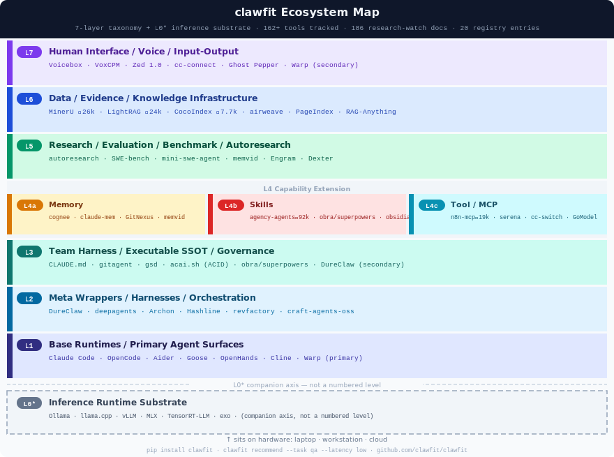

# clawfit

> AI 에이전트 + LLM + 하드웨어 추천 엔진 — **162+ 도구**, **7레이어 생태계 맵**, **192개 리서치워치 문서**, **10차원 스코어링**

> Agent + LLM + hardware recommendation engine — **162+ tools mapped**, **192 research-watch docs**, daily automated scanning.

[](LICENSE)
[](pyproject.toml)
[](tests/)
[](https://github.com/hongsw/clawfit)

**Read in:** [한국어 🇰🇷](README.ko.md)

---

## What is clawfit?

`clawfit` answers a practical question:

**Given a task, latency target, budget, network conditions, and team maturity, what combination of agent pattern, model, and hardware is the best fit?**

It is three things in one:

1. **Recommendation engine** — (agent, LLM, hardware) triples scored across 6 weighted dimensions. Hard filters eliminate mismatches before scoring; soft multipliers handle nuance.

2. **Ecosystem map** — 7-layer taxonomy with 162+ tools tracked by star count, daily automated scanning of GitHub Trending / GeekNews / HN, and 186 research-watch signal documents.

3. **Org-fit diagnosis** — 10-question interactive profile builds your organization's constraint vector and returns a prioritized multi-layer tool stack.

---

## 🗺 Ecosystem map — 7 layers + substrate



> **Map vs registry**: The map tracks 162+ ecosystem tools for awareness. The **recommendation registry** (20 entries: 4 agents × 11 LLMs × 5 hardware) is what `clawfit recommend` scores — curated, validated, schema-bound.

---

## ⚙️ Recommendation axes

```
                    ┌─────────────────────────────────────────────┐
   TASK ──────────▶ │              HARD FILTERS                   │ ◀── NETWORK (online/offline)
   code-gen/qa/...  │  task match · latency · budget · network    │     HARDWARE (cloud/edge/local)
                    │  statefulness · hardware type               │
   LATENCY ───────▶ │─────────────────────────────────────────────│
   low/med/high     │              SCORING                        │ ◀── BUDGET ($/1k tokens)
                    │  latency match   ×0.50                      │
   MATURITY ──────▶ │  cost match      ×0.25  (÷×0.80 w/maturity) │
   stage 1–11       │  LLM preference  ×0.15                      │
                    │  maturity fit    ×0.15  (replaces baseline)  │
                    └──────────────────────┬──────────────────────┘
                                           │
                                    fit_score 0–1.0
                                    (agent, llm, hardware) triple
```

---

## 📊 By the numbers

| Metric | Count |
|--------|-------|
| Tools in ecosystem map (7 layers) | **162+** |
| Research-watch signal documents | **186** |
| LLMs in recommendation registry | **11** |
| Agent patterns in registry | **4** |
| Hardware profiles in registry | **5** |
| Automated tests | **29** |
| Taxonomy layers (L0–L7) | **8** |
| Scoring dimensions | **6** (latency × 3 + cost + pref + maturity) |
| Scan dates tracked | **24** (2026-03-31 → today) |

---

### Who is this for?

| You are... | clawfit gives you... |
|------------|---------------------|
| Developer choosing an agent stack | Scored (agent, LLM, hardware) triple for your task + constraints |
| DevOps setting up local vs cloud | Hard filters on network / hardware / cost — no guesswork |
| CTO evaluating AI tool strategy | 7-layer ecosystem map with 162+ tools, daily-updated |
| Researcher mapping the agent landscape | 186 evidence docs + taxonomy with star counts |
| Builder who wants the current state | Daily scan: GitHub Trending + GeekNews + HN, auto-committed |

> [!IMPORTANT]
> **START HERE — ECOSYSTEM MAP**
>
> If you want to understand what `clawfit` is really mapping, comparing, and tracking:
>
> ## **[Jump directly to the ecosystem map: `docs/reference-levels.md`](https://github.com/hongsw/clawfit/blob/main/docs/reference-levels.md)**
>
> This is the fastest way to see the current landscape of:
> - base agent runtimes (Claude Code, OpenClaw, Goose, Aider, pi-mono, ATLAS...)
> - harness / wrapper layers (oh-my-*, DureClaw, SuperClaude, Archon...)
> - research-loop systems (autoresearch, mdarena, cq...)
> - MCP / memory / tool ecosystems (claude-mem, korean-law-mcp, rtk...)
> - skill packs & persona layers (career-ops, caveman, Polysona...)
> - human interface / generative UI (pi-generative-ui, Ghost Pepper...)

---

## 🔥 What's hot right now (2026-05-06)

| Signal | Why it matters | Level |
|--------|---------------|-------|
| **[PageIndex](https://github.com/VectifyAI/PageIndex) ⭐28.2k 🔥** | Vector-DB-free RAG: hierarchical TOC tree + LLM tree-search retrieval. "Similarity ≠ relevance" thesis. FinanceBench 98.7% (vendor-claimed). L6a structural sub-type "vectorless tree-traversal"; L6c sub-layer candidate (single signal — not promoted). | L6a |
| **[anthropics/financial-services](https://github.com/anthropics/financial-services) ⭐8.5k +540/day** | First 1st-party Anthropic vertical skill pack: 11 workflow agents (Pitch, Earnings, Valuation, KYC…), 50+ skills, 11 data-provider MCPs (FactSet, Moody's, S&P…). Bloomberg/Fortune coverage. Examples repo — registry held. | L4b |
| **[Cloudflare × Stripe Projects](https://blog.cloudflare.com/agents-stripe-projects/) HN 381pts** | Agents now create CF accounts, buy domains, deploy autonomously. April 17 "infra triple" extended from compute → financial+lifecycle. Implies governance_need split into audit + spend-rail axes. | L4c |
| **[Reflex 45× cost benchmark](https://news.ycombinator.com/item?id=48031684) HN 412pts** | Computer Use vs structured-API on identical task: 45× input tokens, 51× wall-clock. L1/L7 collapse pattern (Apr 2026) augmented with cost-axis citation. "Prefer structured" rationale clause added. | meta |
| **[Understand-Anything](https://github.com/Lum1104/Understand-Anything) ⭐12.7k** | Claude Code plugin: code/KB → interactive knowledge graph via LLM multi-agent (vs GitNexus's deterministic Tree-sitter). MIT, TypeScript. Differs from L4a memory tools — graph rebuilt on demand. | L4b |
| **[agency-agents](https://github.com/msitarzewski/agency-agents) ⭐92.4k** | 144 personas across 12 verticals (Sales, Legal, Healthcare, Finance). Cross-tool MD SSOT auto-converts to Claude Code/Cursor/Aider/Windsurf. Anchors finance-vertical cluster. | L4b |
| **[TradingAgents](https://github.com/TauricResearch/TradingAgents) ⭐67k** | Financial analyst→risk→execution pipeline. Member of finance-vertical cluster (Dexter+TradingAgents+agency-agents/finance+anthropics/financial-services+Kronos). | L1 |
| **[Kimi K2.6](https://moonshotai.github.io/Kimi-K2/)** | Moonshot 1T/32B MoE, SWE-Bench Verified 80.2%, 300-agent swarm, Modified MIT, $0.95/M. In llms.json. | LLM |
| **[DeepSeek V4-Pro/Flash](https://huggingface.co/deepseek-ai/DeepSeek-V4-Pro)** | SWE-Bench 80.6, MIT, $0.44/M (V4-Pro), $0.14/M (V4-Flash). V4-Flash runs offline on M5 MacBook. | LLM |
| **[cc-switch](https://github.com/hongsw/cc-switch) ⭐52.8k** | Cross-CLI provider switcher: Claude Code+Codex+Gemini+OpenCode unified SSOT. Multi-vendor anti-lockin cluster anchor. | L3/L4c |

Full analysis in [`docs/research-watch/`](docs/research-watch/) (197 docs) · Full map in [`docs/reference-levels.md`](docs/reference-levels.md)

---

## Changelog

| Date | What changed |
|------|-------------|
| 2026-05-06 | Daily scan (5 docs): PageIndex ⭐28.2k L6a sub-type + L6c candidate flagged (single signal, not promoted), anthropics/financial-services ⭐8.5k 1st-party L4b sub-type candidate, Cloudflare×Stripe agent provisioning + financial autonomy L4c sub-track candidate, Reflex 45×/51× Computer-Use cost benchmark (architectural signal augments April L1/L7 collapse pattern), Understand-Anything ⭐12.7k L4b plugin. Finance vertical cluster meta-pattern formalised (5 signals × 3+ layers in 1 week). 50/50 tests. No registry mutations. |
| 2026-05-05 | Daily scan (11 docs): agency-agents ⭐92.4k L4b, Kimi K2.6 → llms.json, MemPalace ⭐51k L4a (benchmark controversy flagged), local-deep-research ⭐4.8k L5, cloudflare/vibesdk L2, flue L2 sandbox, manifest L4c routing. L6a/L6b formal split (v0.4). 찰떡AI added L6b. Korean expert review section added. 29/29 tests. |
| 2026-05-04 | Daily scan: ruflo ⭐38.8k L2 (Claude swarm orchestration), TradingAgents +3,315★/day now 65.1k, ouroboros Agent OS spec-first harness, cocoindex L6 incremental pipeline, n8n-mcp L4c (1,650+ nodes). n8n-mcp + CocoIndex added to reference-levels.md. 5 research-watch docs. scoring clean. |
| 2026-05-03 | Daily scan: DeepSeek V4-Pro (SWE-Bench 80.6, MIT, $0.44/M), xAI Grok 4.3 (83% cheaper, ELO +321), MS Agent Framework v1.0 (AutoGen+SK consolidated), acai.sh ACID spec-first, craft-agents-oss L6, TradingAgents 57.7k★. Scoring maturity weight bug fixed (was 1.0795, now exact 1.0). L6 diagram corrected. 9 research-watch docs. |
| 2026-04-30 | Daily scan: Warp open-source +11,955★/day record, Zed 1.0 stable, Mistral Medium 3.5 → llms.json, NVIDIA OpenShell L1, memvid L4a portable-binary, cc-connect L7 3rd datapoint, hongsw/harness L2. 7 research-watch docs. |
| 2026-04-28 | All GitHub star counts refreshed. All taxonomy bullet lists and tables sorted by star count (descending). Daily scans 04-21 through 04-28: cc-switch 52.8k★, cmux 15.6k★, GitNexus 31.5k★, dirac TB2 leader, Engram+wuphf L4a, DureClaw L3 SSOT confirmed. 12 research-watch docs. |
| 2026-04-20 | Thunderbolt Mozilla AI client L7, OpenMythos loop-transformer signal, Qwen3.6-35B-A3B open-weight agentic coding. |
| 2026-04-12 | DureClaw highlighted in reference-levels.md. 8 new tools added to registry (50→58). Task taxonomy expanded: +orchestration, +education, +legal-research. Exec role scoring fixed. |
| 2026-04-12 | Daily scan: Strix security agent, GBrain personal knowledge base added |
| 2026-04-11 | Daily scan: superpowers 145k★, Archon harness-builder, rowboat memory-native coworker, Twill.ai cloud delegation |
| 2026-04-08 | Claude Mythos Preview model tier, GLM-5.1 long-horizon, NVIDIA PersonaPlex, Addy Osmani agent-skills |
| 2026-04-07 | 8 repos from hongsw stars: career-ops, claude-peers-mcp, polysona, pi-generative-ui, dureclaw. Korean rewrites. Full numerical verification across all docs. |
| 2026-04-06 | reference-levels.md → v0.3: L4 split into 4a/4b/4c. 19 research-watch docs. Harness team (`.claude/agents/`). |
| 2026-03-31 | Ecosystem map v0.2: 7-layer taxonomy, research-watch scan launch |

---

## Quick start

### Install

**Option A — pipx (recommended, globally available, no venv needed)**

```bash
pipx install git+https://github.com/hongsw/clawfit
```

**Option B — editable install (for development / hacking)**

```bash
git clone https://github.com/hongsw/clawfit.git
cd clawfit
python3 -m venv .venv && source .venv/bin/activate
pip install -e .
```

---

### Org-Fit Diagnosis — find your team's tool stack

Answer 10 questions about your team → get a prioritized multi-layer recommendation.

**TUI** (recommended — navigate with arrow keys, results update live in split pane):

```bash
clawfit tui
```

```
 ████████████░░░░░░  5/10  [USECASE]
 ──────────────────────────┬──────────────────────────────
 What is the main thing    │ Stage 4 — Tool-using agent
 you want AI to do?        │
                           │ [PRI] L1 Base runtime
  ○ Write or review code   │    45% Claude Code
  ● Research & summarize   │    39% Aider
  ○ Answer questions (QA)  │    38% Goose
  ○ Classify / route data  │
  ○ Analyze data           │ [PRI] L4c Tool-use infra
  ○ Summarize at scale     │    41% Serena
                           │    35% Context7
 ─ answered ─              │
  Team size: small team    │ NEXT STEP
  Role: developer          │ You're ready for a meta-wrapper...
 ──────────────────────────┴──────────────────────────────
  ↑/↓ Move   Space/Enter Select+Next   ← Back   → Next   q Quit
```

**CLI (non-interactive, pass answers as JSON):**

```bash
clawfit diagnose --answers '{
  "team_size": "small",
  "primary_role": "developer",
  "current_ai_usage": "coding_agent",
  "primary_task": "code-gen",
  "output_destination": "team",
  "frequency": "daily",
  "data_sensitivity": "internal",
  "monthly_budget": "medium",
  "governance_need": "soft",
  "growth_horizon": "deepen"
}'
```

**Web UI** (browser with live filtering):

```bash
clawfit serve          # opens http://localhost:7771
clawfit serve --port 8080
```

---

### Direct recommendation (if you already know your constraints)

```bash
clawfit recommend --task qa --latency low --budget 0.01
```

```bash
clawfit recommend \
  --task code-gen \
  --latency medium \
  --budget 0.01 \
  --hardware cloud \
  --network online \
  --statefulness session \
  --maturity 5 \
  --top 5
```

> `--maturity 5` = sub-agent user stage. See the [maturity × layer map](docs/pages/maturity-layer-map.md) for all 11 stages.

**Example output:**

```
Rank 1  fit_score: 0.900
  agent:    react-agent
  llm:      gpt-4o         (openai, $0.003/1k, latency: medium)
  hardware: cloud-serverless
  arch:     cloud-api
  why:
    - ReAct Agent supports 'code-gen' with medium latency
    - GPT-4o fits the task and cost profile
    - GPT-4o is a preferred LLM for ReAct Agent

Rank 2  fit_score: 0.900
  agent:    react-agent
  llm:      claude-sonnet  (anthropic, $0.003/1k, latency: medium)
  hardware: cloud-serverless
  arch:     cloud-api

Rank 3  fit_score: 0.850
  agent:    react-agent
  llm:      kimi-k2-6      (moonshot, $0.00095/1k, latency: medium)
  hardware: aws-cpu-medium
  arch:     cloud-api
```

### Inspect the registry

```bash
clawfit list agents
clawfit list llms
clawfit list hardware
clawfit profile
```

---

## Scoring model

10-dimension weighted scoring with hard multipliers:

| Dimension | Weight | What it measures |
|-----------|--------|-----------------|
| task_fit | 0.22 | Does the tool's task list match the user's primary task? |
| maturity_fit | 0.18 | Is the tool appropriate for the user's AI maturity stage (1–11)? |
| role_fit | 0.15 | Does the tool target the user's role (developer/exec/researcher/devops)? |
| layer_relevance | 0.12 | Does the tool's ecosystem layer (L1–L7) match the profile's layer weights? |
| team_size_fit | 0.09 | Is the tool designed for the user's team size (solo/small/mid/large)? |
| network_fit | 0.08 | Does the tool work in the required network environment (online/offline/hybrid)? |
| latency_fit | 0.06 | Does the tool meet the required latency tier? |
| feature_fit | 0.05 | Does the tool support needed features (governance, team-sharing, offline)? |
| complexity_fit | 0.04 | Is setup complexity appropriate for the team's maturity? |
| budget_fit | 0.01 | Does the pricing tier match the budget? |

**Hard multipliers** (applied after weighted sum):
- Offline required + online-only tool → **x0.25**
- Role mismatch (no role overlap) → **x0.75**

---

## Supported task categories

| Task | Description |
|------|-------------|
| `code-gen` | Code generation, review, refactoring |
| `research` | Information gathering, literature review, deep analysis |
| `qa` | Question answering, document Q&A |
| `summarization` | Content summarization at scale |
| `data-analysis` | Data processing, visualization, statistical analysis |
| `orchestration` | Multi-agent coordination, cross-machine task distribution |
| `education` | Personalized learning, tutoring, quiz generation |
| `legal-research` | Legal document search, case law analysis, regulatory compliance |

---

## How it works

The pipeline is intentionally simple and inspectable:

1. **Registry loading** — load 58 tool definitions with 10-field org_fit metadata
2. **Profile building** — convert 10 questionnaire answers into an OrgProfile
3. **Scoring** — score each tool across 10 dimensions + hard multipliers
4. **Layer grouping** — group by ecosystem layer (L1–L7), prioritize by maturity stage
5. **Recommendation output** — return prioritized multi-layer stack with rationale

---

## Repository structure

```text
clawfit/
├─ .claude/agents/          ← harness team sub-agents (5)
├─ clawfit/
│  ├─ cli.py                ← argparse CLI (recommend, list, tui, serve, diagnose)
│  ├─ org_scorer.py         ← 10-dimension scoring engine
│  ├─ tui.py                ← curses TUI with split-pane live preview
│  ├─ server.py             ← stdlib HTTP server (localhost:7771)
│  ├─ diagnose.py           ← interactive CLI questionnaire
│  ├─ filters.py            ← hard constraint elimination
│  ├─ scoring.py            ← cartesian product scoring (agent × LLM × hardware)
│  ├─ recommend.py          ← public API: recommend() → list[dict]
│  ├─ schemas.py            ← dataclasses: Agent, LLM, Hardware, Recommendation
│  ├─ loader.py             ← loads registry/*.json
│  ├─ data/
│  │  ├─ tools_registry.json  ← 76 ecosystem tools with org_fit (10 fields each)
│  │  └─ org_questions.json   ← 10-question bank, 3 phases
│  └─ registry/             ← agents.json, llms.json, hardware.json
├─ docs/
│  ├─ reference-levels.md   ← ecosystem map v0.3 (7-layer taxonomy)
│  ├─ research-watch/       ← 150+ signal analysis docs (daily scan)
│  └─ pages/                ← ecosystem-overview, ecosystem-axes, maturity-layer-map
├─ data/
│  └─ tools_registry.json   ← mirror of clawfit/data/
├─ tests/
│  ├─ test_filters.py
│  └─ test_recommend.py
└─ pyproject.toml
```

---

## Ecosystem research layer

clawfit tracks a broader AI tooling landscape documented in:
- [`docs/reference-levels.md`](docs/reference-levels.md) — canonical 7-layer ecosystem map
- [`docs/pages/ecosystem-axes.md`](docs/pages/ecosystem-axes.md) — classification logic, boundary rules, worked examples
- [`docs/research-watch/`](docs/research-watch/) — 150+ individual tool/trend analysis documents (daily automated scan)
- [`docs/pages/maturity-layer-map.md`](docs/pages/maturity-layer-map.md) — how user maturity stages (1–11) map to tool layers (L1–L7)

### 7-layer structure

| Level | Focus | Examples |
|---|---|---|
| 1 | Base runtimes | Claude Code, OpenClaw, Aider, pi-mono, ATLAS, Hermes Agent |
| 2 | Meta wrappers / harnesses | oh-my-*, DureClaw, SuperClaude, Archon, multica |
| 3 | Team harness / SSOT | CLAUDE.md, AGENTS.md, DESIGN.md, gitagent, superpowers |
| 4a | Memory / persistent context | claude-mem, GBrain, Polysona |
| 4b | Skill packs & managers | career-ops, caveman, obsidian-skills, Chops |
| 4c | Tool-use / action infra | korean-law-mcp, rtk, claude-peers-mcp, serena |
| 5 | Research / evaluation | autoresearch, mdarena, Mozilla cq |
| 6 | Data / knowledge infra | DeepTutor, AnythingLLM |
| 7 | Human interface | pi-generative-ui, Ghost Pepper, ouroboros |

---

## Python API

```python
from clawfit.recommend import recommend

results = recommend(
    task="research",
    latency="high",
    network="online",
    top_n=3,
)

print(results[0])
```

---

## Running tests

```bash
python -m pytest tests/ -v
```

---

## Contributing

Contributions are welcome, especially around:
- registry expansion (new tools with complete org_fit metadata)
- scoring logic improvements
- benchmark references and evidence
- research-watch signal analysis

Open an issue or PR with: what you are adding, what evidence supports it, and how it fits into the comparison model.

---

## License

MIT
