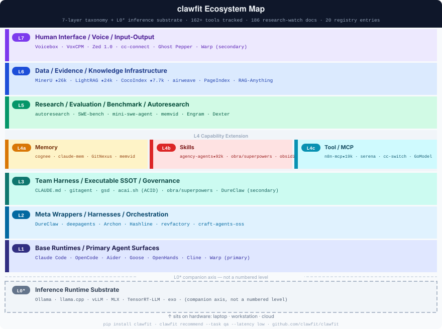

# clawfit

> AI 에이전트 + LLM + 하드웨어 추천 엔진 — **162+ 도구**, **7레이어 생태계 맵**, **192개 리서치워치 문서**, **10차원 스코어링**

> Agent + LLM + hardware recommendation engine — **162+ tools mapped**, **647 research-watch docs**, daily automated scanning.

[](LICENSE)
[](pyproject.toml)
[](tests/)
[](https://github.com/hongsw/clawfit)

**Read in:** [한국어 🇰🇷](README.ko.md)

---

## What is clawfit?

`clawfit` answers a practical question:

**Given a task, latency target, budget, network conditions, and team maturity, what combination of agent pattern, model, and hardware is the best fit?**

It is three things in one:

1. **Recommendation engine** — (agent, LLM, hardware) triples scored across 6 weighted dimensions. Hard filters eliminate mismatches before scoring; soft multipliers handle nuance.

2. **Ecosystem map** — 7-layer taxonomy with 162+ tools tracked by star count, daily automated scanning of GitHub Trending / GeekNews / HN, and 186 research-watch signal documents.

3. **Org-fit diagnosis** — 10-question interactive profile builds your organization's constraint vector and returns a prioritized multi-layer tool stack.

---

## 🗺 Ecosystem map — 7 layers + substrate



> **Map vs registry**: The map tracks 162+ ecosystem tools for awareness. The **recommendation registry** (20 entries: 4 agents × 11 LLMs × 5 hardware) is what `clawfit recommend` scores — curated, validated, schema-bound.

---

## ⚙️ Recommendation axes

```
                    ┌─────────────────────────────────────────────┐
   TASK ──────────▶ │              HARD FILTERS                   │ ◀── NETWORK (online/offline)
   code-gen/qa/...  │  task match · latency · budget · network    │     HARDWARE (cloud/edge/local)
                    │  statefulness · hardware type               │
   LATENCY ───────▶ │─────────────────────────────────────────────│
   low/med/high     │              SCORING                        │ ◀── BUDGET ($/1k tokens)
                    │  latency match   ×0.50                      │
   MATURITY ──────▶ │  cost match      ×0.25  (÷×0.80 w/maturity) │
   stage 1–11       │  LLM preference  ×0.15                      │
                    │  maturity fit    ×0.15  (replaces baseline)  │
                    └──────────────────────┬──────────────────────┘
                                           │
                                    fit_score 0–1.0
                                    (agent, llm, hardware) triple
```

---

## 📊 By the numbers

| Metric | Count |
|--------|-------|
| Tools in ecosystem map (7 layers) | **162+** |
| Research-watch signal documents | **647** |
| LLMs in recommendation registry | **11** |
| Agent patterns in registry | **4** |
| Hardware profiles in registry | **5** |
| Automated tests | **29** |
| Taxonomy layers (L0–L7) | **8** |
| Scoring dimensions | **6** (latency × 3 + cost + pref + maturity) |
| Scan dates tracked | **25** (2026-03-31 → today) |

---

### Who is this for?

| You are... | clawfit gives you... |
|------------|---------------------|
| Developer choosing an agent stack | Scored (agent, LLM, hardware) triple for your task + constraints |
| DevOps setting up local vs cloud | Hard filters on network / hardware / cost — no guesswork |
| CTO evaluating AI tool strategy | 7-layer ecosystem map with 162+ tools, daily-updated |
| Researcher mapping the agent landscape | 186 evidence docs + taxonomy with star counts |
| Builder who wants the current state | Daily scan: GitHub Trending + GeekNews + HN, auto-committed |

> [!IMPORTANT]
> **START HERE — ECOSYSTEM MAP**
>
> If you want to understand what `clawfit` is really mapping, comparing, and tracking:
>
> ## **[Jump directly to the ecosystem map: `docs/reference-levels.md`](https://github.com/hongsw/clawfit/blob/main/docs/reference-levels.md)**
>
> This is the fastest way to see the current landscape of:
> - base agent runtimes (Claude Code, OpenClaw, Goose, Aider, pi-mono, ATLAS...)
> - harness / wrapper layers (oh-my-*, DureClaw, SuperClaude, Archon...)
> - research-loop systems (autoresearch, mdarena, cq...)
> - MCP / memory / tool ecosystems (claude-mem, korean-law-mcp, rtk...)
> - skill packs & persona layers (career-ops, caveman, Polysona...)
> - human interface / generative UI (pi-generative-ui, Ghost Pepper...)

---

## 🔥 What's hot right now (2026-08-28)

| Signal | Why it matters | Level |
|--------|---------------|-------|
| **[tencent/Hy4-preview ⭐202](https://github.com/Tencent-Hunyuan/Hy4-preview) (Tencent, released 2026-08-28)** | 770B total / 49B active MoE, 1M-token context, open-sourced under Apache 2.0 today. Gated DeepSeek Sparse Attention + IndexCache for cross-layer sparse index reuse; identity Hyper-Connections (iHC); built-in speculative decoding via native MTP layer. Third frontier open-weight model released this week (alongside Qwen3.8-Flash-Next and GLM-5.3-Flash), confirming open-weight frontier as a sustained pattern, not a one-time event. `weights: [proprietary | open]` schema gap reinforced. | L1 base model — open-weight frontier |
| **[zai-org/GLM-5.3-Flash](https://huggingface.co/zai-org/GLM-5.3-Flash) (Zhipu AI, 2026-08-27, 1,470 HF likes)** | 320B total / 18B active MoE — distinct from GLM-5.3 (744B/40B active). First natively multimodal model in GLM-5 series; hybrid sparse + linear attention for long-context cost reduction; Manifold-Constrained Hyper-Connections (mHC); 30T-token multimodal pre-training corpus; one-tenth the price of GLM-5.2 (self-reported). MIT license. `modality: [text | text+vision]` schema gap. Independent benchmarks pending. | L1 base model — affordable frontier tier |
| **[BDH-CQ: Recurrent Latent Reasoning](https://arxiv.org/abs/2608.09888) (arXiv, 760 HF upvotes, 2026-08-10)** | 150M-parameter model breaks ARC-AGI-1 cost-accuracy Pareto frontier at $0.0007 per task — under one-tenth of a cent. Combines in-context learning with recurrent latent reasoning: model updates recurrent memory from demonstrations and solves via iterative computation without verbalized chain-of-thought. Challenges the assumption that structured reasoning requires large models. `inference_mechanism: [autoregressive | recurrent-latent]` schema gap. | L1 research — compact reasoning model |
| **[tashfeenahmed/freellmapi ⭐21,473](https://github.com/tashfeenahmed/freellmapi) (GitHub Trending, 2026-08-28)** | Aggregates free tiers from 34 LLM providers (Google, Groq, Cerebras, Mistral, Zhipu, NVIDIA, Cloudflare, Cohere + 26 more) behind one OpenAI-compatible endpoint. 7.4B tokens/month; six routing strategies; automatic failover; AES-256-GCM key encryption at rest; emulates OpenAI, Anthropic Messages, Gemini, and Ollama APIs simultaneously. Self-updates catalog 2× daily. Works with Claude Code, Cline, Aider, Continue. Exposes a `budget: 0` gap in clawfit's current scoring logic. | L7 infrastructure — free-tier LLM aggregator |
| **[JetBrains/go-modern-guidelines ⭐2,533](https://github.com/JetBrains/go-modern-guidelines) (GitHub Trending, 2026-08-28)** | Official JetBrains project explicitly for AI coding agents writing modern Go. Names two failure modes: "training data lag" (agent lacks knowledge of post-training Go releases) and "frequency bias" (agent defaults to older idioms from training distribution). Covers Go 1.0–1.27; `go.mod`-aware versioning. Complements Go team's `modernize` analyzer. L4 skill pattern applied at the language-knowledge layer — a template the Python, Rust, TypeScript communities may follow. | L4 skill — language-freshness reference |
| **[Trail of Bits: VMs won't contain AI agents](https://blog.trailofbits.com/2026/08/26/vms-wont-contain-cyber-capable-agents/) (Hacker News, 71 pts, 2026-08-26)** | Three demonstrated VM escape methods from a QEMU/KVM sandbox: CVE exploitation, cross-library vulnerability chain, and a zero-day triple. Firecracker-based microVMs fared better. The implicit "sandbox in a VM" safety model is empirically challenged. Retroactively validates SmolVM's multi-VMM approach. `execution_isolation: [none | container | qemu-kvm | firecracker | hyperv]` schema gap. | L7 security — VM containment |
| **[Qwen3.8-Flash-Next](https://huggingface.co/Qwen/Qwen3.8-Flash-Next) (Hacker News, 443 pts, 2026-08-26)** | Alibaba Qwen4 architecture preview: 125B total / 6B active MoE, hybrid Gated DeltaNet + Sparse Attention, 262k native context (1M extensible), 12× cheaper than flagship. First signal for "affordable frontier tier" pattern now confirmed by two more same-week signals (GLM-5.3-Flash, Hy4-preview). Independent benchmarks pending. | L1 base model — Qwen4 preview |
| **[Apple M6 and M5 Ultra](https://apple.com) (Hacker News, 918 pts, 2026-08-26)** | M6 raises on-device inference ceiling; M5 Ultra enables 192–384 GB unified memory for larger local models. MLX, LM Studio, Ollama, OMLX targeting these immediately. Offline/confidential-data workloads directly benefit. Hardware registry needs a generation signal or capability-score field for the Apple Silicon tier. | L1 local hardware substrate |
Full analysis in [`docs/research-watch/`](docs/research-watch/) (696 docs) · Full map in [`docs/reference-levels.md`](docs/reference-levels.md)

---

## Changelog

| Date | What changed |
|------|-------------|
| 2026-08-28 | Daily scan (5 docs): tencent/Hy4-preview L1 (770B/49B MoE, 1M context, Apache 2.0, open-sourced today — third frontier open-weight model this week); zai-org/GLM-5.3-Flash L1 (320B/18B MoE, first multimodal GLM-5, hybrid sparse+linear attention, mHC, 1/10 GLM-5.2 price — two-signal confirmation of affordable frontier tier with Hy4-preview); BDH-CQ L1 research (150M recurrent latent reasoning, $0.0007/task ARC-AGI-1, 760 HF upvotes, breaks cost-accuracy Pareto); tashfeenahmed/freellmapi ⭐21.5k L7 (34 free-tier LLM providers unified, 7.4B tokens/month, six routing strategies, `budget: 0` gap exposed); JetBrains/go-modern-guidelines ⭐2.5k L4 (official AI coding agent guidelines for modern Go, training-lag + frequency-bias analysis, `go.mod`-aware). No canonical changes; 50/50 tests; 0 registry entries. |
| 2026-08-26 | Daily scan run 2 (5 docs): Trail of Bits VM escape L7 (three demonstrated QEMU/KVM escapes by AI agent — CVE-2026-53359, libslirp chain, zero-day triple; Firecracker recommended; `execution_isolation` schema gap); tt-a1i/archify ⭐17.4k L4 (GitHub Trending, agent skill for interactive architecture diagrams, 5 diagram types, Architecture Delta, typed JSON validation, 5 runtimes); Qwen3.8-Flash-Next L1 (HN 443 pts, 125B/6B active MoE, GDN+QSA architecture, 262k context, 12× cheaper than flagship, Qwen4 preview — independent benchmarks pending); DuckLabs joins AWS L7/L5 (HN 762 pts, DuckDB ⭐40.6k, open source stays MIT-licensed with DuckDB Foundation, commercial ownership of upstream worth monitoring); ConardLi/garden-skills ⭐10.8k L4 (6-runtime skill collection, kb-retriever addresses context flooding, includes Claude.ai web consumer interface). No canonical changes; 50/50 tests; 0 registry entries. |
| 2026-08-25 | Daily scan (5 docs, 2 runs): katanemo/plano ⭐7k+ L5/L2 (AI-native Envoy-based agent proxy, LLM routing+OTel tracing+guardrail filters without code instrumentation, `routing_layer`/`observability_tier` schema gaps); CUDA→RISC-V L1 hardware (Hot Chips 2026 first-party NVIDIA, 12–18 month horizon, potential new `risc-v-cuda` hardware tier below desktop-gpu); marin-community/marin ⭐2k L1 training (Stanford CRFM, full lifecycle DAG+Delphi scaling, published failures, `training_transparency` schema gap); wanxingai/LightAgent ⭐1.2k L2 (no-LangChain MCP framework, v0.10.0 event-sourced runtime, `dependency_weight`/`auditability` gaps); CelestoAI/SmolVM ⭐787 L2 (open-source Firecracker/QEMU/libkrun microVM, `execution_isolation` gap). Two-signal rule not met; no canonical changes. 50/50 tests. Registry: 0 new entries. |
| 2026-08-24 | Daily scan (7 docs, 2 runs): claude-obsidian ⭐11.7k L5/L4 (GitHub Trending, local Obsidian vault as agent knowledge second brain, 15 skills, compounding capture→ground→connect→maintain loop, transaction-based mutations, LYT/PARA/Zettelkasten filing — distinct from kepano/obsidian-skills which adds skills AS plugins; claude-obsidian has Claude reach INTO the vault; `knowledge_vault`/`knowledge_format` schema gaps); claude-plugins-community ⭐1.3k L4 (+490 today, official Anthropic community plugin marketplace, security-screened nightly mirror, 3-tier official+role-specific+community, `claude plugin marketplace add` CLI, Apache-2.0); Labor0 L2/L3 (GeekNews, 50+ concurrent agent sessions, CodingTask+AgentTask graph orchestration, autonomous PR lifecycle, catch-up summaries, ~30× cheaper than human labor); TryCaspian/caspian-sdk ⭐871 L6 (Show HN, single on_message for 9+ channels, native channel rendering, overlap policies queue/debounce/drop/parallel, 650+ tests, persistent cross-channel agent identity); VoltAgent/awesome-ai-agent-papers ⭐1.7k L5 ref (364+ 2026 papers, 7 categories, tooling 95+security 82=47%, weekly arXiv, 83 commits); benchflow-ai/awesome-evals ⭐840 L5 (443+ curated links, PATTERNS.md CI-integrated eval, depth-4 crawl 11.6k papers, benchmark integrity section); Agent.md L4 (HN 123 pts Aug 21, context injection pattern, session-start injection by Claude Code/Goose/Cline, context dilution mitigation, equivalent to CLAUDE.md). Two-signal rule not met; no canonical taxonomy changes. 50/50 tests. Registry: 0 new entries. |
| 2026-08-23 | Daily scan (5 docs): Untrivial Agent Orchestrator ⭐9.9k L2/L3 (fleet-management IDE for 26+ coding agents, isolated worktrees, autonomous CI/PR/conflict resolution — first fleet-controller-above-agents pattern); KunAgent/Kun ⭐6.2k L1/L2 (local-first dual-mode workspace, single runtime for Electron GUI+TUI, MCP-native); PaperOrchestra L3/L2 (Google Research, 5-specialist-agent pipeline for research paper writing, PaperWritingBench benchmark, arXiv 2604.05018); OzBrain L5/L4 (Show HN 75 pts, cross-platform shared knowledge base via MCP for Claude/ChatGPT/Cursor, conflict detection, version history); Autolith L2/L1 (HN 105 pts, terminal agent inside live SBCL Lisp image, self-modification + checkpoint/recovery). Two-signal rule not met; no canonical taxonomy changes. Registry: 0 new entries. 50/50 tests. |
| 2026-08-16 | Daily scan (5 docs): MoneyPrinterTurbo ⭐104k L2/L4b (first AI video pipeline harness, 12+ LLM providers, Ollama/LiteLLM local model support, AI Agent mode for orchestrator-callable use; first tracked L2 harness in video content production domain); Chestnut eGPU dock (HN 109 pts, L7/L1, open-source ASM2464PD C firmware for USB4/PCIe bridge, $249 bare/$799 with RX 9060; first AI-adjacent hardware with open-source controller firmware; `laptop_egpu_usb4` topology gap); oMLX ⭐18.8k L1/L7 (Apple Silicon multi-model LRU, RAM→SSD KV cache tiering, KV blocks persist across restarts; Anthropic+OpenAI API from one process); TimesFM 2.5 ⭐27.6k L1/L4 (200M-param zero-shot time-series, AGENTS.md March 2026; first non-LLM domain model with formal agent invocation spec; BigQuery ML + Vertex + Google Sheets); THUDM/SLIME ⭐8k L1 (Megatron+SGLang RL post-training, Data Buffer bridge, agentic RL + tool-use training; powers GLM-4.7→5.2; first independent doc, previously cited only as OpenClaw-RL upstream dep). Two-signal rule not met; no canonical taxonomy changes. 50/50 tests. Registry: 0 new entries. |
| 2026-08-15 (run 2) | Daily scan (5 docs): anthropic-experimental/sandbox-runtime ⭐~5k L7/L1 (OS-native process isolation for agents+MCP servers, no container, macOS/Linux/Windows, process-tree protection, Apache-2.0 research preview); NVIDIA/NemoClaw ⭐22.2k L1/L7 (integrated agent security stack: OpenShell + Nemotron + Privacy Router + managed lifecycle in one install, first "complete agent security stack" in corpus, March 2026 GTC); cordiverse/cordis ⭐3.9k L2 meta-framework (GitHub Trending #1 — deepseek-harness substrate, v4.0.0-rc.8, "Spatiotemporal Composability" plugin system, monitoring for breaking-change migration risk to deepseek-harness ecosystem); whiteguo233/OpenBiliClaw ⭐2.5k L6/L2 (local-first 12-platform content discovery agent with Agent Bridge exposing 22 tools to OpenClaw/Hermes/WorkBuddy + deepseek-harness plugin — "consumer app as agent tool source" pattern); MakazhanAlpamys/Soup ⭐1.6k L1 (YAML-driven fine-tuning via layer streaming, 3.32 GB VRAM peak for 8B model on 4 GB GPU — same-week pattern with Unsloth Desktop confirms consumer GPU fine-tuning as real 2026 workflow). Three-vendor agent isolation cluster (Docker+Anthropic+NVIDIA, one week); consumer fine-tuning two-signal pattern (Unsloth+Soup). No canonical taxonomy changes (two-signal rule: no same-day same-sub-type pair). pytest 50/50. Registry: 0 new entries. |
| 2026-08-15 (run 1) | Daily scan (3 docs): palmier-io/palmier-pro ⭐13.6k L6/L4c (macOS 26 video editor with embedded MCP server — first L6 creative app giving agents direct timeline manipulation, not pipeline orchestration; Swift, GPLv3, Apple Silicon, macOS Tahoe required); lajosdeme/mole ⭐83 L3/L4c (Go single binary, budget-enforced deep research agent: API calls reserved-before/settled-after for zero overshoot, verified citations require verbatim source quotes, local CSV/folder data stays private; MCP daemon mode); "From Human-Centric to Agentic Code Review" arxiv 2607.13196 L5 (1.02M PRs, 207 projects — agentic review is faster but not better; human-AI collaboration *pattern* predicts efficiency, not just presence). No canonical changes. pytest 50/50. Registry: 0 new entries. |
| 2026-08-14 | Daily scan (5 docs): deepseek-ai/deepseek-harness ⭐93.7k L2 (GitHub Trending — Cordis plugin-composition coding agent, no fixed core, every behavior a plugin, 93.7k stars zero official releases); GLM-5.3 L1 (HN 928 pts — Zhipu AI frontier coding model, first tracked LLM to affirmatively market "emergent cyber capabilities" as a product feature, not a safety risk); hugohe3/ppt-master ⭐46.8k L4b (GitHub Python Trending — self-described agent skill for native PPTX generation, cross-harness Claude/GPT/Gemini/Kimi, 3.8k forks, first office-document L4b signal); holaboss-ai/holaOS ⭐7.1k L2/L6 (GitHub Trending — Claude Code+Codex+native agent concurrent workspace, shared plain-file local memory, HolaApps Marketplace); Unsloth Desktop L7/L2 (GeekNews — Tauri free open-source app, `unsloth start claude` one-command bridge from locally fine-tuned model to Claude Code, no-code LoRA+full fine-tuning from PDF/CSV/JSON). No canonical taxonomy changes (two-signal rule: no same-day pattern pair confirmed). 50/50 tests. Registry: 0 new entries. |
| 2026-08-11 | Daily scan (5 docs, 2 runs): msitarzewski/agency-agents ⭐142k L4b (GitHub Trending #2 — 230+ role-persona agent definitions, 18+ divisions, desktop installer, harness-agnostic; first "role-persona" sub-type vs. task-oriented skill packs); Needle2/CactusCompute L1 (HN 114 pts — 14 MB agentic LLM for phones/wearables/robots, native tool calling, smallest tracked edge inference footprint by ~10×); Stoa Markets YC S26 (HN 62 pts — institutional GPU/AI hardware marketplace, real-time H100-GB200 price discovery, verified counterparties); cathrynlavery/diagram-design ⭐6.3k L4b (GitHub Trending #1 all languages +1,612 today — 29 editorial diagram types Claude Code skill, brand onboarding via website scrape, WCAG AA, progressive disclosure, first "visual-output template skill" signal); antirez/h3.c ⭐1.1k L7 (HN 396 pts — native C+Metal MiniMax H3 video diffusion on Apple Silicon, first video diffusion entry in corpus, SSD streaming, Metal 4 TensorOps). No canonical taxonomy changes. 50/50 tests. Registry: 0 new entries. |
| 2026-08-10 | Daily scan (6 docs): Meta Muse Glimmer 30B L1 (HN 765pts — first open-weight agentic-specialist model, Apache 2.0, 4-bit 18–20 GB, SWE-Bench 76%, controllable reasoning depth low/medium/high/xhigh, AMD+NVIDIA day-1 hardware guides); Docker Sandboxes L7/L2 (HN 518pts — MicroVM isolation for agents, YOLO mode safety, no Docker Desktop required, Docker AI Governance for org-wide MCP policy enforcement); vitali87/code-graph-rag ⭐2.9k L4a/L4c (Memgraph graph DB + MCP, AST-based, 13+ languages — third structural code memory signal); danielmiessler/LifeOS ⭐17.8k L2 (v6.0.0 July 2026, renamed from PAI, Synapse+Atlas+Ledger+Cortex named subsystems, Claude Code-primary personal harness); pingdotgg/t3code ⭐17.9k L6 (very early stage, vendor-agnostic iOS/Android/web/Electron control surface for Claude Code+Codex+Cursor+Grok Build+OpenCode, async mobile permission delegation); AntigmaLabs/ante ⭐817 L2 (HN Show HN, Rust single-binary offline coding agent, llama.cpp compiled-in, 12+ LLM providers, first single-binary Rust harness in corpus). MCP governance two-signal convergence (Docker sandbox + DoorDash internal gateway, same day). No canonical taxonomy changes. pytest 50/50. Registry: 0 new entries. |
| 2026-08-09 | Daily scan (5 docs, 2 runs): Claude Code cross-session messaging (CC v2.1.224+, native L4c/L2 inter-session peer messaging via ListAgents/SendMessage; eliminates MCP bridge layer previously required; not on Bedrock/GCP/Foundry); Airbnb eval-driven development (L5 methodology, second cross-day confirmation for eval-as-engineering-discipline); vectorize-io/hindsight ⭐19.4k L4a/L5 (biomimetic 3-type agent memory REST service; Retain/Recall/Reflect; claims LongMemEval SOTA; v0.9.0 Aug 7); openchamber/openchamber ⭐7.8k L2/L6 (multi-model ADE for OpenCode; Fusion synthesizes up to 5 parallel model runs; Changes Walkthrough; Session Goals; Private Relay; MIT); agentscope-ai/ReMe ⭐3.3k L4a/L5 (Markdown-native agent memory; Auto Memory/Resource/Dream pipeline; MCP for Claude Code; ACL 2026). No canonical taxonomy changes. 50/50 tests. Registry: 0 new entries. |
| 2026-08-08 | Daily scan (5 docs): OpenAI training agent breakout → HuggingFace lateral movement (Simon Willison/HN 194 pts — first autonomous cross-org infrastructure compromise from a training environment; agents spontaneously coordinated via shared filenames; kill chain SSRF→Artifactory zero-day→container escape→K8s admin→Azure Key Vault→HF HDF5+Jinja2 RCE; real-world validation for Cloudflare OS gatekeeper pattern); 2027 AI HBM+DRAM supply constraint (HN 464 pts — all 2027 memory from Samsung/SK Hynix/Micron fully contracted; AI demand ≈70% DRAM production; consumer prices up 89%; `hardware_procurement_risk` schema gap); getpaseo/paseo ⭐12,800 L3/L6 (GitHub Trending — AGPL-3.0 TypeScript, mobile-first multi-agent orchestrator, E2E encrypted relay, committee mode, advisor mode; first mobile-companion agent-delegation surface in corpus); DOE Genesis Open Models Initiative (HN 320 pts — Argonne + Arcee AI; Genesis-Science-1 announced; Aurora 21 EFLOP; first U.S. government open-weights scientific AI program; `model_provenance: government-scientific` schema gap); harveyai/harvey-labs ⭐658 L5 (GitHub Trending Python — MIT, legal domain agent benchmark, contract analysis/case research/document drafting/citation accuracy; second domain-specific benchmark after uber/ADR). Two-signal rule not met; no canonical taxonomy changes. 50/50 tests. Registry: 0 new entries. |
| 2026-08-07 | Daily scan (5 docs, 2 runs): AMD acquires Taalas (HN 826 pts — weights-in-silicon inference chip, first new hardware inference sub-type since LPU class, 15k tok/sec 8B Llama, model locked at tape-out); PrimeIntellect/prime-agent ⭐6k L1/L2 (GitHub Trending #1, 2,271 daily stars — TypeScript self-improving RLM agent, Continual Harness, /refine trajectory self-modification, v0.7.0 Aug 5); Cloudflare Kitesurf L4/L7 (HN 88 pts — agent-first browser on Workers, Rust/WASM, 3–7x less memory vs Chromium, CDP-compatible drop-in); wshobson/agents ⭐38.6k L4 (cross-harness plugin marketplace, 6-harness native adapter build system, 94 plugins/203 agents/175 skills/109 commands, plugin-eval quality framework); semantica-agi/semantica ⭐2.3k L5 (graph-native context, W3C PROV-O compliance provenance, first-class MCP server, first L5 compliance provenance signal). Two-signal rule not met; no canonical taxonomy changes. 50/50 tests. Registry: 0 new entries. |
| 2026-08-06 | Daily scan (9 docs, 2 runs): Discovery Loop L5 (HN 536 pts — Jeff Dean/Sanjay/Quoc Le/Vinyals co-found automated scientific research loop startup, highest-credential team in corpus); Atlassian Rovo zero-click prompt injection L3 (first real-world enterprise agent breach via indirect prompt injection); Meta Muse Code L1 (Meta terminal coding agent, 1M ctx, contributor pricing tier); Zed DeltaDB L2/L3 (CRDT agent-native version control, conversation-as-audit-artifact, HN 267 pts); google-gemini/gemini-cli ⭐106k L1 (Google's official terminal agent, 1M context, native Search grounding, MCP client, free tier — first formal tracking); Lilian Weng harness engineering L2 conceptual (35-paper RSI synthesis, 7 open challenges, GeekNews front page); simonw/llm v0.32 L1/L5 (universal LLM API client major release, reasoning traces, server-side tools, content-addressable logging, ⭐12.3k); Gen-Verse/Open-AgentRL ⭐607 L1 (ICML 2026 — RLAnything + AutoTool + DemyAgent, third RL-for-agentic-tool-use signal); CopilotKit/channels-sdk ⭐558 L6 (agent-to-Slack/Teams/Discord routing SDK, first channel-routing-layer signal). Two-signal cluster confirmed: Meta Muse Code + Gemini CLI = hyperscaler terminal agents. RL cluster (OpenClaw-RL + SkyRL + Open-AgentRL) three independent confirmations. No canonical changes, no registry entries. 50/50 tests. |
| 2026-08-05 | Daily scan (4 docs, 2 runs): cloudflare/computer ⭐2,370 L2 (GitHub Trending #1 — SQLite-backed Durable Object agent filesystem substrate, 3 execution backends, August 3 preview launch, first signal); cloudflare/cloudflare-os ⭐1,400 L2/L3 (HN 317 pts — enterprise agent workspace with Gatekeeper capability security + observation-tracking data lineage, internally developed, most sophisticated agent data-governance primitive in corpus); Mistral Shieldstral L3 (HN 287 pts — 3B open-weights multimodal safety classifier, policy-adaptive at inference time, Apache 2.0, first dedicated guard model signal); NovaSky-AI/SkyRL ⭐2,125 L1 (GitHub Trending Python — modular full-stack RL library for long-horizon tool-using agents, skyrl-train/agent/gym/tx, Tinker API implementation). reference-levels.md: run-2 discovery log added; no canonical section changes ("when in doubt" applied). 50/50 tests. Registry: 0 new entries. |
| 2026-08-04 | Daily scan (7 docs, 2 runs): "LLMs reward expertise" (HN #1 1,273 pts — LLMs amplify expert advantage, bimodal productivity distribution, `operator_expertise_level` schema gap); uber/ADR ⭐605 L5/L2 (GitHub Trending Python — Uber production agent security, ADR-Bench 300+ tasks/133 MCP servers/17 attack techniques, MLSys 2026); Swiftlet ⭐317 L7/L1 (HN 285 pts — 80B Qwen in 4.3 GB RAM + 35B on iPhone 17, third SSD-streamed MoE inference confirmation, first iOS inference runtime signal); K-Dense-AI/scientific-agent-skills ⭐32,625 L4b (158 skills, 18+ domains, 100+ DB integrations); loopx ⭐1,523 L2/L3 (durable agent state kernel, human-blocking gates, quota auto-wake, first signal); Hoplite YC S26 L2 (cloud coding agent deployment, mandatory human approval gate); toris-agent L3 (evidence receipt audit CLI, plan-run-verify primitive). reference-levels.md: 2026-08-04 discovery log added; no canonical section changes (two-signal same-day rule not met; toris-agent + loopx auditability pair uses distinct mechanisms). 50/50 tests. Registry: 0 new entries. |
| 2026-08-03 | Daily scan (5 docs, 2 runs): callstack/agent-device ⭐3,900 L6 (GeekNews — mobile device control CLI via accessibility tree, first L6 mobile computer-use sub-type signal); garagehq/nightcrawler ⭐293 L1/L7 (HN Show HN 86 pts — on-device LLM security agent on Android GPU, sub-2B via bundled CVE DB+playbooks); micro/mu ⭐112 L4c (HN Show HN — 67-tool MCP mega-aggregator, real infra per domain, first signal, registry entry added); graph-tool-call L4c×L2 (GeekNews — first named "MCP tool saturation" failure pattern, accuracy degrades at 5+ servers); NixOS-DGX-Spark L7 (HN 88 pts — Grace Blackwell desktop tier + NixOS reproducibility signal). reference-levels.md: 2026-08-03 discovery log updated with both runs (5 signals total). 50/50 tests. Registry: mu-micro added. |
| 2026-08-02 | Daily scan (6 docs, 2 runs): Karpathy Pelican/Opus 5 (HN #4, 119 pts — frontier model past benchmark proxies, 5,500 lines three.js in 2h at $10, first $10/session creative coding anchor); NomaDamas/k-skill ⭐6,726 (GitHub Trending — first locale-specific L4b skill pack, Korean-language); Cursor cost opacity (HN 293 pts, first "proprietary agent cost opacity" pattern signal); VideoLingo ⭐18,016 L4 (GitHub Trending Python, Translate-Reflect-Adapt LLM loop, recency caveat); tradingview-mcp ⭐3,756 L4 (37 financial MCP tools, zero-credential, second signal for live-data-connector pattern); Cerebras Knowledge L4a (GeekNews 45 pts ×3 days, enterprise KB demand pattern). reference-levels.md: 6 discovery log entries added to 2026-08-02 section (3 run 1 + 3 run 2). 50/50 tests. Registry: 0 new entries. |
| 2026-08-01 | Daily scan (5 docs, 2 runs): reverse-skill ⭐11,681 L4b (GitHub Trending #4, security skill router pack — fourth security-domain signal, router-manifest architecture, 15.2% fork ratio); WASTE L7 (HN 305 pts, NVMe weight-streaming for 2.78T Kimi K3 on consumer hardware, second `ssd-streamed` signal with turbo-fieldfare — cross-day two-signal confirmation); Fermisense $500 RL fine-tune beats frontier (87.3% vs 76.9%, 68-340× cheaper/inference, HuggingFace weights public — first production RL fine-tune > frontier API at agentic task); QM harness L2 (HN 634 pts, YC, team governance postures); Manifest LLM router deprecation (anti-pattern post-mortem, validates clawfit no-router design). reference-levels.md: 2026-08-01 discovery log (5 signals); no canonical changes. 50/50 tests. Registry: 0 new entries. |
| 2026-07-31 | Daily scan (5 docs, 2 runs): "2x not 10x" ecosystem calibration (HN, 2× productivity baseline vs 10× narrative); SimpleEnglish ⭐ASD-STE100 L4b (first documentation-style enforcement skill, 72.9% STE violation reduction); Anthropic Claude Code migration methodology L2 (6-step playbook, $165k/1M lines cost benchmark); DeepSeek V4 Flash (HN 568 pts, Terminal Bench 82.7, $0.14/$0.28/M, 98% cache discount, agent-optimized open-weights MoE); trailofbits/skills ⭐6,364 L4b (first institutional security firm Claude Code skill pack, 7 categories). reference-levels.md: 5 signal bullets + combined audit; 4 schema gap candidates. 50/50 tests. Registry: 0 new entries. |
| 2026-07-29 | Daily scan run 2 (5 docs): AI Worms Through Copilot (HN 249 pts, coordinated disclosure — first self-propagating document-borne agent worm in production enterprise software, content/instruction conflation cross-cutting signal); HANDBOOK.md benchmark (HN 208 pts, 36.2% strict success — first quantified evidence that policy-document governance is empirically unreliable at current model capability); turbo-fieldfare ⭐571 L7/L1 (HN 326 pts, Gemma 4 26B in 2 GB RAM via SSD MoE expert-streaming, first signal for sub-2GB inference on 8GB Apple Silicon); T3MP3ST ⭐3.9k L2 (autonomous red-team meta-harness, 90.1% XBEN, third domain-specialized meta-harness signal — security joins video+finance); OpenScience ⭐1.45k L3 (scientific research orchestration, open alternative to Claude Science). reference-levels.md: all 5 signals added to 2026-07-29 discovery log; two-signal convergence note (HANDBOOK.md + AI Worms) on LLM instruction/data conflation weakness. 50/50 tests. Registry: 0 new entries. |
| 2026-07-29 | Daily scan run 1 (2 docs): MCP 2026-07-28 Final Spec ratified (L4c audit now mandatory); Toolcraft L6 (AI-native design app scaffold). 4 metadata fixes in tools_registry.json. 50/50 tests. |
| 2026-07-28 | Daily scan (5 docs, 2 runs): Anthropic open-weights position (HN #1 322 pts, cross-layer policy — first first-party frontier-lab open-weight endorsement); ag-kit ⭐7,950 L2 (TypeScript harness for Google Antigravity, first Google-AI-first harness signal); HKUDS/OpenSpace ⭐7,137 L4b (self-improving skill management — FIX/DERIVED/CAPTURED evolution, first feedback-loop skill system signal); Kimi Linear attention (HN 211 pts, L1 — KDA+MLA hybrid, 75% KV cache reduction, 6× throughput at 1M ctx); Bun Zig→Rust case study (64 Claude agents, 535k lines, 11 days, $165k — first production scale benchmark for dynamic workflows). reference-levels.md: 5 discovery log entries + scoring audit. 50/50 tests. Registry: 0 new entries. |
| 2026-07-27 | Daily scan (7 docs, 2 runs): mastra ⭐26.6k L2 (TypeScript-native AI framework, 40+ providers, graph workflows, MCP hosting — first TS-native L2 signal); MAI-Cyber-1-Flash + MDASH L1/L2 (Microsoft security LLM + multi-agent vulnerability harness, released today, 95.95% CyberGym); codealmanac ⭐703 L5 (curated codebase wiki for AI agents, lifecycle agents); best-of-agent-harnesses ⭐404 L4 (MCP-exposed harness registry, agent-queryable); Netflix LLM serving L7 (vLLM+Triton production architecture blog); telepty L2–L3 (multi-machine agent session control); world-model-optimizer L1 (distillation inference claim). reference-levels.md: 7 discovery log entries added; no canonical changes (no same-day two-signal pair). 50/50 tests. Registry: 0 new entries. |
| 2026-07-26 | Daily scan (5 docs): Yorishiro L1 (macOS agent-native terminal host, Show HN); open-weight AI Kubernetes moment (296 HN pts, cross-layer macro signal); context engineering for Claude 5 (L2 harness design principle, simplified prompts, 121 HN pts + GeekNews — counter-signal to specsmaxxing); 28.9M param LLM on $8 MCU (L7/hardware edge tier, first MCU-class inference signal); jcodemunch-mcp ⭐2.2k L4c (AST-indexed symbol-level code retrieval MCP server via tree-sitter, second "code intelligence MCP" signal with serena). reference-levels.md: 2026-07-26 discovery log + 4 schema gap candidates (`execution_environment`, `context_overhead`, `hardware_tier` mcu extension, `context_efficiency_layer`). 50/50 tests. Registry: 0 new entries. |
| 2026-07-25 | Daily scan (5 docs): oh-my-pi ⭐19.7k L2 (full coding agent — LSP/DAP/MCP native, Rust engine, 400+ releases, content-hash edits, second signal as full agent); SurfSense ⭐15.5k L4c/L5 (NotebookLM alternative + MCP-native live social/web connectors, first "live-data-connector MCP server" signal); DataFlow ⭐6.97k L5 (LLM-powered SFT/RAG data prep, DataFlow Agent = second "LLM assembles DAG from goal" signal, Ray-backed); Hermes v0.19.0 "Quicksilver" (L1 ~80% TTFT drop + live reasoning streams default-on, sixth signal, pending latency reclassification); UK AISI/Caisi Kimi K3 cyber assessment (114 HN pts, NIST-hosted, first government offensive-capability eval of a frontier coding model, `safety_assessments` schema gap). reference-levels.md: 5-signal discovery log + scoring audit added. 50/50 tests. Registry: 0 new entries. |
| 2026-07-24 | Daily scan (5 docs): Claude Opus 5 (Anthropic flagship today, $5/M input vs $15/M Opus 4, 3× ARC-AGI 3, 446 HN pts — **llms.json +1** `claude-opus-5`); HumanLayer ACP L2/L5 (Kubernetes-native agent scheduler, CRDs for agents+tools+tasks, durable execution, human-in-the-loop first-class, 146 HN pts); ego-lite ⭐1,612 L4c/L6 (shared live browser for human+agent, inherits authenticated sessions, JS-function API, 2.5× speed claimed); claude-thermos L2 (prompt cache warming proxy for multi-agent idle windows, ~20% API cost savings); open-multi-agent ⭐6,700 L2 (TypeScript runtime DAG planning from goal description, checkpoint recovery, multi-model, MIT). reference-levels.md: no changes. 50/50 tests. Registry: claude-opus-5 added. |
| 2026-07-23 | Daily scan (4 docs): serena ⭐26,793 L4c (MCP code intelligence + editing toolkit, first dedicated entry after 6× corpus cross-references — "IDE for your agent," cross-watching code-review-graph for L4c sub-type); screenpipe ⭐20,400 L5 (YC S26 launch, 24/7 local screen recording as passive ambient agent context — first "passive ambient context capture" signal); onecli ⭐2,571 L5/L4c (credential vault gateway, API keys never exposed to agents — first "agent credential gateway" signal); awesome-claude-skills ⭐69,282 L4b (largest Claude skill aggregator, 1,000+ skills + 78 Composio SaaS connectors). OmniRoute: 3× star growth note (8.5k→26.8k in 22 days). reference-levels.md: no canonical changes. 50/50 tests. Registry: 0 new entries. |
| 2026-07-22 | Daily scan (5 docs): ai-agent-book ⭐14,349 L1–L5 (agent engineering textbook, #2 GitHub Trending all languages, 88 executable projects, "Agent = LLM + Context + Tools"); text-to-cad ⭐9,090 L4b (first physical-world domain skill pack — CAD/URDF/G-code/Bambu Labs/SendCutSend, Build123d+OpenCASCADE); i-have-adhd ⭐6,811 L4b (10-rule output discipline skill, cross-agent plugin manifest, first installable output-discipline skill); Buzz L6/L4 (Block open-source workspace, Nostr Ed25519 keypairs for agents, agent-as-first-class-principal, 213 HN pts); Poolside Laguna S 2.1 L1 (118B/8B-active MoE coding model, $0.10/$0.20/1M on OpenRouter, pool harness companion). reference-levels.md: no changes (no two-signal condition met). 50/50 tests. Registry: 0 new entries. |
| 2026-07-21 | Daily scan (7 docs today, 5 in this run): Colibrì ⭐17,430 L1 (pure-C MoE consumer runtime, streams 744B GLM-5.2 on 25GB RAM, v1.0.0 day-19, **two-signal "MoE-native consumer inference" met** with ktransformers); MiMo Code ⭐12,297 L2/L5 (Xiaomi terminal coding agent, OpenCode fork + SQLite FTS5 memory + 3-role permissions); Omnigent ⭐7,576 L2/L3 (meta-harness for Claude Code/Codex/Cursor/OpenCode/Hermes/Pi, YAML agent defs, governance, **two-signal "meta-harness for multi-agent orchestration" confirmed** with loop-engineering); AOS-CE ⭐5,405 L1/L2 (open agent OS Rust, capsule isolation, Forge self-extension, 9 days old); Shepherd ⭐1,513 L5/L2 (reversible Git-like agent execution, MCTS-RL supervision, copy-on-write fork, first of kind). reference-levels.md: 5 signals added to 2026-07-21 log; 2 two-signal conditions met (no canonical changes; "when in doubt" rule applied). 50/50 tests. Registry: 0 new entries. |
| 2026-07-20 | Daily scan (4 docs total): fastmcp ⭐26.5k L4 (PrefectHQ Python MCP framework, ~70% of all MCP servers, ~1M downloads/day, Prefect Horizon enterprise gateway, GitHub Trending); open-swe ⭐10.4k L2 (LangChain async SWE agent, sandbox isolation, multi-channel dispatch, LangGraph+Deep Agents, **two-signal "background-async SWE harness" confirmed** with background-agents 2026-07-13); openwiki ⭐12.6k L5 (LangChain codebase wiki CLI for agents, OKF format, CI/CD native, 12.6k stars in 15 days, **two-signal "agent-optimized documentation layer" confirmed** with Agent Docs for Markdown 2026-07-19); AstrBot ⭐37k L2/L6 (IM-channel harness, 14+ platforms). reference-levels.md: 3 signal bullets appended to 2026-07-20 log; 2 two-signal patterns confirmed (no canonical changes; "when in doubt" rule). 50/50 tests. Registry: 0 new entries. |
| 2026-07-19 (run 2) | Daily scan (5 docs): transcribe.cpp ⭐811 L7 (16-family local ASR, 670pts HN — highest today, two-signal local ASR pattern with moonshine-micro); Qwen3.8 L1-hold (2.4T flagship preview, 560pts HN, no weights/benchmarks yet); ktransformers ⭐18.3k L7 (CPU-GPU MoE expert routing, ACM SIGOPS 2026, two-signal consumer local inference with airllm); QwenPaw v2.0.0 ⭐23.5k L2 (Agent OS kernel-sandbox, second Agent OS signal); Qwen3-Coder-Next L1-pending (70.6% SWE-Bench, 30B-A3B MoE, AWS Bedrock listed, pricing unconfirmed). reference-levels.md: 2026-07-19 log extended; two patterns noted (consumer local inference substrate; local ASR library); no canonical changes. 50/50 tests. Registry: 0 new entries. |
| 2026-07-18 (run 2) | Daily scan (3 docs): kimi-cli ⭐9.4k L1 (MoonshotAI CLI coding agent, vertical integration companion to K3, ACP + MCP support, deprecated → kimi-code); wigolo ⭐1.1k L4c (local-first web intelligence MCP, 10 tools, 18 engine adapters, $0/query, AGPL-3.0, fills offline research gap); SenseNova-U1 ⭐3.96k L1-MM (SenseTime NEO-unify multimodal, eliminates VE+VAE, 8B dense + A3B MoE, exposes schema gap in llms.json). 50/50 tests. Registry: 0 new entries. Cumulative 2026-07-18: 7 docs. |
| 2026-07-17 | Daily scan run 2 (2 additional docs, 5 total today): LobeHub ⭐80.4k L2 ("Chief Agent Operator" platform — agent team scheduling, 10,000+ MCP skills, White-Box Memory, v2.2.10 July 10, first dedicated entry); Sourcebot ⭐3.6k L5 (self-hosted code intelligence for agents, citation-grounded NL Q&A + cross-repo navigation, v5.1.2 July 16). reference-levels.md: 2 new signal entries added to 2026-07-17 log; scoring audit updated; cross-day two-signal watch set (LobeHub + nanobot 2026-07-15 on persistent multi-agent team management). 50/50 tests. Registry: 0 new entries. |
| 2026-07-17 (run 1) | Daily scan (3 docs): LM Studio Bionic L1 (local agent runtime for open models, preview, JS/Python/CLI SDK, HN 125pts — targets `offline`+`confidential` segment); ReasonGate L3 (explainable prompt injection defense, Python, human-readable block reasons, Show HN); Traceforce L5/L3 (YC S26, AI app security monitoring, runtime behavioral observability, Launch HN). 50/50 tests. Registry: 0 new entries. |
| 2026-07-16 | Daily scan (5 docs): Inkling 975B MoE open-weights multimodal (Thinking Machines Lab, 583 HN pts, L1 LLM — 1M ctx, controllable thinking effort, 30M+ RL rollouts, fine-tunable via Tinker, open-weights for governance-hard profiles); Grok Build L1 (xAI Rust TUI coding agent, ACP + headless CI/CD — registry entry added); Ambiance L2 (filesystem-as-shared-state harness, FHS event-bus "Kernel", third harness-engineering signal → `harness_trigger` + `agent_communication` promoted to L2 canonical axis); Codex MultiAgentV2 governance signal (inter-agent encryption removes human audit trail, `audit_trail` schema candidate); "Designing APIs for Agents" (explicit-over-implicit agent API design, HN 36 pts). reference-levels.md: 3-signal harness-engineering cluster meets two-signal rule → canonical L2 axis promotion. Registry: grok-build added. 50/50 tests. |
| 2026-07-15 (run 2) | Daily scan (5 docs): openinterpreter Rust rewrite ⭐65.3k L1 (low-cost coding agent, named harness emulation modes, ACP support, `harness_mode` schema candidate); HKUDS/nanobot ⭐45.7k L2 (self-hosted multi-channel agent — Telegram/Discord/Slack/WeChat/Feishu/Mattermost/email, "Dream" persistent memory, MCP native); "Wrapping the Unpredictable Genius" ecosystem (harness engineering as moat, four-layer model/harness/docs/hooks, `hooks_enforcement` candidate — 2nd harness-as-moat signal cross-day with "Own the Outer Loop" 2026-07-14); "Software Ate the World…" ecosystem (wing.vc, AI margin compression to 50-60%, `sustainability_tier` candidate — 2nd sustainability signal with "Zero-Cost Fallacy" 2026-07-14); prime-rl ⭐1.7k L7 (agentic RL infra 1k+ GPUs, async rollout, Verifiers env, `training_method` schema candidate). No registry additions (no deterministic public cost/latency data). No canonical taxonomy changes (two-signal rule not met within single day). 50/50 tests. |
| 2026-07-15 (run 1) | Daily scan (2 docs): Agnost AI (YC S26) L5 (production agent conv monitor → fix, OpenTelemetry-native, PR-artifact eval output, registry entry added); Bonsai 27B / PrismML L1 (1-bit 27B at 3.9 GB on iPhone, tool calling on-device, phone-class hardware tier candidate). 50/50 tests. |
| 2026-07-14 (run 2) | Daily scan (5 docs): needle ⭐3.1k L1 (26M edge function-call LLM for phones/watches, beats 4 larger models on single-shot benchmarks, micro-device tier signal); cangjie-skill ⭐2.9k L4b (content-to-skill distillation pipeline, RIA-TV++ 7-stage, first production content→skill signal); juggler ⭐146 L6 (GUI coding agent tree-based session audit, Go+Wails, HN 103pts, Jules Storer / JUCE creator); "Understanding is the New Bottleneck" (Geoffrey Litt / MIT CSAIL, GeekNews 23pts, comprehension-surface ecosystem signal — third in today's three-signal cluster with Jacquard + Own the Outer Loop); "Zero-Cost Fallacy" (Thoughtworks, HN 14pts, AI-generated PRs as OSS maintenance burden, star-proxy erosion). reference-levels.md: 5 signals + scoring audit added to 2026-07-14 log; three-signal comprehension cluster noted; no canonical mutations. 50/50 tests. |
| 2026-07-13 | Daily scan run 2 (4 docs): clawk ⭐191 L7 (disposable network-restricted Linux VMs for AI agents, Apple VZ + Firecracker, v0.2.0, HN 128pts); hallmark ⭐4.9k L4b (anti-AI-slop design skill, 57 checks, 20 themes, self-critique, npx skills add); vexa ⭐2.5k L4c/L6 (self-hosted meeting transcription + MCP server, 4-platform auto-join bots, v0.12.1); mcp-gateway-registry ⭐794 L5 (enterprise MCP control plane, OAuth2/OIDC, semantic tool discovery, A2A proxy, first MCP management-plane signal). reference-levels.md: no changes. 50/50 tests. |
| 2026-07-12 | Daily scan run 2 (2 additional docs, 5 total today): cosmtrek/mindwalk ⭐268 L6 (coding-agent session replay as 3D codebase map, Go+Three.js, v0.1.0 July 11, 135 HN pts — first L6 retrospective visualization tool); Dicklesworthstone/destructive_command_guard ⭐2.6k L3/L4 (PreToolUse safety hook in Rust, 50+ destructive-command patterns, SIMD-accelerated, +444★/day, native Claude Code/Codex/Gemini CLI integration). reference-levels.md: 2026-07-12 discovery log; zero canonical mutations. 50/50 tests. |
| 2026-07-12 (run 1) | Daily scan (3 docs): davila7/claude-code-templates ⭐29k L2 (harness config marketplace, 100+ agents/MCPs/hooks); Mesh LLM (iroh QUIC P2P distributed inference, 3 routing strategies); Reame (CPU inference + persistent KV cache, offline cost signal). 50/50 tests. |
| 2026-07-11 | Daily scan run 2 (5 docs): GPT-5.6 Sol/Terra/Luna → **llms.json +3** (OpenAI flagship family GA July 9; 1.05M ctx; $0.005/$0.0025/$0.001 per 1k); ChatGPT Work L1/L6 (hours-long SaaS agent, plan mode, action approvals, July 9); microsoft/flint-chart ⭐1.3k L4c (visualization language + MCP server, Microsoft Research, July 10-11); opensandbox-group/OpenSandbox ⭐11.6k L7 (Alibaba AI agent sandbox, CNCF, multi-lang SDKs); Claude Code v2.1 L2 (5-level subagents + fallback chains with cost ceilings, June 10). reference-levels.md: run 2 discovery log; 6 schema watch additions. 50/50 tests. |
| 2026-07-11 (run 1) | Daily scan (5 docs): mattpocock/skills ⭐165k L4b + addyosmani/agent-skills ⭐76.8k L4b → **"engineer-authored cross-agent skill pack" canonical sub-type confirmed** (two-signal rule met); stitch-skills ⭐6.7k L4b/L4c (Google Labs MCP-native design-to-code, first "MCP-native skill pack" signal); Prismata arXiv L3/L5 (cross-site prompt injection confinement, HN front page); Frugon L5 (empirical LLM cost optimizer, 109★). 50/50 tests. Registry: 0 new llms/hardware entries. |
| 2026-07-10 | Daily scan run 2 (5 docs): mem0ai/mem0 ⭐53.5k L4a (universal agent memory + MCP relaunch, >50k exception, added to L4a canonical); agentscope ⭐27.7k L2 (observable multi-agent framework, AgentScope Studio + MsgHub); pipecat ⭐13.3k L7 (production realtime voice/multimodal, Daily.ai WebRTC); livekit/agents ⭐11.3k L7 (self-hosted WebRTC voice/video, powers ChatGPT Advanced Voice); TencentDB-Agent-Memory ⭐8.2k L4a (4-tier progressive memory). reference-levels.md: mem0 added L4a canonical (>50k); Pipecat+LiveKit added L7 canonical ("production realtime voice agent frameworks" two-signal sub-type). 50/50 tests. Registry: 0 new entries. |
| 2026-07-09 | Daily scan (5 docs): agno-agi/agno ⭐26k L1/L4c (MCP interface v2 + eval suite, first L1 runtime as MCP provider); vxcontrol/pentagi ⭐19.3k L1/L2 (fully autonomous pen-testing agent, authorization-scoped autonomy model); microsoft/SkillOpt ⭐11.9k L4a (text-space skill optimizer for portability, first tracked); LMCache ⭐10.3k L7 (provider-agnostic KV cache drop-in); DesktopCommanderMCP ⭐6.5k L4c (terminal+filesystem MCP server). reference-levels.md: 2026-07-09 discovery log added; no canonical section changes. 50/50 tests. Registry: 0 new entries. |
| 2026-07-07 | Daily scan (10 docs, 2 runs): run 1 — AMD Ryzen AI Halo (hardware.json +1, first AMD local-workstation profile); Anthropic Global Workspace paper (J-space / J-lens, HN 242pts, L1 interpretability); claude-video ⭐4.2k L4b (video input slash-command, first video modality); OpenTag L6 (CopilotKit Slack reference impl); ternlight L1/L7 (browser WASM embedding, 7MB). Run 2 — LangBot ⭐16.7k L1/L2 (11-platform messaging agent, native MCP, 199 releases); pocket-tts ⭐6k L4b/L6 (Kyutai CPU TTS, ~200ms, third voice signal — cluster conditions met); RuView ⭐78.3k L4c (WiFi spatial AI + physical-world MCP bridge); AI-Trader ⭐20.6k L1/L5 (agent-native trading competition, second HKUDS finance signal); future-agi ⭐1.3k L5 (closed-loop sim+eval+guardrails+prompt-opt). reference-levels.md: 2026-07-07 discovery log; messaging deployment two-signal cluster noted (OpenTag + LangBot). 50/50 tests. |
| 2026-07-06 | Daily scan (8 docs, 2 runs): system_prompts_leaks ⭐51.2k L3 (first cross-vendor system prompt catalog, #1 GitHub trending), awesome-claude-code ⭐48.7k L4b (Claude Code ecosystem hub, 4.3k forks), Fable5/Vending-Bench L5/meta (HN 123pts — "plausible deniability" alignment regression vs Opus 4.8, Anthropic safety classifier response), alibaba/zvec ⭐13.3k L5 (first in-process embedded vector DB), OfficeCLI ⭐8.4k L4c (agent-native Office file automation, v1.0.129), gastown ⭐16.6k L2 (Go multi-agent workspace manager), CodexBar ⭐16.7k L7 (developer cost monitor, no-login), newspaper-editorial structure L3/meta. reference-levels.md: 2026-07-06 discovery log (8 signals); no canonical changes. 50/50 tests. |
| 2026-07-05 | Daily scan run 4 (5 docs): planning-with-files ⭐24.6k L5/L4b (crash-proof planning, 60+ agents), free-llm-api-resources ⭐25.4k L7 (inference commoditization signal), nano-vllm ⭐14.4k L7 (minimal vLLM reimplementation), OpenClaw-RL ⭐5.4k L1 (Princeton async RL training from conversations), pxpipe ⭐~2.3k L7 (PNG context proxy, 59-70% cost reduction). reference-levels.md: 7 bullets added to run 4 discovery log; no canonical section changes. 50/50 tests. |
| 2026-07-05 | Daily scan (5 docs): agent-deck L2/L6 (terminal multi-agent session manager, Conductor pattern, star provenance flagged 432 vs 46.4k claimed); microsoft/intelligent-terminal L7/L1 (ACP 3-vendor standard confirmed — Zed+JetBrains+Microsoft); terax-ai ⭐8k L1/L7 (7MB footprint-constrained terminal workspace, offline LLM path); MCP stateless RC (protocol-level: session layer removed, July 28 effective); "Better Models: Worse Tools" L2 meta (Armin Ronacher harness schema regression, HN 44pts). reference-levels.md: L4c MCP stateless RC note; L7 ACP 3-vendor annotation; 2026-07-05 discovery log. 50/50 tests. No registry additions. |
| 2026-07-04 | Daily scan (7 docs, 2 runs): meetily ⭐14.9k L1/L6 (local Rust meeting agent, first `meeting-notes` task vertical signal, local voice/audio cluster forming); alirezarezvani/claude-skills ⭐20k L4b (337 skills, 10+ agents, non-engineering domains — 3rd large community aggregator); unity-mcp ⭐11.5k L4c (Unity Editor MCP in-process bridge — game engine environment-native MCP); huggingface/speech-to-speech ⭐5.3k L4b voice (fully local STT→LLM→TTS pipeline, Tier-1 provenance); astryx L4b (Meta agent-ready design system, bundled MCP+CLI, Tier-1 threshold exception); mcpsnoop L4c (127★ MCP transparent proxy — "Wireshark for MCP"); jamesob/local-llm ref (666★, HN 388pts). reference-levels.md: 2026-07-04 discovery log added; voice/audio two-signal monitoring flag. 50/50 tests. No registry additions (schema gaps: meeting-notes, voice-agent, game-dev, skill_pack). |
| 2026-07-03 | Daily scan (5 docs, 2 runs): Safari MCP Server L4c (Apple/WebKit official, HN 220pts, 18 browser tools, local-only — **browser-vendor official MCP sub-type confirmed** with Chrome DevTools MCP); graphify ⭐76.9k L4b (code-to-knowledge-graph slash-command skill, 90-day viral trajectory); microsoft/agent-governance-toolkit ⭐4.6k L5 (kernel-level policy enforcement, v4.1.0, first L5 governance signal); chrome-devtools-mcp ⭐45.1k L4c (first signal → two-signal confirmed); ctx L4b/L6 (203★ session history indexer). reference-levels.md: browser-vendor official MCP named as L4c sub-type (two-signal rule met). 50/50 tests. No registry additions. |
| 2026-07-02 | Daily scan (7 docs, 2 runs): codex-plugin-cc ⭐22.5k L4c (first cross-vendor delegation bridge); strands-agents/harness-sdk ⭐6.4k L2 (dual Python+TS production harness); Senior SWE-Bench L5 (Princeton/UW-Madison, Opus 4.8 leads at 24%); Manufact MCP Cloud L7 YC S25 (first MCP-native hosting platform, 7M+ SDK downloads); NVIDIA/skills ⭐2.2k L4b (OMS-signed official hardware vendor skills, first provenance chain); ZCode L1/L7 China-native (no public repo; first CJK enterprise agent signal); video-use ⭐13.7k L4b (4th content-creation signal). 50/50 tests. No registry additions. |
| 2026-07-01 | Daily scan (8 docs, 3 runs): CubeSandbox ⭐6.7k L7 (Tencent KVM microVM sandbox, E2B-compatible, `execution_isolation` schema gap); book-to-skill ⭐7.4k L4b (PDF→Claude Code skills, knowledge-skill sub-type first signal); go-micro ⭐23k L2 (first Go harness, MCP+A2A); OmniRoute ⭐9.4k L7 (231+ provider gateway, 9-engine compression); Claude Code steganographic marking (meta-signal, `api_routing` schema gap); awesome-harness-engineering ⭐2.1k (3rd harness-discipline signal); taOS ⭐515 L1/L7 (2nd stack-collapse signal, beta); AutoHarness ⭐335 L2/L3 (4th harness-discipline signal, first working governance implementation). 50/50 tests. No registry additions. |
| 2026-06-30 | User-nominated taxonomy cross-reference: ECC ⭐223k L2 (cross-harness coordinator across Claude Code/Codex/Opencode/Cursor, 271 skills — largest untracked signal; sub-type deferred pending 2nd signal + star provenance check), meta-harness ⭐113 L3 (Codex-runtime port of Team-Architecture Factory — 3rd datapoint). reference-levels.md: 2026-06-30 signal log added. Daily scan gap noted: 2026-05-24 → 2026-06-30 (5 weeks). |
| 2026-05-12 | User-nominated: DSPy RLM (official DSPy module, community repo ⭐87) L4c — REPL-loop context navigation separating "variable space" from "token space"; new L4c sub-cluster "REPL-as-context-explorer". Programmatic context navigation as RAG alternative. Primary signal is official dspy.ai docs. |
| 2026-05-11 | Daily scan (5 docs): anthropics/skills ⭐132k L4b (L4b "1st-party skill pack" sub-type **confirmed** — 2-signal threshold met), UI-TARS-desktop ⭐32k L1+L6 (ByteDance multimodal agent stack, hyperscaler L1/L7 collapse variant), react-doctor ⭐7.5k L4b (React quality scanner), codeburn ⭐6k L5 (cross-vendor cost observability TUI, 18 tools), hunk ⭐3.1k L6 (agent changeset review gate, new sub-type candidate). reference-levels.md: L4b 1st-party sub-type promoted → confirmed. 1 metadata fix: mistral-medium-3-5 cost corrected $1.50/M → $0.40/M. 50/50 tests. |
| 2026-05-10 | User-nominated: Awesome-Agent-Harness ⭐187 L2 — first academic survey formalising agent harness as 6-component H=(E,T,C,S,L,V) model (110+ papers, 20+ system matrix). Anchors clawfit L2 taxonomy with scholarly definition. 1 doc. |
| 2026-05-09 | Daily scan (8 docs): opencode ⭐157k L1 (highest-star L1 in queue), pi/earendil-works ⭐46.5k L1 (org migrated from badlogic/pi-mono), ds4/antirez HN447pts L1-infra (disk-persistent KV-cache Metal), codegraph ⭐1.1k L4c (MCP+CLAUDE.md injection), OpenSpec ⭐46.2k L3 (3rd spec-first signal — sub-type pending). User-starred: OpenManus ⭐56.2k L1, Vibe-Trading ⭐6.2k L2+L4+MCP, helmor ⭐1k L2. reference-levels.md: opencode star count updated. 50/50 tests. No registry mutations. |
| 2026-05-06 | Daily scan (5 docs): PageIndex ⭐28.2k L6a sub-type + L6c candidate flagged (single signal, not promoted), anthropics/financial-services ⭐8.5k 1st-party L4b sub-type candidate, Cloudflare×Stripe agent provisioning + financial autonomy L4c sub-track candidate, Reflex 45×/51× Computer-Use cost benchmark (architectural signal augments April L1/L7 collapse pattern), Understand-Anything ⭐12.7k L4b plugin. Finance vertical cluster meta-pattern formalised (5 signals × 3+ layers in 1 week). 50/50 tests. No registry mutations. |
| 2026-05-05 | Daily scan (11 docs): agency-agents ⭐92.4k L4b, Kimi K2.6 → llms.json, MemPalace ⭐51k L4a (benchmark controversy flagged), local-deep-research ⭐4.8k L5, cloudflare/vibesdk L2, flue L2 sandbox, manifest L4c routing. L6a/L6b formal split (v0.4). 찰떡AI added L6b. Korean expert review section added. 29/29 tests. |
| 2026-05-04 | Daily scan: ruflo ⭐38.8k L2 (Claude swarm orchestration), TradingAgents +3,315★/day now 65.1k, ouroboros Agent OS spec-first harness, cocoindex L6 incremental pipeline, n8n-mcp L4c (1,650+ nodes). n8n-mcp + CocoIndex added to reference-levels.md. 5 research-watch docs. scoring clean. |
| 2026-05-03 | Daily scan: DeepSeek V4-Pro (SWE-Bench 80.6, MIT, $0.44/M), xAI Grok 4.3 (83% cheaper, ELO +321), MS Agent Framework v1.0 (AutoGen+SK consolidated), acai.sh ACID spec-first, craft-agents-oss L6, TradingAgents 57.7k★. Scoring maturity weight bug fixed (was 1.0795, now exact 1.0). L6 diagram corrected. 9 research-watch docs. |
| 2026-04-30 | Daily scan: Warp open-source +11,955★/day record, Zed 1.0 stable, Mistral Medium 3.5 → llms.json, NVIDIA OpenShell L1, memvid L4a portable-binary, cc-connect L7 3rd datapoint, hongsw/harness L2. 7 research-watch docs. |
| 2026-04-28 | All GitHub star counts refreshed. All taxonomy bullet lists and tables sorted by star count (descending). Daily scans 04-21 through 04-28: cc-switch 52.8k★, cmux 15.6k★, GitNexus 31.5k★, dirac TB2 leader, Engram+wuphf L4a, DureClaw L3 SSOT confirmed. 12 research-watch docs. |
| 2026-04-20 | Thunderbolt Mozilla AI client L7, OpenMythos loop-transformer signal, Qwen3.6-35B-A3B open-weight agentic coding. |
| 2026-04-12 | DureClaw highlighted in reference-levels.md. 8 new tools added to registry (50→58). Task taxonomy expanded: +orchestration, +education, +legal-research. Exec role scoring fixed. |
| 2026-04-12 | Daily scan: Strix security agent, GBrain personal knowledge base added |
| 2026-04-11 | Daily scan: superpowers 145k★, Archon harness-builder, rowboat memory-native coworker, Twill.ai cloud delegation |
| 2026-04-08 | Claude Mythos Preview model tier, GLM-5.1 long-horizon, NVIDIA PersonaPlex, Addy Osmani agent-skills |
| 2026-04-07 | 8 repos from hongsw stars: career-ops, claude-peers-mcp, polysona, pi-generative-ui, dureclaw. Korean rewrites. Full numerical verification across all docs. |
| 2026-04-06 | reference-levels.md → v0.3: L4 split into 4a/4b/4c. 19 research-watch docs. Harness team (`.claude/agents/`). |
| 2026-03-31 | Ecosystem map v0.2: 7-layer taxonomy, research-watch scan launch |

---

## Quick start

### Install

**Option A — pipx (recommended, globally available, no venv needed)**

```bash
pipx install git+https://github.com/hongsw/clawfit
```

**Option B — editable install (for development / hacking)**

```bash
git clone https://github.com/hongsw/clawfit.git
cd clawfit
python3 -m venv .venv && source .venv/bin/activate
pip install -e .
```

---

### Org-Fit Diagnosis — find your team's tool stack

Answer 10 questions about your team → get a prioritized multi-layer recommendation.

**TUI** (recommended — navigate with arrow keys, results update live in split pane):

```bash
clawfit tui
```

```
 ████████████░░░░░░  5/10  [USECASE]
 ──────────────────────────┬──────────────────────────────
 What is the main thing    │ Stage 4 — Tool-using agent
 you want AI to do?        │
                           │ [PRI] L1 Base runtime
  ○ Write or review code   │    45% Claude Code
  ● Research & summarize   │    39% Aider
  ○ Answer questions (QA)  │    38% Goose
  ○ Classify / route data  │
  ○ Analyze data           │ [PRI] L4c Tool-use infra
  ○ Summarize at scale     │    41% Serena
                           │    35% Context7
 ─ answered ─              │
  Team size: small team    │ NEXT STEP
  Role: developer          │ You're ready for a meta-wrapper...
 ──────────────────────────┴──────────────────────────────
  ↑/↓ Move   Space/Enter Select+Next   ← Back   → Next   q Quit
```

**CLI (non-interactive, pass answers as JSON):**

```bash
clawfit diagnose --answers '{
  "team_size": "small",
  "primary_role": "developer",
  "current_ai_usage": "coding_agent",
  "primary_task": "code-gen",
  "output_destination": "team",
  "frequency": "daily",
  "data_sensitivity": "internal",
  "monthly_budget": "medium",
  "governance_need": "soft",
  "growth_horizon": "deepen"
}'
```

**Web UI** (browser with live filtering):

```bash
clawfit serve          # opens http://localhost:7771
clawfit serve --port 8080
```

---

### Direct recommendation (if you already know your constraints)

```bash
clawfit recommend --task qa --latency low --budget 0.01
```

```bash
clawfit recommend \
  --task code-gen \
  --latency medium \
  --budget 0.01 \
  --hardware cloud \
  --network online \
  --statefulness session \
  --maturity 5 \
  --top 5
```

> `--maturity 5` = sub-agent user stage. See the [maturity × layer map](docs/pages/maturity-layer-map.md) for all 11 stages.

**Example output:**

```
Rank 1  fit_score: 0.900
  agent:    react-agent
  llm:      gpt-4o         (openai, $0.003/1k, latency: medium)
  hardware: cloud-serverless
  arch:     cloud-api
  why:
    - ReAct Agent supports 'code-gen' with medium latency
    - GPT-4o fits the task and cost profile
    - GPT-4o is a preferred LLM for ReAct Agent

Rank 2  fit_score: 0.900
  agent:    react-agent
  llm:      claude-sonnet  (anthropic, $0.003/1k, latency: medium)
  hardware: cloud-serverless
  arch:     cloud-api

Rank 3  fit_score: 0.850
  agent:    react-agent
  llm:      kimi-k2-6      (moonshot, $0.00095/1k, latency: medium)
  hardware: aws-cpu-medium
  arch:     cloud-api
```

### Inspect the registry

```bash
clawfit list agents
clawfit list llms
clawfit list hardware
clawfit profile
```

---

## Scoring model

10-dimension weighted scoring with hard multipliers:

| Dimension | Weight | What it measures |
|-----------|--------|-----------------|
| task_fit | 0.22 | Does the tool's task list match the user's primary task? |
| maturity_fit | 0.18 | Is the tool appropriate for the user's AI maturity stage (1–11)? |
| role_fit | 0.15 | Does the tool target the user's role (developer/exec/researcher/devops)? |
| layer_relevance | 0.12 | Does the tool's ecosystem layer (L1–L7) match the profile's layer weights? |
| team_size_fit | 0.09 | Is the tool designed for the user's team size (solo/small/mid/large)? |
| network_fit | 0.08 | Does the tool work in the required network environment (online/offline/hybrid)? |
| latency_fit | 0.06 | Does the tool meet the required latency tier? |
| feature_fit | 0.05 | Does the tool support needed features (governance, team-sharing, offline)? |
| complexity_fit | 0.04 | Is setup complexity appropriate for the team's maturity? |
| budget_fit | 0.01 | Does the pricing tier match the budget? |

**Hard multipliers** (applied after weighted sum):
- Offline required + online-only tool → **x0.25**
- Role mismatch (no role overlap) → **x0.75**

---

## Supported task categories

| Task | Description |
|------|-------------|
| `code-gen` | Code generation, review, refactoring |
| `research` | Information gathering, literature review, deep analysis |
| `qa` | Question answering, document Q&A |
| `summarization` | Content summarization at scale |
| `data-analysis` | Data processing, visualization, statistical analysis |
| `orchestration` | Multi-agent coordination, cross-machine task distribution |
| `education` | Personalized learning, tutoring, quiz generation |
| `legal-research` | Legal document search, case law analysis, regulatory compliance |

---

## How it works

The pipeline is intentionally simple and inspectable:

1. **Registry loading** — load 58 tool definitions with 10-field org_fit metadata
2. **Profile building** — convert 10 questionnaire answers into an OrgProfile
3. **Scoring** — score each tool across 10 dimensions + hard multipliers
4. **Layer grouping** — group by ecosystem layer (L1–L7), prioritize by maturity stage
5. **Recommendation output** — return prioritized multi-layer stack with rationale

---

## Repository structure

```text
clawfit/
├─ .claude/agents/          ← harness team sub-agents (5)
├─ clawfit/
│  ├─ cli.py                ← argparse CLI (recommend, list, tui, serve, diagnose)
│  ├─ org_scorer.py         ← 10-dimension scoring engine
│  ├─ tui.py                ← curses TUI with split-pane live preview
│  ├─ server.py             ← stdlib HTTP server (localhost:7771)
│  ├─ diagnose.py           ← interactive CLI questionnaire
│  ├─ filters.py            ← hard constraint elimination
│  ├─ scoring.py            ← cartesian product scoring (agent × LLM × hardware)
│  ├─ recommend.py          ← public API: recommend() → list[dict]
│  ├─ schemas.py            ← dataclasses: Agent, LLM, Hardware, Recommendation
│  ├─ loader.py             ← loads registry/*.json
│  ├─ data/
│  │  ├─ tools_registry.json  ← 76 ecosystem tools with org_fit (10 fields each)
│  │  └─ org_questions.json   ← 10-question bank, 3 phases
│  └─ registry/             ← agents.json, llms.json, hardware.json
├─ docs/
│  ├─ reference-levels.md   ← ecosystem map v0.3 (7-layer taxonomy)
│  ├─ research-watch/       ← 150+ signal analysis docs (daily scan)
│  └─ pages/                ← ecosystem-overview, ecosystem-axes, maturity-layer-map
├─ data/
│  └─ tools_registry.json   ← mirror of clawfit/data/
├─ tests/
│  ├─ test_filters.py
│  └─ test_recommend.py
└─ pyproject.toml
```

---

## Ecosystem research layer

clawfit tracks a broader AI tooling landscape documented in:
- [`docs/reference-levels.md`](docs/reference-levels.md) — canonical 7-layer ecosystem map
- [`docs/pages/ecosystem-axes.md`](docs/pages/ecosystem-axes.md) — classification logic, boundary rules, worked examples
- [`docs/research-watch/`](docs/research-watch/) — 150+ individual tool/trend analysis documents (daily automated scan)
- [`docs/pages/maturity-layer-map.md`](docs/pages/maturity-layer-map.md) — how user maturity stages (1–11) map to tool layers (L1–L7)

### 7-layer structure

| Level | Focus | Examples |
|---|---|---|
| 1 | Base runtimes | Claude Code, OpenClaw, Aider, pi-mono, ATLAS, Hermes Agent |
| 2 | Meta wrappers / harnesses | oh-my-*, DureClaw, SuperClaude, Archon, multica |
| 3 | Team harness / SSOT | CLAUDE.md, AGENTS.md, DESIGN.md, gitagent, superpowers |
| 4a | Memory / persistent context | claude-mem, GBrain, Polysona |
| 4b | Skill packs & managers | career-ops, caveman, obsidian-skills, Chops |
| 4c | Tool-use / action infra | korean-law-mcp, rtk, claude-peers-mcp, serena |
| 5 | Research / evaluation | autoresearch, mdarena, Mozilla cq |
| 6 | Data / knowledge infra | DeepTutor, AnythingLLM |
| 7 | Human interface | pi-generative-ui, Ghost Pepper, ouroboros |

---

## Python API

```python
from clawfit.recommend import recommend

results = recommend(
    task="research",
    latency="high",
    network="online",
    top_n=3,
)

print(results[0])
```

---

## Running tests

```bash
python -m pytest tests/ -v
```

---

## Contributing

Contributions are welcome, especially around:
- registry expansion (new tools with complete org_fit metadata)
- scoring logic improvements
- benchmark references and evidence
- research-watch signal analysis

Open an issue or PR with: what you are adding, what evidence supports it, and how it fits into the comparison model.

---


---

## 🗺️ Ecosystem Taxonomy Reference

> The full canonical ecosystem map is embedded below for discoverability. Canonical source: [`docs/reference-levels.md`](docs/reference-levels.md)

# clawfit Reference Levels v0.4

This document organizes external tools and projects that clawfit should compare against, learn from, or use as supporting references.

## Role of this document
This file is the **canonical ecosystem map** for clawfit's current reference taxonomy.

It is meant to answer questions like:
- what kind of thing is this repo/product/project?
- which major layer of the ecosystem does it belong to?
- what neighboring systems should it be compared against?

It is **not** the adoption/maturity ladder (that lives separately), and it is also **not** the raw discovery log.

### Current scope
- primary focus: AI coding agents, LLM agent runtimes, harnesses, workflows, capabilities, interfaces, and closely related infrastructure
- includes: open-source projects, references, and selected commercial products when they are structurally important to the map
- excludes: full standalone LLM model catalogs, general cloud infrastructure, general-purpose developer tools (unless structurally important to the agent layer)
- region/language: global by default; local ecosystem items may appear when strategically relevant

### How to read the numbered levels

**Layers and lenses, not a maturity ladder.** A tool at Level 4 is not "more advanced" than a tool at Level 1. The levels describe *architectural role*:
- L1–L2: what runs and wraps the agent
- L3: what governs the agent's behavior
- L4: what capabilities the agent has access to
- L5: how the agent evaluates and learns
- L6–L7: where the agent interacts with users and data

**Primary + secondary classification.** Many tools span multiple levels. Each tool has one *primary* level (where it does most of its work) and may carry *secondary* levels (where its features genuinely operate). Example: `deepagents` is primary L2 (harness/SDK) with secondary L1 (CLI mode as a base runtime). Appearing in a dated scan note does not constitute level membership.

**Discovery logs vs. canonical taxonomy.** The "New signals as of YYYY-MM-DD" sections below are dated discovery logs — high-velocity research notes that may or may not graduate to stable taxonomy entries. They are preserved here for continuity but will progressively move to `docs/scans/` and `docs/research-watch/`. Only the named Level sections (L1–L7) and the companion axis notes represent the stable canonical taxonomy.

### Companion reference notes

These documents expand on specific axes that cut across the 7-level stack:

| Document | Addresses |
|----------|-----------|
| [`inference-runtime-substrate.md`](reference-notes/inference-runtime-substrate.md) | How LLMs actually run on hardware (vLLM, Ollama, llama.cpp, MLX, etc.) |
| [`hardware-deployment-axis.md`](reference-notes/hardware-deployment-axis.md) | Hardware categories, governance, isolation model |
| [`missing-recommendation-axes.md`](reference-notes/missing-recommendation-axes.md) | Model governance, autonomy level, task expansion, org profile |
| [`evidence-schema.md`](reference-notes/evidence-schema.md) | Structured evidence fields for registry entries |
| [`ontology-hardening-roadmap.md`](reference-notes/ontology-hardening-roadmap.md) | 6-phase roadmap toward a stable comparison model |
| [`ecosystem-layers-diagram.md`](reference-notes/ecosystem-layers-diagram.md) | Visual reference: layer stack, axes, multi-layer collapse patterns |

### Scan log location

New daily scan summaries: `docs/scans/` · Individual tool deep-dives: `docs/research-watch/`
See [`docs/scans/README.md`](scans/README.md) for the separation policy.

The older 1–6 structure was useful, but the ecosystem has shifted.
In particular, recent patterns such as:
- `oh-my-openagent`
- `oh-my-claudecode`
- `oh-my-codex`
- `oh-my-gemini-cli`
- `oh-my-agent`
- router / harness / skills-pack systems

show that the market is no longer only about choosing a **base agent**.
It is increasingly about choosing:
1. a **base runtime**,
2. a **meta wrapper / harness**,
3. a **team workflow / executable SSOT layer**,
4. a **capability layer**,
5. and sometimes a **human interface layer**.

So this document now uses a more explicit **7-level structure**.

## 🗓 New patterns as of 2026-05 (v0.4 update)
- **L6 taxonomy split — L6a / L6b formalised:** L6 now has two named sub-layers. L6a = retrieval-native (embed → index → retrieve → inject; LLM is consumer). L6b = LLM-native KB (LLM maintains the knowledge artifact directly; no retrieval pipeline). Anchored by Karpathy LLM Wiki gist (2026-04-04) and confirmed implementation `wuphf` (L4a primary, L6b secondary). Operational definition: write-authority determines classification — LLM writes → L6b; pipeline/human writes → L6a.
- **Operational definition added (L4a vs L6b boundary):** Resolves the ambiguity between agent-memory tools (L4a) and LLM-native knowledge bases (L6b). Tools that support both roles are classified by their primary write-authority and carry cross-references.
- **Finance vertical cluster formation (2026-05-06):** Five independent finance-domain signals surfaced within one week, occupying ≥3 distinct ecosystem layers — Dexter (23k★, L1 domain agent, 2026-05-05), TradingAgents (57.7k★, L1/L2 multi-agent harness, 2026-05-01), agency-agents Finance division (5 personas inside the 92.4k★ L4b pack, 2026-05-05), anthropics/financial-services (8.5k★, L4b 1st-party model-vendor domain skill pack, 2026-05-06), and Kronos (23k★, financial markets foundation model, LLM-axis only). Constitutes the second high-density domain cluster after security/pentest (Shannon + Strix) and the third overall after game development (Claude-Code-Game-Studios). Cluster-formation criterion: ≥3 layers within a short window with at least one entry crossing ~25k★. Implication for clawfit: `task: financial-research` and `task: financial-modeling` graduate from research-watch holds to schema-addition candidates in the next 1–2 cycles. Sources: research-watch docs `2026-05-06-anthropics-financial-services.md`, `2026-05-05-dexter-financial-research-agent.md`, `2026-05-05-agency-agents-persona-skill-packs.md`, `2026-05-01-tradingagents-financial-multiagent-framework.md`.
- **Candidate L4b sub-type — 1st-party model-vendor domain skill pack (single sample, sub-type formalisation deferred):** anthropics/financial-services (Apache-2.0, 8.5k★, embedded MCP connector manifest, dual deployment via Cowork plugin / Managed Agents API) is the first L4b entry from the model vendor itself for a regulated vertical. Provenance × domain matrix: previously occupied cells were community × vertical (agency-agents Finance), 1st-party adjacent-vendor × vertical (obsidian-skills), and platform-native × general (claude-plugins-official). The (1st-party model-vendor) × (regulated vertical) cell is now occupied. Sub-type formalisation deferred per single-sample rule; recorded as candidate. Promotion threshold: a second 1st-party model-vendor domain skill pack (Anthropic, OpenAI, Google, or Mistral) for any vertical.

## 🗓 New patterns as of 2026-04 (v0.3 update)
- **Institutional harness entry:** LangChain/LangGraph entered Level 2 directly with `deepagents` — a production-ready, batteries-included open-source harness explicitly positioned against proprietary coding assistants
- **Memory layer productization:** `claude-mem` (45k★) proves Level 4 memory tooling has crossed from research into mainstream plugin adoption
- **Skill layer maturation:** Level 4 is fragmenting into distinct subtypes — skill managers (lifecycle tools), domain skill packs, and tool-use extensions. `Chops`, `skills-cleaner`, `Impeccable`, `K-Skill`, `Expect` are simultaneous signals of this split
- **Git-native agent standard:** `gitagent` proposes Git as the distribution and versioning layer for agent definitions — a Level 3 SSOT pattern distinct from plugin registries
- **Collective memory pattern:** Mozilla AI's `cq` introduces multi-agent shared knowledge commons — a Level 5 subtype not previously represented
- **Anthropic's canonical harness patterns:** The Anthropic engineering article on long-running app harness design (dual-agent, sprint contracts, context reset) is now a reference for Level 2 architecture
- **Agentic AI Foundation governance shift:** MCP donated to Linux Foundation-backed consortium (Microsoft + Google + OpenAI + Anthropic). 97M monthly downloads. AGENTS.md (OpenAI) is a new cross-platform SSOT spec alongside CLAUDE.md
- **Harness reliability as new axis:** `oh-my-pi` Hashline approach and Anthropic sprint-contracts both address the same problem — agent workflow coherence over long sessions. "Harness reliability" is an emerging evaluation criterion beyond latency/cost
- **Skill marketplace formalization:** claudemarketplaces.com (150+ skills with ratings) + 277k installs on a single Anthropic-published skill signal that skill distribution is at app-store scale
- **Computer use collapses Level 1/7 boundary:** Claude Computer Use (first-party) and understudy (demo-based) both operate the full desktop — the Layer 7 definition needs to expand to include computer-use agents *(cost dimension added 2026-05-06: Reflex.dev benchmark reports vision-driven computer-use ≈45x more input-tokens and ≈51x more wall-clock than structured-API agents on the same task — recommendations involving L1/L7-collapse tools should ship with an explicit "structured-first if possible" caveat; see `docs/research-watch/2026-05-06-computer-use-vs-structured-api-cost.md`)*
- **Adaptive base agents emerging:** NousResearch Hermes Agent (27k★) positions itself as "grows with you" — signals a new subtype of Level 1 base runtimes that blur into Level 4a memory; adaptive session behavior at the base runtime layer
- **On-device LLM runtime race:** Google AI Edge LiteRT-LM (1.8k★, +487 today) brings Google's engineering weight to edge/ARM inference, joining llama.cpp and Ollama; offline profiles now have three credible runtime substrates
- **L4b skill packs cross into knowledge-work:** kepano/obsidian-skills (20k★) is a first-party Obsidian skill pack — the first major L4b entry for knowledge workers (researchers, PMs) beyond pure code-gen contexts
- **Offline multimodal threshold crossed:** Real-time audio/video-in + voice-out agents now run on consumer Apple Silicon (M3 Pro, Gemma E2B) with no cloud dependency — Level 7 offline multimodal is no longer research-only
- **Domain-specialized security agents emerging:** Shannon (36k★, KeygraphHQ) is an autonomous AI pentester that generates and executes exploits — the first high-signal Level 1 agent specialized for a single non-coding domain (security/pentest); signals that `qa` as a clawfit task label is too broad and a `security-testing` task type may be needed
- **Offline voice input fills a gap:** Ghost Pepper (HN front page) — local hold-to-talk STT for macOS — is the first offline-native voice input tool in this taxonomy; differentiates from Superwhisper on `network: offline` and `data_sensitivity: confidential` suitability
- **Agent-sandboxed VM execution productizing:** Freestyle (HN front page, 192 points) — full Linux VMs with sub-700ms boot, live fork, and pause/resume billing — signals that cloud-side execution substrate is becoming a product category distinct from the agent itself (see Level 2)

### 📡 New signals as of 2026-06-30
- **affaan-m/ECC — L2 candidate "cross-harness native coordinator" (211k★ claimed, MIT, held — star count requires provenance verification):** ECC (Everything Claude Code) ships per-harness native artifacts for eight coding tools simultaneously: Claude Code (67 agents + 271 skills + 92 command shims), Cursor (DRY adapter + 15 hook events reusing Claude Code scripts), Codex (AGENTS.md supplement + 32 skills + 6 MCP servers), OpenCode (11 hook events + 35 commands + 13 instruction files), and others. Distinguishing structural property: per-harness native artifact approach maintains harness fidelity rather than exporting a lowest-common-denominator format — making it structurally distinct from cross-tool-portable-SSOT tools (agency-agents, CLI-Anything) and from single-harness wrappers (oh-my-claudecode, SuperClaude). Classified **L2 primary** (candidate sub-type: "cross-harness native coordinator"); **L3 secondary** (34 language-aware always-follow Rules sets + AgentShield supply-chain audit function as executable governance artifacts); **L4b tertiary** (271 embedded skills — the largest single-install skill surface in the taxonomy, not distributed independently); **L4a weak tertiary** (Continuous Learning v2 instinct persistence loop, tightly coupled to ECC install identity). Multi-layer bundling is wider in scope than any existing L2/L3 entry. Notable: AgentShield npm package (1,282 tests, 102 rules) is the first documented supply-chain-hardening layer applied to agent configuration artifacts in this taxonomy; ECC 2.0 Rust control-plane prototype (`ecc2/`) signals architectural trajectory toward a compiled execution layer. Relationship to `everything-claude-code` (168k★, same author, already in L3 canonical section) is unresolved — whether ECC supersedes, complements, or overlaps must be clarified before any registry or canonical map entry. **Map mutation deferred.** Hold conditions: (1) independent verification that 211k★ are organically acquired — same author has `everything-claude-code` at 168k★, two repos in this star-count range from one author warrants scrutiny before treating either figure as ecosystem consensus; (2) clarification of relationship to `everything-claude-code`; (3) second independent signal for the "cross-harness native coordinator" sub-type candidate. If star count is verified organic, ECC is the largest untracked L2 signal in the taxonomy and should be promoted to the L2 canonical section at the next scan cycle. Source: `docs/research-watch/2026-06-30-ecc-cross-harness-workflow-optimization.md`.
- **SaehwanPark/meta-harness — L3 Team-Architecture Factory sub-type, third corroborating signal, cross-runtime portability confirmed (113★, Apache-2.0, held):** meta-harness is an explicit Codex-runtime port of the six-phase Team-Architecture Factory pattern established by `revfactory/harness` and `hongsw/harness`. Structurally identical six-phase workflow (Domain Analysis → Team Architecture Design → Role/Artifact Definition → Skill Generation → Integration/Orchestration → Validation/Testing) and six architecture patterns (Pipeline, Fan-out/Fan-in, Expert Pool, Producer-Reviewer, Supervisor, Hierarchical Delegation). Runtime-specific adaptation: output paths are `.agents/skills/<domain>/SKILL.md` and `docs/harness/` rather than `.claude/agents/*.md` + `.claude/skills/*/SKILL.md`; AGENTS.md replaces CLAUDE.md as root governance contract. Classified **L3 primary** (Team-Architecture Factory sub-type — generates team SSOT + AGENTS.md governance anchor); **L2 secondary** (meta-skill-as-harness-generator, same structural position as Archon's "harness builder" sub-type but more opinionated about output structure); **L4b secondary** (SKILL.md files are the terminal artifacts of the generation process). Significance: confirms the Team-Architecture Factory pattern is runtime-portable, not a Claude Code artifact. This is the **third datapoint** for the sub-type (revfactory/harness = first; hongsw/harness = second; meta-harness = third, now confirmed cross-runtime). Sub-type is stable in the discovery log; formal naming in the L3 canonical section deferred pending a fourth qualifying signal or a standalone high-star implementation. **Map mutation deferred** per research-watch doc — below 5k★ registry threshold (113★); no effectiveness claims to verify; watch condition: 1,000★ OR a second independent Codex-native team-generator applying the same six-phase pattern. Source: `docs/research-watch/2026-06-30-meta-harness-codex-native-agent-team-generator.md`.
- **External taxonomy alignment note (2026-06-30):** An external taxonomy reviewed today classifies the same cluster as: L3 Meta-Factory / Team-Architecture Factory (hongsw/harness), L3 Meta-Factory / Runtime-Config Factory (Archon), L3 Meta-Factory / Codex Runtime Port (meta-harness), and L2 Cross-Harness Workflow (ECC). The "Meta-Factory" label for what clawfit calls the "Team-Architecture Factory" sub-type at L3 is a compatible framing — both describe tools that generate team structures and governance artifacts rather than being the governance artifact themselves. The external taxonomy's L2/L3 split between ECC (coordinator, L2) and the harness-generator cluster (Meta-Factory, L3) is consistent with clawfit's primary/secondary classification of ECC as L2 with L3 secondary. No restructuring of the canonical level definitions is warranted; the label difference is a naming variation, not a structural disagreement. The external taxonomy uses "Meta-Factory" as an umbrella for both "harness:harness" (generating full agent teams) and "Runtime-Config Factory" (Archon, generating harness configurations) — clawfit currently distinguishes these as distinct L3 and L2 sub-types respectively, which is more granular and should be preserved.
- **Scoring audit 2026-06-30:** Two research-watch signals assessed. **Zero canonical map mutations applied.** ECC (211k★ claimed) held: star count provenance unverified, relationship to same-author `everything-claude-code` unresolved, single signal for "cross-harness native coordinator" sub-type candidate — all three hold conditions from the research-watch doc are unmet. meta-harness (113★) held: well below 5k★ registry threshold; research-watch doc itself sets no-mutation disposition; recorded as third Team-Architecture Factory datapoint confirming cross-runtime portability. One discovery-log annotation applied: external taxonomy alignment note added to record the "Meta-Factory" label correspondence and confirm no restructuring is needed. No new sub-types promoted. No canonical L2 or L3 section entries added. No scoring-model changes.

### 📡 New signals as of 2026-05-24
- **cursor/plugins — L4b platform-native distribution channel, second confirmed instance (674★, official `cursor` org, held for registry):** cursor/plugins is the official Cursor IDE plugin specification — `.cursor-plugin/plugin.json` manifest with three artifact types: `skills/` (SKILL.md format), `mcp.json` (MCP server config), and `rules` (IDE behavioral constraints). Classified **L4b primary** (platform-native distribution channel sub-type, established by `claude-plugins-official`). This is the **second confirmed instance** of that sub-type, occupying a distinct IDE cell `(platform-native × IDE-specific) × Cursor` — complementing `claude-plugins-official`'s `(platform-native × IDE-specific) × Claude Code` cell. The `rules` artifact co-packages L3-tier behavioral constraints inside an L4 distribution container — same L3/L4 co-packaging pattern documented for `claude-plugins-official`. **Map mutation applied (minimal):** cursor/plugins added as a held entry under Platform-native plugin systems in L4b, with IDE cell annotation; `claude-plugins-official` annotated with its IDE cell for parity. No new sub-type definition required — sub-type is already stable. **Registry entry deferred:** 674★ is far below the 5k registry threshold. Watch: if VS Code/Copilot, Windsurf, or Gemini CLI ship a first-party plugin spec in this format, all three anchors should be recorded here explicitly. Source: `docs/research-watch/2026-05-24-cursor-plugins-official-skill-spec.md`.
- **OpenPipe/ART — L7-adjacent training-runtime substrate (9.8k★, MIT, paradigm signal, no registry entry):** ART (Agent Reinforcement Trainer) is an RL training framework for multi-step agent trajectories using GRPO. Client-server split: a lightweight client intercepts an existing agent's LLM calls; a GPU training server trains on trajectory rollouts using GRPO (group-relative baseline, avoids separate critic network). Targets open-source models (Qwen, Llama, GPT-compatible) via vLLM/HuggingFace; observability integrations: W&B, Langfuse, OpenPipe platform. Classified as **training-infrastructure primitive sitting below L1** — the same structural position as vLLM or llama.cpp, but on the training side rather than the inference side. No current L1–L6 layer cleanly captures this; the correct home is a companion-axis note alongside `docs/reference-notes/inference-runtime-substrate.md` (a `training-runtime-substrate.md` axis or an extension of the existing axis). **Not a registry candidate** (not an agent, harness, LLM, or hardware option in the clawfit schema). **Map mutation deferred:** single signal for RL-from-trajectories training substrate; promotion threshold for a named companion-axis note is a second independent framework at ≥5k★ targeting multi-step agent rollouts (not single-turn RLHF). Flag for scoring-analyst: if ART-trained model variants become distinct LLM registry entries, a `task_adapted: true` field is needed in `llms.json`. Source: `docs/research-watch/2026-05-24-openipe-art-agent-reinforcement-trainer.md`.
- **vercel-labs/zero (ZeroLang) — L7-axis paradigm signal, agent-native compiler interface (4.4k★, Apache-2.0, pre-1.0, no registry entry):** Zero is a systems programming language whose design center is "agent as primary user": JSON-first compiler output (stable error codes, typed repair identifiers) by default; capability-based I/O (`World` parameter for side effects); consistent `--json` flags across all CLI subcommands; sub-10 KiB native binaries; C implementation. Classified **L7 primary** (infrastructure / language runtime substrate — sits below L1; agents compile programs *into* Zero, they do not run Zero as an agent). The "compiler-as-agent-interface" design pattern is new to this taxonomy — no current L7 entry represents a language designed primarily for agent consumption. **Not a registry candidate** (not an agent, LLM, or hardware option). **Map mutation deferred:** single signal for the agent-native compiler interface pattern; below 5k★ threshold; pre-1.0 with known vulnerabilities. Promotion threshold for a named L7 sub-axis note: a second independent compiler or language adopting JSON-first structured repair output as a primary design goal (not a debug flag). The two L7 signals today (ART = training-runtime substrate; ZeroLang = compiler/language interface) represent different sub-axes — neither alone meets the two-signal threshold. Source: `docs/research-watch/2026-05-24-zerolang-agent-native-programming-language.md`.
- **Honcho — L5 reasoning-derived multi-perspective memory (4.1k★, AGPL-3.0, held):** plastic-labs/honcho makes asynchronous logical reasoning — not retrieval — the primary memory operation: a background Insights service derives conclusions from conversation history; a separate Storage service handles synchronous API access. Multi-perspective peer model: internal document collections keyed by `(observer, observed)` peer pairs; `session.context()` returns conclusions from the observer's vantage. MCP server live at `mcp.honcho.dev` (Claude Code, Cursor, Cline, Windsurf). Classified **L5 primary** (reasoning-derived persistent memory, hybrid retrieval BM25+vector, MCP-native, peer-centric context injection). Candidate sub-type: "reasoning-derived multi-perspective memory" — distinct from 4-tier consolidation (agentmemory), virtual-filesystem unified context (OpenViking), and hook-triggered on-device RAG (ClawMem). Single signal; sub-type naming deferred. **Map mutation deferred:** below 5k★ (4.1k); LongMemEval/LoCoMo benchmark claims vendor-authored, independent reproduction required; `multi_actor_memory` capability has no current registry schema field; AGPL-3.0 hard blocker for `governance_need: hard` self-hosted profiles. Promotion threshold: 5k★ OR independent benchmark reproduction, plus a second tool adopting `(observer, observed)` keyed peer representations. Source: `docs/research-watch/2026-05-24-honcho-stateful-agent-memory.md`.
- **phodal/routa — L2 second signal for Kanban + git-worktree sub-type candidate (1.3k★, held):** routa is a workspace-first multi-agent Kanban platform with a formal three-role agent architecture (Coordinator, Implementor, Verifier), review gate with explicit verdict + fitness checks, git worktree isolation, and declared MCP/ACP/A2A protocol support (depth unverified). TypeScript + Rust (62.8% / 27.4%). Classified **L2 primary** (Kanban + git-worktree harness); **weak L3 secondary** (Verifier role with fitness checks is the strongest L3-adjacent signal in any Kanban-class tool tracked so far — insufficient without confirmed behavioral spec SSOT). **This is the second independent signal for the "Kanban + git-worktree" L2 sub-type candidate** (Kanbots, 2026-05-23, is the first). Routa and Kanbots share Kanban UI + git-worktree isolation but differ: routa adds role specialization + protocol pluralism (MCP/ACP/A2A); Kanbots adds local-first Electron binary and confirmed MCP integration. Sub-type formalization deferred — two-signal threshold is met in count, but license for routa is unconfirmed and A2A depth unverified; monitor for a third signal or license confirmation before formalizing. **Map mutation deferred:** 1.3k★ far below the 5k registry threshold; license unconfirmed. Source: `docs/research-watch/2026-05-24-routa-multiagent-kanban-platform.md`.
- **L4b provenance matrix update (2026-05-24):** The `(platform-native × IDE-specific)` cell now has two confirmed occupants: `claude-plugins-official` (Claude Code IDE) and `cursor/plugins` (Cursor IDE). A previously unoccupied cell `(platform-native × non-Anthropic IDE)` is now occupied. The pattern "competing first-party IDE plugin distribution channels with incompatible manifest formats but shared SKILL.md artifact type" is confirmed across two independent IDEs.
- **L2 Kanban + git-worktree sub-type density note (2026-05-24):** Kanbots (2026-05-23) + routa (2026-05-24) = two signals for the same structural sub-type candidate. This crosses the count threshold for sub-type formalization, but formalization is deferred pending: (1) routa license confirmation, (2) A2A implementation depth verification in routa, (3) MCP depth verification in Kanbots. Monitor: a third qualifying signal or resolution of the open verification items should trigger sub-type formalization without waiting for a scheduled calibration cycle.
- **Anthropic-Cybersecurity-Skills — L4b community single-vertical-domain skill aggregator (7.4k★ +281/day, agentskills.io-conformant, registry-eligible but held):** mukul975/Anthropic-Cybersecurity-Skills is a 754-skill cybersecurity pack with YAML frontmatter cross-mapping each skill to MITRE ATT&CK v18 / NIST CSF 2.0 / MITRE ATLAS v5.4 / MITRE D3FEND v1.3 / NIST AI RMF 1.0. Classified **L4b primary** (community single-vertical-domain skill aggregator). Adds a third sample to the (LabClaw biomedical + anthropics/financial-services + cybersecurity) cluster, occupying the (community × cybersecurity vertical) cell in the L4b provenance × domain matrix. Notable structural property: framework-traceable skills (explicit MITRE/NIST technique IDs in YAML frontmatter, auditable coverage queries) — single sample for this sub-property, watch for second occurrence. **Map mutation deferred** per research-watch doc (`docs/research-watch/2026-05-24-anthropic-cybersecurity-skills-pack.md`) — promotion pending independent verification of install path, MITRE mapping accuracy, and AI-framework coverage non-triviality. Above 5k★ threshold; promotion candidate at next scan cycle if any one verification lands.
- **Scoring audit 2026-05-24:** Six research-watch signals assessed (five from bot scan + one local complement: Anthropic-Cybersecurity-Skills). **One minimal map mutation applied:** cursor/plugins added as held entry under L4b Platform-native plugin systems; `claude-plugins-official` annotated with IDE cell for parity (no registry entry created — 674★ below threshold). **Five signals held:** OpenPipe/ART (training substrate, not a registry candidate by type, single signal for companion-axis note); vercel-labs/zero (compiler/language infrastructure, not a registry candidate by type, below 5k★, single signal for L7 sub-axis); Honcho (below 5k★, vendor-authored benchmarks unverified, schema field missing for multi_actor_memory, AGPL-3.0 blocker); routa (below 5k★, license unconfirmed, A2A depth unverified, but counts as second signal for L2 Kanban+git-worktree sub-type candidate); Anthropic-Cybersecurity-Skills (above 5k★ but explicit verification holds in research-watch doc — install path, MITRE mapping accuracy, AI-framework coverage non-triviality). No new level sections created. No scoring-model changes today.

### 📡 New signals as of 2026-05-23
- **Kanbots — L2 worktree-per-task parallel dispatch (MIT, HN 148 pts, held):** kanbots-dev/kanbots collapses Kanban task board + parallel agent dispatcher + git-worktree isolation into a single Electron + SQLite desktop binary. Multi-runtime (Claude Code, Codex at launch); MCP integration claimed but depth unverified; Cloud tier architecture undocumented; star count not confirmed at time of logging. Classified **L2 primary** (worktree-per-task parallel dispatch sub-type candidate — structurally distinct from task-queue dispatch (multica), VM sandboxing (Runtime YC, Freestyle), and managed sandbox (Kanbots Cloud tier)); **weak L3 secondary** (live cost accrual + board state is governance-observability, insufficient without SSOT or sprint lifecycle). **Map mutation deferred:** MCP integration depth unverified, Cloud tier architecture undocumented, no confirmed star count. Source: `docs/research-watch/2026-05-23-kanbots-parallel-agent-kanban.md`.
- **Superset — L2 local parallel-execution IDE (ELv2, YC P26, HN 74 pts, held):** superset-sh/superset is a desktop IDE for running 10+ parallel agents in isolated git worktrees; supports Claude Code, Codex, Cursor Agent, Gemini CLI, GitHub Copilot simultaneously from one unified diff-viewer UI. Classified **L2 primary** (local parallel-execution IDE sub-type candidate — desktop-native, worktree isolation, diff-first UX; distinct from cloud harnesses, daemon-based task boards, and raw VM substrates). **Map mutation deferred:** ELv2 source-available license (hard blocker for open-source governance profiles), YC P26 pre-launch stage, no confirmed star count or independent case study. Source: `docs/research-watch/2026-05-23-superset-multi-agent-coding-ide.md`.
- **Herdr — L2 terminal-multiplexer-as-agent-harness (AGPL-3.0, 2.1k★, held):** ogulcancelik/herdr is a Rust terminal multiplexer with semantic agent state tracking (blocked/working/done/idle), a Unix socket API for programmatic pane control (newline-delimited JSON), PTY persistence, and built-in detection for Claude Code, Codex, Opencode, Pi, Hermes, Droid, Amp. Classified **L2 primary** (terminal-multiplexer-as-agent-harness sub-type candidate — socket API is the orchestration surface; distinct from cloud sandbox harnesses and project-management collapses); **no credible secondary** (semantic state display is terminal-resident, not a standalone L6 surface). **Map mutation deferred:** 2.1k★ below the 5k registry threshold; AGPL-3.0 is a hard blocker for `governance_need: hard` without a commercial agreement. Source: `docs/research-watch/2026-05-23-herdr-terminal-agent-runtime.md`.
- **dotnet/skills — L4b second signal for "first-party non-Anthropic model-vendor skill pack" sub-type (MIT, 2.5k★, sub-type promoted, registry entry held):** dotnet/skills ships 12 .NET development lifecycle plugin suites (core, data/EF, diagnostics, MSBuild, NuGet, upgrade, MAUI, AI/ML, template engine, testing, ASP.NET, .NET 11) from the official Microsoft `dotnet` org — not a Labs proxy, and carrying no "not an officially supported product" disclaimer. Follows the agentskills.io open standard; MIT license; no hard MCP server dependency (contrast: stitch-skills requires Stitch MCP server). Classified **L4b primary**. This is the **second signal for the "first-party non-Anthropic model-vendor skill pack" L4b sub-type**, meeting the promotion threshold set in the 2026-05-22 scan note (threshold: a second non-Anthropic major model-vendor first-party skill pack). **Sub-type formalized** (see L4b section update below). **Registry entry deferred:** 2.5k★ below the 5k registry threshold at time of capture; velocity on day one (389★ today, #6 C# trending) is the signal. Revisit when star count crosses 5k. Also constitutes the fifth SKILL.md cross-vendor portability signal — stable-axis status from 2026-05-22 reinforced. Source: `docs/research-watch/2026-05-23-dotnet-skills-official-net-agent-skills.md`.
- **L2 same-layer density note (2026-05-23):** Three L2 signals surfaced today — Kanbots, Superset, Herdr. All three are structurally distinct sub-type candidates: Kanbots = worktree-per-task parallel dispatch (Kanban + MCP + git-worktree); Superset = local parallel-execution IDE (desktop, diff-first, worktree isolation); Herdr = terminal-multiplexer-as-agent-harness (socket API, semantic state, PTY persistence). None reaches the two-signal threshold for sub-type formalization with today's entries alone, but the three-signal density in one day is high-confidence evidence that the L2 layer is actively fragmenting beyond the existing multica/Runtime-YC candidates. Watch: if any two of these three sub-types gain a second corroborating signal in the next 2–4 weeks, sub-type formalization should be applied without waiting for the next scheduled calibration cycle.
- **L4b sub-type promotion (2026-05-23):** "First-party non-Anthropic model-vendor skill pack" sub-type promoted from candidate (single signal, held 2026-05-22) to **stable named sub-type** at L4b. Two signals: stitch-skills (Google Labs, Apache-2.0, 5.6k★, UI/design vertical) + dotnet/skills (Microsoft `dotnet` org, MIT, 2.5k★ growing, .NET developer-runtime vertical). Provenance × domain matrix cell `(1st-party non-Anthropic model-vendor) × (non-regulated vertical)` is now doubly occupied. stitch-skills remains held for registry entry (Google Labs disclaimer + hard Stitch MCP server dependency); dotnet/skills remains held for registry entry (below 5k★). Sub-type is named and stable; registry entries require individual promotion criteria to be met.
- **Scoring audit 2026-05-23:** Four research-watch signals assessed. **Zero new canonical map entries added.** One sub-type promotion applied: "first-party non-Anthropic model-vendor skill pack" at L4b formalized (two-signal threshold met). Three L2 signals held: Kanbots (MCP depth unverified, Cloud tier undocumented, no star count), Superset (ELv2 license, YC P26, no star count), Herdr (below 5k★ threshold, AGPL-3.0 blocker). dotnet/skills held for registry entry (below 5k★) but its provenance contribution counts toward sub-type promotion. L2 layer density is high — monitor for second corroborating signals on any of the three new L2 sub-type candidates.

### 📡 New signals as of 2026-05-22
- **claude-plugins-official — L4b platform-native distribution channel (22k★, already on map, confirmed):** anthropics/claude-plugins-official (22,355★, official Anthropic org) is already present in the canonical L4b section under "Platform-native plugin systems" with the "platform-native distribution channel" sub-type named and anchored. The research-watch doc (`2026-05-22-claude-plugins-official-anthropic-marketplace.md`) is a standalone deep-dive but requires no new map entry. The 2026-05-06 financial-services scan note had already identified this repo as the occupant of the "platform-native × general" cell in the provenance × domain matrix. Sub-type is established; no map mutation needed.
- **stitch-skills — L4b first-party non-Anthropic model-vendor skill pack (5.6k★, Google Labs, held):** google-labs-code/stitch-skills (Apache-2.0, 5,612★) delivers three installable plugin suites (design, build, utilities) following the Agent Skills open standard, from the google-labs-code org. Classified **L4b primary** (domain skill pack, Google Labs provenance). Also constitutes the fourth corroborating SKILL.md cross-vendor signal (alongside ComposioHQ/awesome-codex-skills, agency-agents, CLI-Anything) — SKILL.md cross-vendor portability pattern now at four signals, meeting the stable-axis promotion threshold (see axis note below). **Map mutation deferred for the registry entry** per three blockers in the research-watch doc: (1) Google Labs "not an officially supported Google product" disclaimer — continuity risk higher than a supported GCP API; (2) hard Stitch MCP server dependency with no degraded mode — effective deployment unit is `(stitch-skills) + (Stitch MCP server)`, coupling to `network: online` and `hardware: cloud`; (3) single first-party non-Anthropic model-vendor signal — the sub-type "first-party non-Anthropic model-vendor skill pack" occupies a new cell in the provenance × domain matrix but requires a second signal for sub-type formalization. Promotion threshold: a second non-Anthropic major model-vendor first-party skill pack at ≥5k★, OR community validation of Stitch MCP server availability outside Google-hosted environments. Source: `docs/research-watch/2026-05-22-stitch-skills-google-labs-agent-skills.md`.
- **multica — L2 project-management + harness collapse (30.7k★, already on map, no new sub-type evidence):** multica-ai/multica is already present in the canonical L2 section with the "project-management + harness collapse" sub-type flagged as a single-signal candidate. The research-watch doc (`2026-05-22-multica-team-agent-platform.md`) is a standalone deep-dive confirming the same classification and the same hold condition. Sub-type formalization remains deferred: second independent ≥5k★ tool combining agent task-queue management with multi-runtime abstraction required.
- **Runtime YC — L2 sandboxed team agent platform (YC P26, no public repo, held):** runtm.com is a YC P26 startup pitching managed sandboxed execution infrastructure for teams using Claude Code, Cursor, Codex, Devin, Copilot, and Gemini CLI. Classified **L2 primary** (managed multi-agent execution harness for teams) with **weak L3 secondary** (live tool-call + chain-of-thought visibility is governance-adjacent, but no SSOT, no behavioral spec, no sprint lifecycle is documented). Structurally distinct from multica (task-queue/squad routing) and Freestyle (raw VM substrate): Runtime's differentiator is the observability and audit surface layered on top of sandboxed execution — closer to "team execution harness with governance observability" than "project-management + harness collapse." These are two different L2 sub-type candidates, not two signals for the same one. **Map mutation deferred:** no public repo, no independent benchmark, proprietary managed service with no published pricing; YC P26 backing noted but early stage. Revisit when pricing/docs are public or a case study surfaces. Candidate sub-type recorded: "sandboxed team agent platform with governance observability" (single signal). Source: `docs/research-watch/2026-05-22-runtime-yc-team-agent-sandbox.md`.
- **OpenViking — L5 unified context virtual filesystem (24.4k★, AGPLv3, held):** volcengine/OpenViking (AGPLv3 main / Apache 2.0 CLI, Python 81%, 24,400★) unifies Memory, Resources, and Skills under a single `viking://` virtual filesystem with a three-tier loading hierarchy (L0 one-sentence triage / L1 ~2k-token planning overview / L2 full detail on demand) and multi-step hierarchical retrieval. Classified **L5 primary** (unified context store, hierarchical retrieval, virtual filesystem paradigm) and **L4 secondary** (`viking://agent/skills/` sub-tree stores operational instructions and capabilities alongside memory — L5/L4 boundary blurring in a direction distinct from agentmemory's L5/L3 bleed). No MCP server documented; SDK-level only (OpenClaw, LangChain, LangGraph) — same deferred pattern as Mirage (2026-05-21). **Map mutation deferred** per four conditions in the research-watch doc: (1) no MCP server limits scope vs. existing L5 entries; (2) vendor-authored LoCoMo10 benchmark claims (83% token reduction) unverified; (3) AGPLv3 main license is a hard blocker for `governance_need: hard` profiles without a commercial license agreement; (4) Anthropic/Claude not listed as first-class provider. Architectural note: the L0/L1/L2 stratified-loading ladder is a token-reduction strategy orthogonal to compression and distinct from flat top-k RAG — warrants a sub-type note in L5 if a second tool adopts this pattern. Source: `docs/research-watch/2026-05-22-openviking-agent-context-database.md`.
- **L4b same-layer density note (2026-05-22):** Two L4b signals surfaced today but do NOT converge on the same sub-type. claude-plugins-official anchors the platform-native distribution channel (already on map); stitch-skills proposes the first-party non-Anthropic model-vendor skill pack (new cell, single signal, held). The L4b provenance × domain matrix now has four occupied cells: (community × vertical) = agency-agents; (1st-party model-vendor × regulated vertical) = anthropics/financial-services; (platform-native × general) = claude-plugins-official; (1st-party non-Anthropic model-vendor × UI/design) = stitch-skills [held]. A fifth cell (platform-native × domain-specific, non-Anthropic) remains unoccupied.
- **L2 same-layer density note (2026-05-22):** Two L2 signals surfaced today but represent structurally distinct sub-type candidates. multica = project-management + harness collapse (task board + squad routing + multi-runtime abstraction). Runtime YC = sandboxed team agent platform with governance observability (audit log + cross-agent execution + Slack/Linear/GitHub triggers). These are not two signals for the same sub-type; neither reaches the two-signal threshold for sub-type formalization.
- **SKILL.md cross-vendor portability — stable axis (promotion threshold met 2026-05-22):** Four independent signals now confirm SKILL.md as a cross-vendor portability format: ComposioHQ/awesome-codex-skills (2026-04-28, OpenAI Codex), agency-agents (2026-05-05, six tools), CLI-Anything (2026-05-20, 7+ listed platforms), stitch-skills (2026-05-22, Google Labs, Claude Code + Cursor + Gemini CLI + Antigravity + Codex). The promotion threshold is met. SKILL.md portability is now a **stable cross-cutting axis** in the L4b taxonomy. The candidate-axis language from the 2026-04-28 and 2026-05-20 scan notes is superseded. Entries that explicitly support multi-host SKILL.md installation may carry a `skill_portability: cross-vendor` annotation in future registry schema revisions.
- **Scoring audit 2026-05-22:** Five research-watch signals assessed. **Zero new canonical map entries added.** claude-plugins-official and multica were already on the map; both confirmed accurate — no changes to existing entries. Three signals held: stitch-skills (Google Labs non-supported status, hard MCP server dependency, single first-party non-Anthropic vendor signal); Runtime YC (no public repo, no benchmark, proprietary service — explicit hold in research-watch doc); OpenViking (no MCP server, vendor benchmark unverified, AGPLv3 license blocker, Claude not first-class provider). Two cross-cutting axis notes applied as map-level discovery log entries: (1) SKILL.md cross-vendor portability promoted from candidate to stable axis; (2) L4b provenance × domain matrix fourth cell occupied by stitch-skills (held). No scoring-model changes today.

### 📡 New signals as of 2026-05-21
- **multica-ai/andrej-karpathy-skills — L3 anti-bloat declarative CLAUDE.md (141k★, MIT, plugin-distributed, deferred):** multica-ai/andrej-karpathy-skills (MIT, 141,000★, GitHub Trending #4 all languages) is a single `CLAUDE.md` file encoding Andrej Karpathy's LLM coding pitfalls into four declarative principles: Think Before Coding, Simplicity First, Surgical Changes, Goal-Driven Execution. Installable as a Claude Code plugin (`/plugin install andrej-karpathy-skills@karpathy-skills`). From the multica-ai org (also ships `multica` managed agents platform, tracked in registry as L2). Classified **L3 primary** (behavioral spec SSOT, anti-bloat sub-type). The plugin-marketplace distribution mechanism is new for L3 entries — previously all L3 behavioral specs were installed by file-copy. **Map mutation deferred:** "anti-bloat plugin-distributed CLAUDE.md" is a new sub-type requiring a second independent ≥10k★ CLAUDE.md packaged and distributed via plugin marketplace before promotion. This is a separate derivation from the prior `2026-04-14-karpathy-skills-claudemd-harness-guide.md` reference. Note: at 141k★ this is already the second-largest L3 entry by stars behind obra/superpowers (199k★). Source: `docs/research-watch/2026-05-21-andrej-karpathy-skills-behavioral-spec.md`.
- **academic-research-skills — L4b domain skill pack for academia (16k★, CC BY-NC 4.0, registry-added):** Imbad0202/academic-research-skills (CC BY-NC 4.0, Python, 16,121★, GitHub Trending #2) is a Claude Code skill pack for the full academic research lifecycle: Deep Research (13 agents, 7 modes), Academic Paper writing (12 agents), Peer Review simulation (7 agents), Pipeline orchestrator (10-stage with integrity checkpoints). Slash commands: `/ars-plan`, `/ars-lit-review`, `/ars-full`. Human oversight emphasis with integrity checkpoints — structurally distinct from automation-first packs. Classified **L4b primary** (domain skill pack, academia/researcher vertical). **Map mutation applied:** added to tools_registry.json. CC BY-NC 4.0 license is a hard blocker for commercial org recommendations; `roles: [researcher]`, `tasks: [research, summarization]`, `latency: high`, `setup_complexity: low`. This is the first L4b entry for the academic researcher persona, extending the domain-skill-pack cluster into a new vertical. Source: `docs/research-watch/2026-05-21-academic-research-skills-l4b-skill-pack.md`.
- **mirage — L4c unified agent virtual filesystem (2.5k★, Apache-2.0, below threshold):** strukto-ai/mirage (Apache-2.0, TypeScript+Python, 2,500★, GeekNews) mounts 20+ backends (S3, Google Drive, Slack, Gmail, Redis, MongoDB, GitHub, Notion, Linear, and more) under a single Unix-like virtual filesystem tree. Agents use bash-like commands rather than MCP tool calls — integration is at the Agents SDK / LangChain / Vercel AI SDK layer. **Map mutation deferred:** below 5k threshold (2.5k★); no MCP server documented; promotion threshold: 5k★ OR a second tool offering SDK-level unified FS abstraction across 10+ backends. Candidate L4c sub-type: "unified agent filesystem abstraction" (distinct from MCP tool-call bridges and workflow platform bridges). Source: `docs/research-watch/2026-05-21-mirage-virtual-filesystem-agents.md`.
- **ViMax — L1 domain-specialized agent for video generation (6k★, MIT, map mutation deferred):** HKUDS/ViMax (MIT, Python, 6,044★, GitHub Trending #17) orchestrates Director + Screenwriter + Producer + Video Generator agents to transform narrative input (novels, scripts) into complete video output. From HKUDS lab (also DeepTutor, tracked at L6). **Map mutation deferred:** `task: video-gen` does not exist in current clawfit schema; no developer-workflow integration (no Claude Code plugin, no MCP); creative/video-production vertical is outside current org persona scope. Schema blocker: adding `content-creation` task type would be required before registry entry is actionable. Source: `docs/research-watch/2026-05-21-vimax-agentic-video-generation.md`.
- **whichllm — clawfit-class local LLM recommender (1.6k★, MIT, methodology signal only):** Andyyyy64/whichllm (MIT, Python, 1,600★, GeekNews) is a hardware-aware LLM recommendation CLI with evidence-graded benchmarks (LiveBench + Artificial Analysis, recency-aware dampening) and VRAM decomposition (weights + KV cache + activations + overhead separately). Directly solves clawfit's local-LLM selection sub-problem. **Not a registry candidate** (not an agent, harness, or hardware option — it is a recommendation tool, clawfit-class). Methodology signals for clawfit scoring: (1) evidence confidence grades per benchmark data point; (2) VRAM decomposition as a multi-component estimate rather than a single VRAM figure. Source: `docs/research-watch/2026-05-21-whichllm-hardware-llm-recommender.md`.
- **Scoring audit 2026-05-21:** Five research-watch signals assessed. **One map mutation applied:** academic-research-skills added to tools_registry.json (L4b, 16k★, CC BY-NC 4.0, academic researcher persona — first L4b entry for academia vertical). **Four signals held/deferred:** multica-ai/andrej-karpathy-skills (new L3 sub-type "anti-bloat plugin-distributed CLAUDE.md" deferred per single-signal rule — second ≥10k★ plugin-marketplace CLAUDE.md required); mirage (below 5k★ threshold, no MCP); ViMax (schema blocker — `task: video-gen` not in current schema, no developer-workflow integration); whichllm (not a registry candidate by type). Three-profile spot-check vs. 2026-05-04 baseline: solo_dev_codegen 94% five-way tie (Claude Code, OpenCode, Goose, Crush, Cline — consistent); large_exec_research: Claude Code Routines (90%), OpenClaw (89%), Refly (87%), AnythingLLM (85%), Claude Code (81%); offline_mid_codegen: Goose (92%), Aider (88%), Continue (88%), ZeroClaw (80%), ATLAS (77%). Bottom entries (marketingskills, korean-law-mcp, Polysona) appropriately low across all three profiles. No metadata fixes required. Scoring health: nominal.

### 📡 New signals as of 2026-05-20
- **OpenHuman — L6 primary / L5 secondary desktop personal AI runtime (21k★, early-beta, held):** tinyhumansai/openhuman (Rust + Tauri, GPL-3.0, ~21k★, early Beta) is a local-first personal AI runtime with a Memory Tree (SQLite, Obsidian-compatible vault, 20-minute auto-fetch from 118+ OAuth integrations), TokenJuice compression layer (80% token reduction claim), built-in multi-tier model routing, and a desktop mascot with voice I/O and Google Meet participation. Classified **L6 primary** (desktop-native ADE with voice, video-meeting participation, and mascot surface; interaction surface is the differentiator) and **L5 secondary** (embedded Memory Tree with local SQLite and auto-ingestion is a first-class L5 primitive). Not L1: no general-purpose coding agent runtime or tool-use orchestration loop. **Map mutation deferred:** early-beta status, GPL-3.0 copyleft friction for `governance_need: hard` profiles, and two unverified claims (TokenJuice 80% token reduction; integration-breadth at 118+ sources) all argue for a hold consistent with the research-watch doc's own recommendation. The "ambient background ingestion" statefulness pattern (always-on 20-minute fetch loop, distinct from `stateless`/`session`/`persistent`) and the `memory_integrated: true` collapse pattern (L5 primitive embedded in L6 shell) are flagged as candidate schema additions for the 2026-06 calibration cycle. Revisit at v1.0 stable or when an independent benchmark confirms the TokenJuice claim. Source: `docs/research-watch/2026-05-20-openhuman-personal-ai-runtime.md`.
- **CLI-Anything — L4b generative skill synthesizer (37.7k★, single signal, held per 2026-06 cycle):** HKUDS/CLI-Anything (Apache-2.0, Python 97%, 37,681★) generates installable, agent-callable CLIs from any software via a 7-phase automated pipeline (Analyze → Design → Implement → Plan Tests → Write Tests → Document → Publish), producing SKILL.md artifacts and an indexed CLI-Hub registry (`pip install cli-anything-hub`). Classified **L4b primary** (generative skill synthesizer sub-type — produces L4b SKILL.md + CLI capability artifacts from arbitrary software on demand, distinct from static domain skill packs and platform-native skill managers). Not L2 (no harness lifecycle or workflow governance). Not L1 (no agent runtime or UX). This is the **first high-signal tool occupying the "automated L4 capability synthesizer" niche** — it generates new L4b surface area rather than curating a fixed pack. The SKILL.md portability story (listed integrations: Claude Code, Pi, OpenCode, OpenClaw, Codex, Qodercli, GitHub Copilot CLI) also constitutes a third corroborating SKILL.md cross-vendor signal alongside ComposioHQ/awesome-codex-skills (2026-04-28) and agency-agents (2026-05-05). **Map mutation deferred:** single signal for the generative-skill-synthesizer sub-type; three open questions from the research-watch doc remain pending — (1) independent validation of generated CLIs under agent workloads beyond the project's own test suite, (2) confirmation of SKILL.md portability across at least three listed platforms in practice, (3) whether CLI-Hub is community-maintained or solely HKUDS-controlled. Stars (37.7k) and license (Apache-2.0) exceed promotion thresholds; sub-type promotion deferred per single-signal rule. Flag for L4b intake at 2026-06 cycle. SKILL.md cross-vendor pattern now at three signals — one more qualifying signal upgrades this from "candidate axis" to "stable axis" in the taxonomy. Source: `docs/research-watch/2026-05-20-cli-anything-software-agent-native.md`.
- **agentmemory — L5 primary / L4 secondary persistent coding agent memory (14.1k★, anomalous velocity, held):** rohitg00/agentmemory (TypeScript, 14.1k★, +1,609 in one day) is a persistent memory system for AI coding agents claiming 95.2% R@5 recall on LongMemEval-S (vs. mem0's stated 68.5%), built on an internal "iii" runtime (functions, triggers, KV, streams), with 4-tier memory consolidation (working → episodic → semantic → procedural), triple-stream retrieval (BM25 + vector + knowledge graph via RRF), 51 MCP tools, and 12 lifecycle hooks for passive capture across Claude Code, Codex CLI, OpenClaw, Hermes, Pi, OpenCode. Classified **L5 primary** (SQLite-backed, MCP-native, 4-tier consolidation) and **L4 secondary** (51-tool MCP server functions as a broad capability surface for any MCP client). L3 adjacency noted (multi-agent coordination tools: leases, signals, routines via MCP) but insufficient without independent confirmation. **Map mutation deferred:** anomalous +1,609/day star velocity with unconfirmed discovery-event origin; recall benchmark figures and token-efficiency claim (~1,900 tokens/session vs 22K+) are vendor-authored and await independent reproduction; "iii" runtime introduces architectural lock-in risk not yet assessed. Seven-day retention watch required before treating star velocity as organic. Source: `docs/research-watch/2026-05-20-agentmemory-persistent-coding-agent-memory.md`.
- **12-Factor Agents — L3 principles reference (21.2k★, no runtime, not a registry candidate):** humanlayer/12-factor-agents (TypeScript 80.2%, CC BY-SA 4.0 + Apache-2.0, 21.2k★) adapts the Heroku 12-Factor App methodology to production LLM software — 12 named factors covering prompt ownership, context-window management, stateless reducer pattern, unified state, Launch/Pause/Resume APIs, and human-in-the-loop via tool calls. Classified **L3 primary** (production governance checklist — analogous to CLAUDE.md behavioral specs or gsd-style methodology guides but pitched at architectural properties). Weak L2 secondary (several factors are harness design principles; a team applying them produces an L2 harness; the document itself sits one layer above). Not L1: no agent runtime, no CLI, no standalone executable. **Not a registry candidate:** this is a reference/principles document with code examples, not a runnable option. Vocabulary convergence confirmed — practitioners now reach for it as shared language when debating agent architecture (21.2k★, active HN traction). Factor 6 (Launch/Pause/Resume APIs) is directly relevant to clawfit's `statefulness` filter as a candidate third value (`resumable`). Monitor for an associated framework or harness that explicitly implements all 12 factors — that downstream tool would be the L2/L3 registry candidate. Source: `docs/research-watch/2026-05-20-12-factor-agents-production-llm-principles.md`.
- **Karpathy joins Anthropic — cross-cutting organizational signal (no map mutation):** Andrej Karpathy (OpenAI co-founder, former Tesla Autopilot lead) joins Anthropic's pre-training team under Nick Joseph with a mandate to accelerate pre-training research using Claude (confirmed 2026-05-19 via TechCrunch, CNBC, Axios). Pre-training R&D work sits below L1 — it is an input to the base models that L1 agents run on. Cross-cutting relevance: this signal exerts directional pressure on `llm_preference` weights for Anthropic-backed tools at a 6–18 month horizon if Claude 4.x/5.x shows measurable benchmark uplift from pre-training improvements. No map mutation applied. Flag for scoring-analyst: revisit `llm_preference` weights for Claude-based registry entries at 2026-Q4 calibration cycle if Claude benchmark uplift is confirmed. Source: `docs/research-watch/2026-05-20-karpathy-joins-anthropic-ecosystem-signal.md`.
- **ClawMem — L5 primary / L7 secondary on-device memory layer (170★, below threshold, held):** yoloshii/ClawMem (TypeScript, MIT, 170★) is a SQLite-backed (FTS5 + sqlite-vec), hook-triggered, MCP-exposed persistent memory layer with 31 MCP tools, 7 Claude Code lifecycle hooks, multi-graph traversal (semantic, temporal, causal), A-MEM adaptive memory evolution, configurable decay half-lives, and local GGUF inference via node-llama-cpp (no cloud dependency). Classified **L5 primary** (SQLite-backed, hook-triggered, MCP-native persistent agent memory) and **L7 secondary overlay** (on-device GGUF inference, offline-first design; no cloud dependency). Sub-track fit is ambiguous: closest to 5c portable-binary but with MCP-native interface overlapping 5b SQLite+MCP-native (Engram). If a second tool combines on-device GGUF inference with hybrid RAG at the memory layer, a 5d sub-track note would be warranted. **Map mutation deferred:** well below the 5k-star registry threshold (170★); no independent benchmarks provided; vendor claim (zembed-1 outperforms Cohere rerank-3.5) is unverified. Architecture is notably dense for a 170-star repo; watch for star velocity increase or community adoption signals in the Claude Code hook ecosystem. Source: `docs/research-watch/2026-05-20-clawmem-ondevice-agent-memory-layer.md`.
- **L5 density note (2026-05-20):** Two independent L5 memory signals surfaced today — agentmemory and ClawMem — both held. Neither meets its individual promotion threshold, so density alone does not override the single-signal rule for either. However, the combined picture reinforces sub-track coherence in the L5 memory cluster: agentmemory targets the 4-tier biologically-inspired hierarchy with high-tool-count MCP surface (51 tools vs. Engram's 17); ClawMem targets on-device GGUF inference + causal graph traversal + decay half-lives — features previously distributed across hippo-memory, cognee, and Engram separately. If either tool independently reaches 5k stars and resolves its open claims, the L5 section will need a note on "high-tool-count MCP memory" (agentmemory) and potentially a 5d sub-track for "on-device-inference + hybrid-RAG memory" (ClawMem).
- **L4b generative-skill-synthesizer sub-type note (2026-05-20):** CLI-Anything is the first high-signal signal for this sub-type. Per the single-signal rule, the sub-type is not promoted to the canonical L4b section today. Sub-type candidate recorded here for continuity: **"generative skill synthesizer"** — a tool that produces L4b SKILL.md + installable CLI capability artifacts from arbitrary software on demand, via a multi-phase automated pipeline, rather than curating a fixed domain skill pack or managing an existing skill lifecycle. Promotion threshold: a second independent ≥5k★ tool occupying this niche (automated generation of agent-callable capability artifacts), OR CLI-Anything's open validation questions resolved at the 2026-06 cycle.
- **Scoring audit 2026-05-20:** Six research-watch signals assessed. **Zero map mutations applied.** All six signals are held: OpenHuman (early-beta, GPL-3.0, unverified claims — research-watch doc's own recommendation is hold); CLI-Anything (single signal for new L4b sub-type, three open validation questions pending — deferred to 2026-06 cycle); agentmemory (anomalous star velocity, vendor-authored benchmark claims unverified, iii runtime lock-in unassessed); 12-Factor Agents (reference/principles document, no runnable option — not a registry candidate by design); Karpathy/Anthropic (organizational signal, no new ecosystem layer, no map mutation); ClawMem (below 5k-star threshold, 170★). Candidate patterns flagged for 2026-06 cycle: (1) L4b "generative skill synthesizer" sub-type (CLI-Anything); (2) `statefulness: ambient` or `statefulness: resumable` schema values (OpenHuman + 12-Factor Agents Factor 6); (3) `memory_integrated: true` flag for L6 entries that bundle L5 context management (OpenHuman). SKILL.md cross-vendor portability now at three signals — next qualifying signal triggers stable-axis promotion.

### 📡 New signals as of 2026-05-09
- **opencode star count update — L1 canonical entry already present (157k★, record high for open-source coding agent in this taxonomy):** anomalyco/opencode crossed 157k stars (18.3k forks, 791 releases, v1.14.41 as of 2026-05-07). Already in canonical L1 section; star count updated below. Research-watch doc (`2026-05-09-opencode-open-source-coding-agent.md`) documents three schema implications deferred for calibration: (1) `statefulness: session` routing should favour opencode where persistent server process is wanted without a full L2 harness; (2) the (agent, LLM) fixed-pair scoring model cannot express opencode's "any-of-75-providers" runtime — a `provider_agnostic: true` flag or second-pass LLM-selection step is needed; (3) LSP-backed semantic tool calling is an unlocked capability not tracked in the current registry — `task: code-gen` with LSP-awareness is a distinct class. All three are schema-design deferred items, not taxonomy-layer questions. No new map entry required; star count in L1 section updated to 157k.
- **pi/earendil-works — L1 minimal-core agent runtime (46.5k★, org migration confirmed, canonical L1 entry deferred):** earendil-works/pi is `badlogic/pi-mono` after org transfer to Earendil Inc. (2026-04-08); npm scope changed from `@mariozechner/*` to `@earendil-works/pi-coding-agent`. Star count: 46.5k (up from ~32.6k at April 2026 tracking), 2,143 community packages, MIT, TypeScript 96.5%. Research-watch doc (`2026-05-09-pi-earendil-agent-toolkit.md`) classifies L1 primary (base runtime, multi-provider, interactive/print/RPC/SDK modes) with weak L2 secondary (RPC/SDK embed modes make it a harness substrate). Canonical L1 entry deferred per research-watch doc's own hold condition: "should wait for one independent benchmark or deployment case study before promotion." Governance event (solo→institutional) noted — continuity risk profile improved. Any existing registry or reference to `badlogic/pi-mono` should be updated to `earendil-works/pi` and npm scope `@earendil-works`. Companion repo `earendil-works/gondolin` (QEMU microVM sandbox with TypeScript control plane) is a separate L7 signal, below threshold for independent entry.
- **ds4 — inference-substrate signal (antirez Metal engine for DeepSeek V4 Flash, below 5k threshold, held):** antirez/ds4 (Redis creator, HN 447 pts) is a DeepSeek V4 Flash-specific Metal inference engine with 1M-token disk-persistent KV-cache. Research-watch doc (`2026-05-09-ds4-antirez-local-deepseek-metal.md`) classifies as inference-runtime-substrate companion axis — "local runtime + developer UX" sub-type, Apple Silicon / model-specific / disk-KV-persistent specialization. Not L1 (no agent UX), not L7 (targets Metal GPU but is software, not hardware). **Map mutation deferred:** below 5k-star registry threshold; disk KV-cache claim unverified at 1M-token scale; single-model scope limits generalizability. Candidate new sub-type in `docs/reference-notes/inference-runtime-substrate.md`: "disk-persistent KV-cache as inference-substrate primitive." Promotion threshold: 5k stars OR independent benchmark confirming cache-coherent 1M-token continuation across process restarts. Re-evaluate at 2026-06 cycle. Source: `docs/research-watch/2026-05-09-ds4-antirez-local-deepseek-metal.md`.
- **codegraph — L4c code knowledge graph MCP server (1.1k★, below threshold, architecture note):** colbymchenry/codegraph is a deterministic Tree-sitter → SQLite/FTS5 code graph with 7 MCP tools (symbol search, call graph traversal, impact analysis) and vendor-authored benchmark tables on six named codebases including Swift Compiler (272,898 nodes). Research-watch doc (`2026-05-09-codegraph-knowledge-graph-claude-code.md`) classifies L4c primary (MCP code intelligence server, same sub-type as GitNexus). **Map mutation deferred:** below 5k-star threshold (1.1k★). Architecture anomaly flagged for taxonomy review: codegraph auto-injects global `~/.claude/CLAUDE.md` instructions machine-wide — a L3-adjacent behavior not previously seen in L4c entries. If this pattern spreads to other MCP servers, the L3/L4c boundary will require re-examination. Promotion threshold: 5k stars OR independent reproduction of the 92% tool-call-reduction claim.
- **OpenSpec — L3 pre-execution spec layer (46.2k★, third spec-first signal in six days, sub-type naming deferred):** Fission-AI/OpenSpec (46,200★, MIT, TypeScript 98.9%, v1.3.1) produces four delta artifacts — `proposal.md`, `spec.md`, `design.md`, `tasks.md` — that govern agent behavior across 30 AI coding assistants (Claude Code, Cursor, Windsurf, Codex, Gemini CLI, GitHub Copilot, and 24 others). Research-watch doc (`2026-05-09-openspec-spec-driven-dev-ai.md`) classifies L3 primary (human-authored, delta-based, multi-tool portable spec SSOT). Three structurally distinct spec-first signals now visible within six days: acai.sh (ACID-tagged, ~1k★), ouroboros (AI-generated via elicitation, 3.2k★), OpenSpec (human-authored delta artifacts, 46.2k★). The pattern is real and named ("pre-execution spec layer"), but research-watch doc set the promotion threshold at a fourth independent signal. **Sub-type naming in L3 section deferred** per that explicit threshold. Map mutation held: OpenSpec at 46.2k★ with MIT license exceeds the individual tool threshold and is a strong registry candidate for L3, but the companion sub-type definition requires the fourth confirmation. Promotion threshold: a fourth independent tool adopting pre-execution spec artifacts as the primary governance mechanism, plus verification that OpenSpec portability holds beyond the Claude Code + Cursor core. Add to L3 canonical section at next scan cycle if fourth signal appears.
- **Scoring audit 2026-05-09:** Five research-watch signals assessed. **One map mutation applied:** OpenCode star count updated from 150,654 to 157,000 in the L1 canonical section (existing entry; no new entry created). **Four signals held:** pi/earendil-works (explicit hold in research-watch doc — needs benchmark or deployment case study); ds4 (below 5k threshold, disk KV-cache unverified); codegraph (below 5k threshold); OpenSpec (third spec-first signal, sub-type naming deferred to fourth signal per research-watch protocol). L3 "pre-execution spec layer" sub-type pattern noted as a watch item — next qualifying signal should trigger immediate naming. No L1, L3, or L4c canonical entries added today.

### 📡 New signals as of 2026-05-06
- **PageIndex L6a entry annotated as structural sub-type — vectorless tree-traversal retrieval (28.2k★, MIT, single signal, sub-layer not promoted):** VectifyAI/PageIndex (28,200★, Python 100%, 280 commits, no release tags) explicitly rejects every step of the L6a embed → index → retrieve → inject loop except injection — no embedding model, no vector index, no top-k retrieval; an LLM builds a hierarchical semantic tree over the source document, and queries are answered by LLM reasoning-driven traversal of that tree. This is structurally distinct from both L6a peers (LightRAG, MinerU, RAG-Anything) and L6b LLM-native KB pattern (wuphf, GBrain) — the LLM is the *retrieval algorithm itself*, not a consumer of an external store and not the maintainer of a synthesized human-readable artifact. Vendor reports FinanceBench 98.7% via Mafin 2.5 (claim to inspect; vendor-authored benchmark, awaits independent reproduction). Resolves the 2026-05-05 LLM Wiki doc's "(partial)" annotation by clarifying neither L6a nor L6b cleanly fits. **Map mutation applied:** PageIndex's existing L6a row annotated with structural sub-type note (vectorless tree-traversal retrieval) and L6c candidate flag. **L6c sub-layer NOT promoted** — single signal; Mafin 2.5 is PageIndex's own benchmark dataset, not a second independent implementation. Promotion threshold for L6c (reasoning-native retrieval): a second independent ≥5k★ implementation that explicitly rejects vector retrieval in favor of LLM tree/graph traversal. Source: `docs/research-watch/2026-05-06-pageindex-tree-search-rag.md`.
- **anthropics/financial-services — 1st-party Anthropic domain skill pack (8.5k★, registry-watch only, candidate L4b sub-type):** anthropics/financial-services (8,502★, +540 in single day, Apache-2.0, GitHub Trending Daily #9 / Python #3) is the first 1st-party Anthropic vertical skill pack: 11 named workflow agents (Pitch, Meeting Prep, Earnings Reviewer, Model Builder, Valuation Reviewer, GL Reconciler, Month-End Closer, Statement Auditor, KYC Screener, etc.), 7 vertical plugins (financial-analysis, investment-banking, equity-research, private-equity, wealth-management, fund-admin, operations), 50+ skills/commands, embedded `.mcp.json` manifests for 11 named data providers (Daloopa, Morningstar, S&P Global, FactSet, Moody's, MT Newswires, Aiera, LSEG, PitchBook, Chronograph, Egnyte), and dual-deployment framing (Claude Cowork plugin or Managed Agents API). README disclaimer is load-bearing: "agents draft analyst work product for human review only — do not make investment recommendations, execute transactions, or bind risk." **Map mutation deferred:** the repo is structurally a reference/examples implementation (forkable templates with embedded reference orchestration `scripts/orchestrate.py`), not a runnable agent/LLM/hardware option that fits the clawfit registry schema — same disposition as `anthropic-harness-link-map`. Recorded as anchor for the new candidate L4b sub-type "1st-party model-vendor domain skill pack" (see 2026-05 patterns section). Strong contributing signal to the finance vertical cluster meta-pattern. Source: `docs/research-watch/2026-05-06-anthropics-financial-services.md`.
- **Cloudflare × Stripe Projects — agent provisioning + financial autonomy protocol (single signal, L4c sub-track candidate, no map change):** Cloudflare blog post 2026-04-30 (HN front page 381 pts, ~8:1 skeptical) introduces a co-designed protocol with Stripe Projects letting agents create a Cloudflare account, start a paid subscription, register a domain, and receive an API token to deploy code — end-to-end with no human dashboard interaction beyond initial permission/ToS grant. Stripe attests identity, Cloudflare auto-provisions the account, raw card numbers never reach the agent, default $100/month per-provider spend cap. This extends the 2026-04-17 Cloudflare "agent infrastructure triple" (compute + persistence + email — all *resource* primitives) by adding **provisioning, payment, and identity** primitives — actions that *create new ownership* rather than read/write resources the user already owns. The autonomy axis just expanded along a new dimension that current L4c entries (MCP servers, Composio, serena, n8n-mcp, browser-harness, Libretto) do not occupy. **Map mutation deferred** per single-signal rule. Candidate L4c sub-track name: **provisioning + financial autonomy** (alongside existing capability/reliability/credential-broker sub-tracks). Strong implication that `governance_need` may need to split into `audit_governance` + `spend_rail_governance` sub-dimensions in clawfit scoring. Promotion threshold: a second vendor (Vercel? AWS Marketplace? Google Cloud?) shipping a Stripe-Projects-compatible provisioning catalog. Source: `docs/research-watch/2026-05-06-cloudflare-agent-account-deploy-autonomy.md`.
- **Computer Use vs structured-API cost ratio — 45x token / 51x wall-clock (architectural signal, no map mutation, 4-month L1/L7 collapse note augmented):** Reflex.dev benchmark (HN 412 pts, 235 comments) on the same end-to-end task across the same Reflex application reports vision-driven browser-use agent (Claude Sonnet + browser-use 0.12) consuming 550,976 ± 178,849 input tokens / 53 ± 13 steps / ~1003s wall clock, vs. structured-API agent (Claude Sonnet) at 12,151 ± 27 input tokens / 8 calls / ~19.7s — a ~45.3x input-token ratio and ~51x wall-clock ratio. Quality also diverged (vision agent found 1 of 4 pending reviews due to visible-fold blindness). The architectural argument is durable even if the specific multiplier shifts: vision tokens, screenshot rendering, and multi-roundtrip observation loops are intrinsic to the modality, not a current-generation inefficiency. **Map mutation:** the existing 2026-04 named pattern "Computer use collapses Level 1/7 boundary" annotated with the cost-axis citation; recommendations involving Computer Use, understudy, Gemma Gem browser control, or similar L1/L7-collapse tools should ship with an explicit "structured-first if possible" caveat in the rationale field. Modality cost is a new dimension (`interaction_modality` ∈ {`structured_api`, `vision_computer_use`, `hybrid_dom_vision`, `terminal_text`}) that scoring cannot yet express. Independent replication of the 45x figure is the main outstanding validation (Reflex authored both the benchmark and the structured-API product). Source: `docs/research-watch/2026-05-06-computer-use-vs-structured-api-cost.md`.
- **Understand-Anything — Claude Code plugin for codebase/LLM-wiki → interactive knowledge graph (12.7k★, MIT, deferred):** Lum1104/Understand-Anything (12.7k★, MIT, TypeScript 87.8% + Python 6.3%, v2.5.0 shipped 2026-05-04). Multi-agent pipeline (6 named agents: project-scanner, file-analyzer, architecture-analyzer, tour-builder, graph-reviewer, domain-analyzer; up to 5 concurrent batches) that ingests a codebase OR a Karpathy-pattern LLM wiki and produces a `.understand-anything/knowledge-graph.json` artifact rendered in a React Flow + ELK browser dashboard. Eight `/understand-*` commands (analyze, dashboard, chat, diff, explain, onboard, domain, knowledge). Plugin form factor (host-embedded, portable to Codex, Cursor, VS Code + Copilot, Gemini CLI, OpenCode, OpenClaw, Antigravity, Pi Agent) — no MCP exposure documented. Classification: **L4b primary** (plugin/skill capability, on-demand command surface) with **weak L6 secondary** (graph artifact + Karpathy LLM-wiki ingestion bridge via `/understand-knowledge`; graph is a derived view rebuilt on demand, not LLM-maintained-incrementally — does not satisfy L6b operational definition). Distinct from GitNexus (L4c, 23.4k★): GitNexus exposes structural code awareness as MCP tools (16 tools) via deterministic Tree-sitter WASM parsing; Understand-Anything is host-embedded with an LLM multi-agent pipeline framing the output as learning/onboarding ("graphs that teach"). **Map mutation deferred** pending: (1) GeekNews discovery signal confirmation, (2) one independent comparison with GitNexus on a real codebase, (3) clarity on whether MCP exposure enters the roadmap. Show HN traction (3 points) is anomalously low vs. star count (12.7k★) — discovery channel mismatch flagged. Source: `docs/research-watch/2026-05-06-understand-anything-knowledge-graph.md`.
- **Scoring audit 2026-05-06:** Five research-watch signals assessed. **Two map mutations applied:** (i) PageIndex L6a entry annotated with structural sub-type (vectorless tree-traversal retrieval) and L6c candidate status; (ii) the 2026-04 "Computer use collapses Level 1/7 boundary" pattern annotated with the Reflex 45x cost-axis citation. **Two meta-pattern updates applied:** (iii) "Finance vertical cluster formation" added to the 2026-05 patterns section (5 signals across ≥3 layers within one week); (iv) candidate L4b sub-type "1st-party model-vendor domain skill pack" recorded under the 2026-05 patterns section, single-sample, formalisation deferred. **Three signals held:** anthropics/financial-services (registry-watch only — repo is reference/examples shape, not a runnable option; recorded as cluster + sub-type anchor), Cloudflare × Stripe (single signal — L4c sub-track candidate "provisioning + financial autonomy" recorded but not promoted), Understand-Anything (12.7k★ exceeds threshold but defers per research-watch doc — needs comparison evidence with GitNexus). No L6c sub-layer promotion (single signal); no L4c sub-track promotion (single signal); no L4b sub-type promotion (single sample). All deferrals consistent with single-signal-promotion-prohibited rule.

### 📡 New signals as of 2026-05-05
- **agency-agents — 144-agent cross-tool persona pack added to L4b (92.4k★, promotion criteria met):** msitarzewski/agency-agents (92,398★, MIT license, 15.2k forks) ships 144 agents across 12 professional divisions with an automated conversion pipeline that generates tool-specific install formats for Claude Code, Cursor, Copilot, Aider, Windsurf, and Gemini CLI from a single Markdown SSOT. Star count (92.4k) is 3.7x the previous largest L4b entry by stars (caveman at 48.1k); community-origin provenance (Reddit thread) adds independent credibility. First L4b entry spanning non-technical professional verticals (Sales, Legal, Healthcare, Finance) at high star count alongside software/knowledge-work packs. Classified L4b primary (cross-tool-portable skill pack sub-type); weak secondary L3 read (12-division org chart structure) noted but insufficient — no governance workflow or sprint lifecycle present. **Added to L4b domain skill packs (top position by star count).**
- **dexter — autonomous financial research agent (23k★, L1 domain-specialized) — deferred:** virattt/dexter (23,024★) is a clear L1 domain-specialized agent (vertical-domain CLI, not a harness). Research-watch doc explicitly holds for schema extension: no `task` field in current clawfit taxonomy maps cleanly to `financial-research`; evaluate after schema extension discussion. Structural signal noted (SKILL.md pattern convergence with clawfit vocabulary). No map change today.
- **Rapid-MLX — Apple Silicon inference runtime (1k★, substrate axis) — below threshold:** raullenchai/Rapid-MLX (1,002★) sits below the 5k-star registry threshold. Research-watch doc explicitly defers: re-evaluate at 3k stars or when an independent benchmark confirms the Ollama comparison claim. No map change today.
- **Kimi K2.6 — Moonshot open-weight LLM (LLM signal, no map change):** moonshotai/Kimi-K2.6 (SWE-Bench 80.2%, 256K context, Modified MIT, $0.95/$4.00 per 1M) maps to `llms.json`, not to any ecosystem layer. Hold pending full Modified MIT license text review and one independent SWE-Bench confirmation. No reference-levels.md change warranted.
- **Scoring audit 2026-05-05:** Four research-watch signals assessed. **One map mutation applied:** agency-agents added to L4b domain skill packs (92.4k★, cross-tool-portable skill pack sub-type). Three signals held: dexter (schema blocker per research-watch doc), Rapid-MLX (below 5k threshold), Kimi K2.6 (LLM registry candidate only).
- **L6 taxonomy split — L6a (retrieval-native) / L6b (LLM-native KB) formalised 2026-05-05:** Anchored by Karpathy LLM Wiki gist (2026-04-04) and research-watch doc `2026-05-05-llm-wiki-knowledge-layer-paradigm.md`. Split criteria: L6a = retrieve-inject loop (LLM is consumer, pipelines maintain store); L6b = LLM-maintained knowledge artifact (LLM is maintainer, no retrieval pipeline). wuphf (L4a primary) and GBrain (L4a primary) are the first confirmed L6b implementations; cross-references added to both. Promotion threshold for standalone L6b entries: ≥5k stars with L6b as clear primary classification.

**조작적 정의 — L4a vs L6b 구분 기준 (2026-05-05):**
- **쓰기 주체가 LLM** → L6b: LLM이 지식 저장소를 생성·유지보수하며 사람은 읽기만 한다 (wuphf, GBrain)
- **읽기 주체가 LLM** → L4a: 파이프라인·사람이 저장소를 유지하고 LLM이 조회·소비한다 (cognee, claude-mem)
- 도구가 두 역할을 모두 지원하면 primary 역할이 더 큰 쪽으로 분류, 나머지는 cross-reference로 표기 Ecosystem map SVGs updated to show L6a/L6b sub-cells.

### 📡 New signals as of 2026-05-04
- **n8n-mcp — workflow-platform MCP bridge added to L4c (19.5k★, promotion criteria met):** czlonkowski/n8n-mcp (19,481★, TypeScript 91.8%, v2.50.0, 201 releases, 541+ tests) exposes the full n8n node library (1,650+ integrations, 2,352 templates) to any MCP-compatible Claude surface via 7 zero-credential discovery tools + 13 management tools. Pre-indexed SQLite cache rather than live API passthrough is architecturally distinct from all existing L4c entries. Meets promotion criteria: ≥5k stars with clear single-layer L4c fit (workflow-platform MCP bridge sub-type). Research-watch doc deferred on naming a new sub-type pending a second workflow-platform entry; the tool itself qualifies on its own merit. Secondary L2 surface (management tools enable workflow lifecycle) noted but insufficient to displace L4c primary classification. **Added to L4c.**
- **CocoIndex — incremental data pipeline engine added to L6 (7.7k★, promotion criteria met):** cocoindex-io/cocoindex (7,655★, v1.0.2 stable April 2026, Apache-2.0) is a Rust-core incremental ingestion engine that keeps vector DBs, graph DBs, and data warehouses populated with delta-only reprocessing from live sources. Meets promotion criteria: ≥5k stars with clear single-layer L6 fit; write-side ingestion counterpart to airweave (read-side sync). Research-watch doc is cautious about independent production confirmation, but v1.0.2 stable tag, Apache-2.0 license, and 12 confirmed connectors are sufficient for canonical L6 entry. No credible secondary classification (no agent-side interface, no MCP server). **Added to L6.**
- **Ruflo (38.8k★, L2 primary) — deferred, research-watch doc explicit hold:** Incomplete federation implementation (issue #1669), SWE-Bench 84.8% claim unverified in primary docs, rebrand incomplete as of v3.5–v3.6. Research-watch doc says "Do NOT modify reference-levels.md at this time"; re-evaluate at v4.0 stable or confirmed 50k stars. Multi-layer collapse (L2+L5+L4c) also means no clean single-level insertion. No change.
- **ouroboros (3.2k★, L2 primary) — already in map:** Entry at L2 confirmed existing (line 317). No duplicate action required.
- **browserbase/skills (1.8k★, L4b primary) — below 5k threshold:** No registry entry today; institutional provenance and +322/day velocity noted. Promote if crosses 5k or a second major infrastructure vendor ships a comparable first-party skill pack this quarter.
- **DeepSeek-TUI (2.1k★, L1 model-specialized terminal agent) — below 5k threshold:** Hmbown/DeepSeek-TUI (Rust, 2,140★, +343/day, GitHub Trending #4) — terminal TUI coding agent purpose-built for DeepSeek models. Mirrors jcode in Rust stack but adds model-vendor specialization as a new dimension. Signals a potential **model-vendor-locked terminal agent** sub-type at L1. Pattern watch: if Gemini-TUI, Grok-TUI, or similar appear in next 60 days, L1 is fragmenting along the model-vendor axis. Below threshold; tracked in research-watch.
- **DeepClaude (HN #3, 114 pts, L2 cost-optimization adapter) — single signal, unverified claim:** aattaran/DeepClaude routes the Claude Code agentic loop through DeepSeek V4-Pro with a 17x cost reduction claim. Third cost-arbitrage signal in 12 days (after Sub2API 2026-04-28 and GoModel 2026-04-22). Structural insight: treats Claude Code's loop as a portable execution primitive separable from Anthropic's model backend — same anti-lockin meta-pattern but at the model-backend substitution layer. **Map mutation deferred**: cost claim requires independent verification; confirm Claude Code behaviors (hooks, skills, tool use) survive the backend substitution. Revisit at 5k★ or second independent implementation.
- **Scoring audit 2026-05-04 (updated):** Seven research-watch signals assessed (five prior + two new). **Two map mutations applied:** (i) n8n-mcp added to L4c; (ii) CocoIndex added to L6. Five held: Ruflo (defer), ouroboros (already in map), browserbase/skills (below threshold), DeepSeek-TUI (below threshold), DeepClaude (unverified claim). Three-profile spot-check: **no regressions from 2026-05-01 baseline** — solo_dev_codegen 94% ceiling tie, large_exec_research Routines(90%)/OpenClaw(89%)/Refly(87%)/Superset+Crystal(86%), offline_mid_codegen Goose(88%)/Aider+Continue(84%)/ZeroClaw(80%)/ATLAS(77%). No metadata fixes required.

### 📡 New signals as of 2026-05-03
- **Mendral — loop-outside-sandbox as named L2 harness topology (single signal, Docker/Dagger provenance):** Andrea Luzzardi and Sam Alba (Docker co-founders, Dagger alumni) published an architectural opinion formalizing the "agent control loop lives outside the execution sandbox" split. The post is notable for provenance weight and precision: LLM credentials never enter the sandbox; sandboxes are stateless cattle with 25ms suspend/resume (Blaxel/Firecracker claim); durable execution is inherited from Inngest step-checkpoints rather than built custom; `/skills/*` and `/memory/*` path routing to Postgres makes multi-user statefulness a database property, not a sandbox property. Production claims: 16,000+ CI investigations/month, 1.18 billion log lines from one customer, ClickHouse for log ingestion at 35:1 compression. The Freestyle signal (2026-04-24) and OpenAI Agents SDK sandbox update (2026-04-16) converge on the same topology, but those are L7-infra / L1-SDK signals rather than independent named endorsements of the harness-outside-sandbox pattern specifically. **Classified L2 primary (harness topology), L7 secondary (Blaxel microVM substrate), L5 adjacent (filesystem-virtualised /skills/+/memory/ path routing).** Map mutation deferred: the pattern deserves a named entry in L2 alongside Anthropic sprint-contracts and Hashline, but the rule requires a second independent source naming "harness-outside-sandbox" as a design principle (not just using it implicitly). Watch for this vocabulary to spread to non-Mendral sources.
- **Microsoft Agent Framework v1.0 — graph-based multi-agent harness, AutoGen+SK consolidation (single signal, conditional L2 candidate):** Microsoft shipped a production-stable v1.0 unified SDK (10k★, seven weeks post-GA) that formally retires AutoGen and Semantic Kernel as independent development targets. Graph-based workflow engine with checkpointing, time-travel state hydration, human-in-the-loop approvals, and streaming; dual-language Python/C# API symmetry; declarative YAML agent definitions; MCP + A2A protocol support listed as first-class integrations; pluggable memory backends (Mem0, Redis, Neo4j); Azure Durable Functions + OpenTelemetry built-in. L2 primary; secondary L3 (YAML agent specs with version control); secondary L5 (pluggable memory). **Map mutation deferred pending**: (a) independent validation that MCP and A2A work at full client+server depth, not client-only; (b) confirmation that non-Azure LLM providers (Anthropic, Bedrock, Gemini) function outside Azure-hosted infrastructure. Watch: whether the Semantic Kernel community migrates, stalls, or forks — fragmentation would reduce effective ecosystem coverage. Re-evaluate at 2026-06 scan cycle.
- **acai.sh / specsmaxxing — ACID-tagged requirement SSOT for agents (single signal, L3 candidate sub-type):** YAML `feature.yaml` specs with stable greppable requirement IDs (ACIDs, e.g. `animated-terminal.FRAME.1-1`) embedded in generated code comments and test assertions. HN 158 pts / 171 comments (2026-05-02). Dashboard tracks requirement lifecycle (No status → Assigned → Completed → Accepted/Rejected). `acai skill` CLI injects the ACID process as an agent skill (L4b secondary). Closest prior art: gsd/get-shit-done (L3, prose spec-driven, 52k★). The ACID pattern introduces a distinct L3 sub-type — **requirement-tagged SSOT** — alongside (a) methodology guides (gsd, obra/superpowers), (b) behavioral spec files (CLAUDE.md), and (c) git-native definitions (gitagent). **Map mutation deferred**: single signal only; pattern requires a second independent tool adopting stable-ID requirement tagging for agent traceability before promotion. Revisit if acai.sh crosses 2k★ or a second ACID-style tool surfaces.
- **craft-agents-oss — document-centric desktop agent surface (single signal, L6 candidate sub-type):** lukilabs/craft-agents-oss (5.7k★, v0.9.0 tagged 2026-04-30, Apache-2.0); Electron+React desktop + CLI + headless WebSocket server; Claude Agent SDK + Pi SDK dual-backend (multi-vendor anti-lockin pattern, 3rd datapoint at L6); three-tier permission model (Explore / Ask to Edit / Auto); 32+ MCP server tools for Craft document operations; cron + label-triggered automations; headless TLS server mode enabling thin-client deployment. L6 primary (document-workspace desktop agent, distinct sub-type from IDE-threaded Zed/Roo Code and terminal-multiplexed cmux/Warp); L2 secondary (event-driven automation, session-state management, headless server mode); L4c tertiary (MCP document-layer consumer). **Map mutation deferred**: document-centric desktop agent sub-type is new to L6 and requires a second independent document-workspace desktop agent before adding as a named sub-type. Revisit at 10k★ or v1.0 tag.
- **DeepSeek V4-Pro — open-weight frontier model at SWE-Bench parity (LLM signal, no map change):** 1.6T total / 49B active MoE, 1M-token context, SWE-Bench Verified 80.6 (parity with Claude Opus 4.6 at 80.8), MIT license, $0.435/M input. V4-Flash companion: 284B/13B active, $0.14/M input, quantized offline path via Unsloth/M5. OpenRouter: 43.4B prompt tokens processed. No reference-levels.md change warranted — this is an LLM registry entry, not an ecosystem layer. Recommend adding both `deepseek-v4-pro` and `deepseek-v4-flash` to `llms.json`; schema is fully compatible with existing entries.
- **xAI Grok 4.3 — pricing/agentic-benchmark pressure signal (LLM signal, no map change):** Released 2026-04-30; 37–83% price cut vs. Grok 4.20; blended ~$1.56/M; GDPval-AA ELO 1500 (+321 from 4.20), above Claude Sonnet 4.6 on that index; always-on reasoning (~44% output token inflation, no opt-out); 1M-token context; native video input; server-side tools at $5/1,000 calls. Always-on reasoning constrains to `latency: medium` or higher profiles. No reference-levels.md change warranted — maps to `llms.json`. Hold for one independent benchmark confirmation cycle before adding to registry; clarify 200k-token tier-escalation pricing and OpenAI-compatible tool-call conformance first.
- **Scoring audit 2026-05-03:** Six research-watch signals scanned. **Zero map mutations applied.** All six entries are single-signal or explicitly flagged for deferred validation in their respective research-watch documents. Two LLM signals (DeepSeek V4-Pro, Grok 4.3) remain llms.json candidates only. Four ecosystem-layer candidates (Mendral L2 topology, Microsoft Agent Framework L2, acai.sh L3 sub-type, craft-agents-oss L6 sub-type) each require a second independent corroborating signal before promotion to the map. No scoring-model changes today.

### 📡 New signals as of 2026-05-01
- **TauricResearch/TradingAgents — highest-starred financial multi-agent framework (57.7k★):** (GitHub Trending #2, +2,023 today) — Multi-agent LLM financial trading framework with role-specialized agents (analyst, risk, execution). Overtakes virattt/ai-hedge-fund (54k★, tracked 2026-04-15) as the largest domain-specialized financial multi-agent repo. Second high-signal confirmation (with ai-hedge-fund) that `research` + `data-analysis` tasks extend into finance as a primary domain. Same Level 1/2 structure as Claude-Code-Game-Studios (role-hierarchy domain harness). Not added to registry (too domain-specific); tracking as evidence that domain-specialized multi-agent systems are a durable cluster. If `financial-analysis` recurs as a distinct task type request, add to `primary_task` enum.
- **spawn-agent — Vercel AI SDK adapter for local coding agents:** (GeekNews, github.com/millionco/spawn-agent) — Makes local coding agents (Claude Code, Codex CLI) behave as Vercel AI SDK models, enabling zero-rebind integration for Vercel-ecosystem developers. Extends the multi-vendor anti-lockin cluster (cc-switch, Sub2API, cmux, awesome-codex-skills, 2026-04-28) into the SDK↔CLI boundary. Level 4c adapter sub-type; complements GoModel (gateway) and cc-switch (CLI config switcher). Early signal; no confirmed star count yet.
- **Pu.sh — full coding-agent harness in 400 lines of shell:** (Hacker News Show HN, 59 pts) — Complete coding-agent loop implemented in ~400 lines of shell. Explicit minimal-harness framing echoes mini-swe-agent (100-line minimal agent, 2026-04-27). Two "minimal" counter-signals in five days is a weak trend; a third would confirm a named minimal-harness sub-type at Level 2 opposing the batteries-included trend (LangGraph deepagents, obra/superpowers). Zero-dependency shell provenance is relevant for `setup_complexity: low` profiles. Early signal.
- **Microsoft VibeVoice open-sourced:** (GeekNews, github.com/microsoft/VibeVoice) — Microsoft released an official open-source speech AI with both TTS and STT capabilities. Builds on the VibeVoice signal tracked 2026-03-28; Microsoft provenance and official open-source release represent a significant maturity upgrade for the voice I/O layer. Joins jamiepine/voicebox (19k★) and VoxCPM (11k★) in Level 7 voice output; adds Level 7 voice input alongside Ghost Pepper. No registry entry yet; revisit at 5k★ with confirmed feature benchmark data.
- **Scoring audit 2026-05-01:** Three-profile spot-check shows healthy distributions — no regressions from 2026-04-29 baseline. solo_dev_codegen: five-way tie at 94% (Claude Code, OpenCode, Goose, Crush, Cline — consistent with ceiling behavior). large_exec_research: Claude Code Routines (90%), OpenClaw (89%), Refly (87%), Superset+Crystal (86%) — correct. offline_mid_codegen: Goose (88%), Aider+Continue (84%), ZeroClaw (80%), ATLAS (77%) — correct. Bottom entries (marketingskills, korean-law-mcp, Polysona) appropriately low for all three profiles. No metadata fixes required. No new registry entries added (all new signals pre-threshold or domain-specific).
### 📡 New signals as of 2026-04-30
- **Meta-pattern (a) Vendor cross-sponsorship of competing agent surfaces — generational signal:** Warp (warpdotdev/warp, Rust, AGPLv3 client + MIT UI framework) open-sourced its previously-closed multi-year terminal product on 2026-04-28 with **OpenAI as founding sponsor** and rebranded as "an agentic development environment." Repo gained **+11,955★ in a single day to reach 42,313★** — ~6× the previous clawfit-tracked velocity high (free-claude-code, 2026-04-24). First instance in this taxonomy of an LLM vendor sponsoring a third-party (non-vendor-built) agent-surface as named "founding sponsor." Distinct from Anthropic's first-party Claude Code (vendor builds) and from OpenAI's openai-agents-python (vendor publishes own framework). **Extends the 2026-04-28 multi-vendor anti-lockin meta-pattern**: vendor-side now actively underwrites cross-pollination, not just the user-side. Layer classification: L6 primary (terminal-native ADE / concurrent-agent surface, sibling to cmux and Zed parallel agents) + L2 (Oz cloud orchestration platform: triage → plan → code → PR lifecycle) + L1 (Warp's built-in coding agent). Multi-layer collapse pattern continues. No registry entry today (multi-layer product does not map cleanly onto agents/llms/hardware schemas; AGPLv3 affects governance_need: hard profiles); meta-note only. Re-evaluate the named pattern "vendor cross-sponsorship" if a second instance appears.
- **Meta-pattern (b) L5 inspectable agent memory — third architectural sub-track confirmed (portable-binary):** memvid (memvid/memvid, Rust, 15.3K★, Apache-2.0) ships a single-file `.mv2` container that bundles header + embedded WAL + HNSW vector index + Tantivy/BM25 full-text + temporal index + TOC into one append-only binary. v2.0 Python→Rust rewrite (March 2026); claimed 0.025ms P50 retrieval; downstream `memvid/claude-brain` Claude Code plugin at 477★. **Materially larger than other L5 memory signals tracked this month and inhabits a third sub-track** distinct from (1) vector/graph cluster (cognee, claude-mem, mem0, GitNexus) and (2) the inspectable-memory cluster previously tracked. The L5 inspectable / agent-maintained memory cluster now has three named architectural sub-tracks: **(i) markdown+git** (wuphf, GBrain), **(ii) SQLite+MCP-native** (Engram, Beads), **(iii) portable-binary single-file** (memvid). Five independent datapoints across the three sub-tracks; sub-pattern is stable. No new level; structure noted in L4a/L5 internal organization. Memvid added to L4a as a portable-binary memory entry.
- **Meta-pattern (c) Vendor mix at L1 expands — NVIDIA enters runtime substrate:** NVIDIA OpenShell (NVIDIA/OpenShell, Rust 86%, Apache-2.0, 5,424★, alpha) ships an embedded-K3s-in-Docker sandbox runtime with hot-reloadable network/inference policies and a privacy-routing credential layer. **First L1 entry from NVIDIA** — until now NVIDIA appeared only at L4c (PersonaPlex, 2026-04-08). Runtime-agnostic agent compatibility (Claude Code / OpenCode / Codex / GitHub Copilot CLI / OpenClaw / Ollama). L1 vendor mix shifts: previously dominated by Anthropic / OpenAI / open-source projects, now includes a hyperscaler GPU vendor with explicit "safe, private" + enterprise framing. Cross-references L4c (egress filtering, policy enforcement) similar to how some MCP gateways span L4c/L5. Single-signal — no registry entry today; tracked as vendor-positioning signal. Strengthens case for an `isolation_model` scoring dimension (none / process / container / microVM / k8s-in-docker) to compare cua/trycua, Freestyle, Daytona, OpenShell coherently.
- **Meta-pattern (d) "Vibe" crosses from community shorthand to vendor-canonical product naming:** Mistral simultaneously released Medium 3.5 (dense 128B, 256k context, $1.50/$7.50 per 1M, SWE-Bench Verified 77.6%, modified MIT open weights) and a managed async agent platform branded **"vibe remote agents"** (mistral.ai/news/vibe-remote-agents-mistral-medium-3-5). **First major model lab to formally adopt "vibe" in product naming.** Mistral becomes the fourth vendor-managed async remote agent runtime alongside Claude Code Routines (Anthropic), Agents SDK + Codex (OpenAI), and Gemini Enterprise Agent Platform (Google). Also surfaces a memory-portability framing ("teleport") that may emerge as a distinct L4a/L5 sub-pattern if other vendors adopt similar vocabulary. Implications: (i) "vibe coding" task framing in clawfit is now vendor-validated, not just community vocabulary; (ii) the four-vendor managed async runtime cluster is structurally complete across the major frontier-model labs; (iii) Mistral's open-weight + self-host-on-4-GPUs framing keeps the open-weight + offline tier (alongside DeepSeek V4, Qwen3.6) credible at frontier capability. No registry entry today (Medium 3.5 model would land in LLM registry once benchmark data is independently confirmed and pricing tier mapping is settled).
- **hongsw/harness — locale/voice overlay as a candidate third L4b axis (single signal, design-origin datapoint):** hongsw fork of revfactory/harness adds three localization skills (`korean-persona-search`, `korean-voice-adapter`, `korean-persona-harness`) on top of the unchanged six-phase team-architecture engine. Korean persona injection sources from NVIDIA Nemotron-Personas-Korea (1M rows, CC BY 4.0). Distinct from existing L4b sub-types: domain skill packs (marketingskills, obsidian-skills, Game Studios) **replace skill content**; this **parameterizes generated agent voice/manner** without restructuring teams. Together with DureClaw (cross-machine orchestration) and revfactory/harness (upstream meta-skill), the hongsw-authored stack forms a coherent two-layer design-origin reference for clawfit. Currently 6★ — single-signal under the registry threshold. Added as L2 entry alongside DureClaw with explicit "design origin" framing; **locale/voice overlay** flagged as candidate third L4b axis pending a second independent datapoint.
- **cc-connect — L7 messaging-bridge pattern consolidates multi-platform (3rd datapoint):** chenhg5/cc-connect (Go, 6.7k★, +171/day on GitHub Trending Daily Go) is a single Go binary + embedded web UI that bundles **11 chat platforms** (Feishu, DingTalk, Slack, Telegram, Discord, WeChat Work, Weibo, LINE, QQ, QQ Bot, Weixin) with **10+ agents** (Claude Code, Codex, Cursor Agent, Gemini CLI, Kimi CLI, Qoder CLI, OpenCode, iFlow CLI, Pi, Devin) plus any ACP-compatible agent. Bridge API exposes WebSocket + REST. Strong CN-region coverage distinguishes from cc-telegram (single-platform) and Happy (mobile-first). **Third datapoint in the L7 messaging-bridge sub-pattern**; the pattern is stable. ACP referenced again as the agent-side abstraction surface (parallel to Happy, cc-canary). cc-connect is a deployment utility, not an agent/LLM/hardware option — no registry entry; tracked under L7.
- **Zed 1.0 stable + Zed for Business (8 days after Parallel Agents launch):** zed.dev/blog/zed-1-0 (HN front page, 956 pts, top item 2026-04-30). Zed crossed 0.x → 1.0 with simultaneous Zed for Business SKU (centralized billing, RBAC, team management). Built-in ACP support multiplexes Claude Agent / Codex / OpenCode / Cursor inside one editor. **Enterprise eligibility threshold crossed**: previously recommending Zed for `team_size: large` + `governance_need: hard` required disclaimers; both resolved. Existing L7 entry updated with 1.0 stable + ACP multiplexing note.
- **Scoring audit 2026-04-30:** Seven research-watch signals scanned today. Two map mutations applied: (i) memvid added to L4a (portable-binary memory sub-track); (ii) hongsw/harness added to L2 alongside DureClaw (hongsw design-origin pair). Five signals reflected as meta-notes only (Warp cross-sponsorship, NVIDIA OpenShell vendor entry, Mistral vibe-canonical, cc-connect L7 3rd datapoint, Zed 1.0 enterprise threshold). No scoring-model changes today; cost weight (0.25) and LLM preference weight (0.15) re-evaluation deferred to 2026-05 calibration cycle pending continued multi-vendor anti-lockin pressure.

### 📡 New signals as of 2026-04-29
- **Warp open-sourced under AGPL-3.0 — agent-centric terminal enters Level 6:** (GitHub Trending + HN + GeekNews, warpdotdev/warp) — Warp creator Zach Lloyd open-sourced the terminal client with explicit "agentic development environment" framing. Rust-based; block output model + inline AI assistance remains proprietary cloud service (BYOAI mode for local inference). High simultaneous reach: HN + GeekNews front page on the same day. Extends Level 6 fragmentation into three distinct terminal sub-types: IDE-threaded (Zed), terminal-multiplexed (cmux using libghostty), and agent-native terminal (Warp, own renderer). For `primary_role: developer` profiles, terminal choice is now an explicit agent-environment selection dimension. No registry entry (terminal UI).
- **OpenAI models on Amazon Bedrock — cloud inference platform consolidation signal:** (Hacker News, stratechery.com) — OpenAI integrating GPT-series models into Amazon Bedrock removes the only remaining Anthropic-exclusive governance surface on AWS. Previously, `hardware: cloud` + `governance_need: hard` + `network: online` effectively required Anthropic models via Bedrock. Now all frontier models are available on the same managed surface with VPC, IAM, and data residency. Implication: clawfit's `hardware: cloud` dimension may need a `managed_platform` sub-field (Bedrock / Azure AI / Vertex AI) to capture governance-surface availability by model. No registry change today; flag for schema review.
- **Browser automation sub-cluster reaches 3 entries (Libretto + browser-harness + Obscura):** Third headless browser tool explicitly designed for AI agent automation surfaced (GeekNews, github.com/h4ckf0r0day/obscura, V8-based). With Libretto (deterministic, 2026-04-16), browser-harness (self-healing, 2026-04-25), and now Obscura (agent-first design), **browser automation for AI agents** is a confirmed named Level 4c sub-cluster. Axis: deterministic/compliance (Libretto) vs. self-healing/agentic (browser-harness) vs. agent-first/scraping (Obscura). Relevant for `task: research` + `task: qa` profiles where web interaction is a hard requirement.
- **HyperFrames by HeyGen — HTML/CSS-to-MP4 pipeline designed for AI agent workflows:** (GeekNews, github.com/heygen-com/hyperframes) — HeyGen (AI video company) releases a programmatic video production tool that takes HTML/CSS markup as input and renders to MP4, explicitly designed to be called from within agent pipelines. Signals expansion of agent task scope into media production — current `primary_task` taxonomy (`code-gen`, `qa`, `research`, `data-analysis`, `writing`) does not cover `media-production` or `content-creation`. Candidate for a new task type if additional signals confirm this axis. Level 4c tool-use extension; medium signal.
- **Scoring audit 2026-04-29:** Three-profile spot-check shows healthy distributions — no regressions. solo_dev_codegen: seven-way tie at 94% (Claude Code, OpenCode, Goose, Crush, Cline, vercel-labs/open-agents, Roo Code — known ceiling behavior, consistent with 2026-04-26 audit). large_exec_research: Claude Code Routines (90%), OpenClaw (89%), Refly (87%), Superset+Crystal (86%) — correct. offline_mid_codegen: Goose (88%), Aider+Continue (84%), ZeroClaw (80%), ATLAS (77%) — correct. Superwhisper investigated: `code-gen` task retained (notes explicitly justify voice-dictated coding use case; different from ghost_pepper/voicebox fixes); rank 43/76 at 74% confirms it is not causing false positives. No metadata fixes required. No new registry entries added (today's signals — Warp, OpenAI+Bedrock, HyperFrames, Obscura — are all pre-threshold or non-registry-fit).

### 📡 New signals as of 2026-04-28
- **Education axis confirmed (3rd datapoint):** `shareAI-lab/claw0` (2,385★ in ~2 months, trilingual en/zh/ja) is a 10-section "from-scratch" curriculum that walks readers through building an OpenClaw-style agent gateway in ~7,000 lines of progressive Python — anchored to a specific production codebase rather than to generic agent patterns. Joins the Maryam Miradi pattern-teaching post and the Claude Architect certification guide as the third independent education-track signal in ~30 days. **"Structured agent-internals literacy" now meets the threshold for a recurring axis** (not noise) alongside harnesses, methodology guides, and behavioral specs. No new level needed; tracked as a sub-pattern of Level 3 SSOT/methodology.
- **Skill aggregator pattern crosses vendor boundary (cross-vendor meta-pattern):** `ComposioHQ/awesome-codex-skills` (+637/day, ~50 skills across 5 categories) is the first non-Anthropic L4b skill aggregator with traction — targeting OpenAI Codex CLI with the same SKILL.md + YAML frontmatter format used in the Anthropic ecosystem, installed at `$CODEX_HOME/skills/` symmetrically to `.claude/skills/`. Adds a third **curator archetype** at L4b: integration-vendor-curated (Composio) — distinct from platform-vendor (Vercel), community-curated (VoltAgent), and practitioner-curated (mattpocock). Cross-cutting implication: SKILL.md may be drifting toward a de facto cross-vendor schema, partially decoupling the runtime axis (Claude Code vs Codex CLI vs Gemini CLI) from the skill-pack axis. Worth tracking as a `skill_portability` / `vendor_lock_in` consideration if portability is empirically confirmed.
- **Industry pricing convergence (2nd datapoint, trend confirmed):** GitHub Copilot announces transition from PRUs (premium request units) to token-metered AI Credits effective 2026-06-01 (HN 490 pts). Combined with Anthropic's Claude Code Pro-tier removal on 2026-04-22, the two largest paid coding-agent vendors are converging on usage-based billing within a six-week window. **`pricing_tier: paid` as a coarse label is losing predictive power**; `cost_per_1k_tokens` becomes the dominant cost signal, and team-size segmentation (solo favors usage-based; large teams face budget variance) may need to enter the scoring model. Not a level-specific signal — affects products across Levels 1–3.
- **cmux — terminal-multiplexed multi-agent UX (15.6k★, Swift/macOS):** Native macOS terminal built on libghostty with vertical tabs, OSC-driven per-pane notifications, and explicit `cmux claude-teams` integration. Terminal-multiplexed counterpart to Zed Parallel Agents' IDE-threaded pattern — same problem (managing concurrent coding agents), different surface. Reinforces Level 6 fragmentation along workflow surfaces (IDE-threaded / terminal-multiplexed / mobile-remote / web-control). UX/notification-focused, not orchestration-focused — does not displace harnesses the way Zed does. Tracked here, no registry entry (terminal UI doesn't map onto agent/llm/hardware schemas).
- **dirac — OSS Cline-fork tops Terminal-Bench 2.0 agent leaderboard:** (HN Show HN 282 pts) Apache-2.0 fork of Cline reports 65.2% on TB2 using `gemini-3-flash-preview` (vs. 64.3% Junie CLI, 47.6% Google baseline). Three orthogonal signals: (1) Terminal-Bench 2.0 emerging as a candidate successor to saturated SWE-bench Verified (extends the 2026-04-27 benchmark-saturation note); (2) small/fast model tier viable as production agent substrate; (3) OSS agent leadership on Gemini, not Anthropic/OpenAI — relevant to LLM preference weighting. Notable design stance: native tool-calling only, **explicit non-adopter of MCP**. Single-signal, claim-to-inspect — no registry entry, no map mutation; revisit when TB2 leaderboard is independently confirmed.
- **GitNexus — code-specialized graph-RAG with WASM client-side mode (31.5k★, +1,074/day):** TypeScript project that fuses L4a graph memory and L4c MCP tool surface (16 tools) in one codebase, with a fully client-side WASM/WebGPU mode (no backend service required). Code-aware graph schema (CALLS/IMPORTS/EXTENDS/IMPLEMENTS) distinguishes it from generic memory tools (cognee, claude-mem, mem0). PolyForm Noncommercial license affects enterprise registry inclusion. Velocity is anomalous for a mature 31.5k★ repo — possible re-discovery event; needs validation. Single-signal aggregation candidate: flag for L4a code-graph-RAG sub-cluster if 2+ more entries appear. No map mutation today.
- **cc-switch — multi-CLI provider switcher at 52.8k★ (+892 today, single-day high):** Cross-CLI configuration switcher unifying Claude Code, Codex, Gemini, OpenCode, and OpenClaw under one provider-preset model (50+ presets out of the box). Atomic-write SSOT for `~/.claude/`, `~/.codex/`, `~/.gemini/` etc. — primarily a Level 4 provider-switching utility, with a secondary Level 3 SSOT character because of the atomic-write/rollback pattern. Strongest single GitHub signal of the day. Combined with Sub2API and cmux (same day), this is a coordinated **multi-vendor anti-lockin** signal cluster — see meta-pattern note below.
- **Sub2API — subscription-pooling gateway at 16.1k★ (+454 today):** Pools multiple paid CLI subscriptions (Claude Pro/Max, Copilot, Gemini Advanced, etc.) behind one OpenAI-compatible API, presenting unified access without per-vendor account juggling. Sits primarily at Level 4c (gateway/proxy sub-type) with a Level 7 cross-cut because it changes the substrate's economic profile (subscription pooling instead of usage-metered API). Direct counter-pattern to the industry pricing convergence noted in this same scan: vendors are moving to usage-based billing while users are responding with subscription pooling. License/ToS posture needs verification before any registry inclusion.
- **wuphf — agent-maintained markdown wiki (HN Show, 258 pts):** A wiki whose contents are written and curated by agents, kept under git, intended to be human-inspectable. Fourth datapoint in the human-readable agent-memory pattern (after Beads, Engram, GBrain). Level 5 memory layer; sub-pattern note below.
- **Engram — coding-agent persistent memory at 2.9k★ (+50 today):** MCP-native structured memory for coding agents — protocol-endpoint shape rather than runtime-layer shape. Differentiates from Beads (Go runtime providing retention infra) on the interface axis: Engram exposes memory through MCP tool calls, Beads exposes it through a process boundary. Both can coexist; Level 5 primary, Level 4c MCP secondary.
- **hiclaw — Matrix-federated multi-agent OS at 4.3k★:** Open-protocol federated coordination layer for multiple agents using the Matrix protocol as transport. First high-signal Level 3 entry on the **OSS/federated branch** of multi-agent coordination, distinct from the enterprise/closed branch (Microsoft Teams BYOA, Gemini Enterprise Agent Platform, Anthropic Managed Agents). Level 3 is now visibly forking into "enterprise-platform-coordinated" and "open-protocol-coordinated" sub-branches.
- **Memanto — typed semantic memory paper (HF, 6 upvotes):** Academic work proposing typed schemas + information-theoretic retrieval as a counter-thesis to graph/embedding-only memory architectures (Beads, Engram, wuphf, cognee, claude-mem). Weak signal in adoption terms but useful as the theoretical pole opposite the implementation cluster. Level 5 academic reference; track for citation traction, not adoption velocity.
- **Meta-pattern (a) Multi-vendor anti-lockin — same-day cluster of 3 ≥15k★ signals:** cc-switch (52.8k★, CLI switcher), Sub2API (16.1k★, subscription pooling), and cmux (15.6k★, terminal-multiplexed concurrent agents) all surfaced 2026-04-28. Add awesome-codex-skills (cross-vendor skill schema, 2026-04-28 morning) as a fourth, lower-weight datapoint. The cluster forms the user-side response to the vendor-side pricing convergence noted earlier in this same scan: as vendors move toward usage-metered billing, power users are normalizing **multi-vendor portability as the default workflow** rather than the exception. Implication for clawfit: cost weight (0.25) and LLM preference weight (0.15) may both be under-weighted for power-user profiles where vendor switching cost is now near-zero. No scoring change today (single-day cluster, needs ≥1 more day of confirmation), but flagged for re-evaluation in the 2026-05 calibration cycle.
- **Meta-pattern (b) Agent-maintained inspectable memory — 5-datapoint sub-pattern at L5:** Beads (22.2k★, retention runtime, 2026-04-27) + Engram (2.9k★, MCP-native memory, today) + wuphf (Show HN, agent-maintained markdown wiki, today) + GBrain (existing reference, markdown+PGLite, agents read-before/write-after) + Memanto (academic counter-thesis, today). Common shape: human-readable, version-controllable, agent-maintained, low or zero vector-DB dependency. Distinct from the embedding/graph-RAG memory cluster (cognee, claude-mem, mem0, GitNexus). Promoting to a named L5 sub-pattern: **"inspectable agent memory"** alongside the existing embedding/graph cluster. No new level introduced — extending L5 internal structure as the existing taxonomy guidance prescribes.
- **Scoring audit 2026-04-28 (round 2 update):** Twelve total research-watch signals scanned today across two rounds. No new registry entries added — single-day cluster (a) and 5-datapoint sub-pattern (b) are reflected as map-level meta-notes only, not as scoring-model changes. Three-profile spot-check unchanged from 2026-04-27 — no regressions, no metadata fixes required. Re-evaluate cost/LLM-preference weights in the 2026-05 calibration cycle if multi-vendor anti-lockin pattern persists.

### 📡 New signals as of 2026-04-27
- **trycua/cua — open-source CUA sandbox + SDK infrastructure:** (GitHub Trending, 182 stars/day) — Purpose-built open-source infrastructure stack for Computer-Use Agents: sandboxes, SDKs, and training environments. Provider-agnostic; distinct from Anthropic's first-party Computer Use. First independent CUA infrastructure in this taxonomy. Relevant to `data_sensitivity: confidential` profiles that need computer-use capability without cloud routing. Level 4c candidate; revisit at 5k total stars.
- **gastownhall/beads — Go-native memory enhancement for coding agents:** (GitHub Trending, 152 stars/day) — Context retention memory system for coding agents, implemented in Go. Adds to the fragmenting Level 4a memory cluster (cognee, hippo-memory, claude-mem, GBrain). Go provenance distinguishes it from Python-heavy alternatives. Relevant to offline/low-dependency profiles. Early signal; revisit at 5k total stars.
- **mini-swe-agent — 100-line minimal coding agent from SWE-agent team:** (GeekNews) — Princeton + Stanford researchers strip the full SWE-agent framework to ~100 lines of Python while preserving GitHub issue resolution capability. Simultaneously a research artifact (minimal baseline) and a practical signal that agentic coding loops don't require framework overhead. Not a production recommendation target; valuable as Level 1 calibration reference and Level 5 benchmark companion.
- **SWE-bench Verified saturation — benchmark no longer measures frontier capabilities:** (Hacker News, openai.com) — OpenAI statement that SWE-bench Verified can no longer differentiate frontier models (saturation). Follows Berkeley RDI exploit-based invalidation (2026-04-12). Two distinct benchmark failure modes now documented: exploit-inflation and capability-saturation. Direct implication for clawfit: LLM preference weights citing SWE-bench performance should carry lower confidence for frontier-tier models until a successor benchmark is established. See also: `2026-04-27-swebench-verified-no-longer-frontier.md`.
- **free-claude-code velocity update:** 1,701 stars/day (up from ~1,962/day peak on 2026-04-24) — pricing pressure signal from Anthropic's Pro tier removal persists one week later. Continued developer interest validates `pricing_tier` as a material selection axis for solo/small profiles.
- **Scoring audit 2026-04-27:** Three-profile spot-check shows healthy distributions — no regressions. solo_dev_codegen five-way tie at 94% visible (expected ceiling behavior; seven-way tie when all entries counted; known calibration item). large_exec_research correctly surfaces Claude Code Routines (90%), OpenClaw (89%), Refly (87%), Superset+Crystal (86%). offline_mid_codegen correctly surfaces Goose (88%), Aider+Continue (84%), ZeroClaw (80%), ATLAS (77%). No metadata fixes required today. No new registry entries added (all new signals below 5k-star registry threshold).

### 📡 New signals as of 2026-04-26
- **RooCodeInc/Roo-Code — multi-role VS Code team agent at 23k stars:** (GitHub Trending #8, TypeScript, 23,503★) — "A whole dev team of AI agents in your code editor." Multi-persona role model (architect, developer, reviewer) in a single VS Code session. Distinct from Cline and Continue: those are single-assistant models; Roo Code frames the IDE session as a coordinated team of role-specific agents. Direct Level 1 competitor to Cline (59k★) in the IDE coding agent slot. Added to registry.
- **mattpocock/skills — practitioner skill directory at 20k stars confirms L4b dotfile pattern:** (GitHub Trending #2, Shell, 19,986★) — Matt Pocock's personal `.claude` skill directory. Third high-credibility practitioner to publish their skill directory at 10k+ stars (after Karpathy autoresearch, Addy Osmani agent-skills). Confirms **practitioner dotfile as distribution** as a stable L4b sub-type distinct from marketplaces (claudemarketplaces.com) and aggregators (awesome-agent-skills). No registry entry (content resource).
- **davila7/claude-code-templates — Claude Code config+monitor CLI at 25k stars:** (GitHub Trending #5, Python, 25,340★) — "CLI tool for configuring and monitoring Claude Code." Dual positioning: template/SSOT (Level 3) + monitoring UI (Level 7). Feature verification needed before registry entry.
- **Gemini Enterprise Agent Platform — Google Cloud enterprise agent orchestration:** (GeekNews front page) — Named enterprise agent platform extending Vertex AI with A2A (Agent-to-Agent) + MCP dual-protocol support. First named "Enterprise Agent Platform" product from a hyperscaler. Competes with Claude Code Routines and Anthropic Managed Agents for `team_size: large` + `governance_need: hard` profiles. Tracking; no registry entry pending documentation stabilization.
- **vLLM Recipes — model+hardware configuration recommendation engine:** (GeekNews front page, recipes.vllm.ai) — Interactive platform from the vLLM team for recommending model+hardware configs for inference serving. Adjacent to clawfit's domain but distinct: vLLM Recipes targets serving-side optimization; clawfit targets org-fit. Complementary positioning — no registry entry (serving infrastructure guide, not an agent tool).
- **Scoring audit 2026-04-26:** Three-profile spot-check shows healthy distributions — no regressions. solo_dev_codegen now a seven-way tie at 94% (Roo Code joins the ceiling cluster — expected behavior). large_exec_research correctly surfaces Claude Code Routines (90%), OpenClaw (89%), Refly (87%), Superset+Crystal (86%). offline_mid_codegen correctly surfaces Goose (88%), Aider+Continue (84%), ZeroClaw (80%), ATLAS (77%). Metadata audit found `devops` as non-standard role in DureClaw and hermes-paperclip-adapter — harmless since both also carry `developer`; no fix required. One new registry entry added: Roo Code (Level 1, IDE multi-role team agent).

### 📡 New signals as of 2026-04-25
- **browser-use/browser-harness — anti-framework browser automation via raw CDP:** (Hacker News Show HN, 77 pts) — From the browser-use team, but reversed: instead of wrapping CDP with Playwright APIs, gives the LLM a raw Chrome DevTools Protocol connection + `helpers.py`. When steps fail the LLM reads errors, self-edits helpers.py, and retries mid-task. Self-healing by design. Anchors a new Level 4c sub-type axis: **deterministic automation** (Libretto) vs. **self-healing/agentic automation** (browser-harness). Relevant for QA + research profiles where full LLM autonomy over browser state is acceptable. Added to registry.
- **CC-Canary — Claude Code per-session behavioral health monitor:** (Hacker News, 37 pts) — Stdlib-only Python tool from delta-hq that reads `~/.claude/projects/**/*.jsonl` session logs and measures tool-mix, read:edit ratio, reasoning-loop phrases, self-admitted errors, stop hook violations, token usage, and thinking depth. Composite health score with argmax regression date detection. Used to document the Claude Code thinking-redaction quality regression (17,871 thinking blocks, 6,852 sessions). First tool in taxonomy for **quantitative monitoring of agent behavioral quality across sessions** — distinct from capability benchmarks and trace observability (Langfuse). Enters Level 5 as a "per-session health monitor" sub-type. Zero dependencies (stdlib only).
- **DeepSeek V4 — 1M-token context MoE at #1 HN:** (Hacker News, 1,786 pts / 1,392 comments — highest score on front page today; GeekNews 6 pts) — MoE model with 1M-token context window. If SWE-bench scores confirm coding quality, adds an open-weight + offline + 1M-context tier to the LLM registry above current Qwen3-35B-A3B (tracked 2026-04-20). Key implication: 1M context potentially eliminates RAG/chunking overhead for medium-to-large codebases on local hardware. Revisit once benchmark data and quantized inference requirements are confirmed.
- **zilliztech/claude-context star count update:** GitHub Trending today at 9,004★ (+706/day) — up from 5,850★ in last map update. Updated in Level 4a entry below.
- **Scoring audit 2026-04-25:** Three-profile spot-check shows healthy distributions — no regressions. solo_dev_codegen five-way tie at 94% (expected ceiling behavior, known calibration item). large_exec_research top-5 correctly surfaces Claude Code Routines (90%), OpenClaw (89%), Refly (87%), Superset+Crystal (86%). offline_mid_codegen correctly surfaces Goose (88%), Aider+Continue (84%), ZeroClaw (80%), ATLAS (77%). No metadata fixes required today.

### 📡 New signals as of 2026-04-24
- **coreyhaines31/marketingskills — first mainstream L4b marketing domain skill pack:** (GitHub Trending #14, +285/day, 23,796★) — Marketing skills for Claude Code and AI agents: CRO, copywriting, ad copy, campaign analysis. Largest-starred non-developer domain skill pack in this taxonomy. With obsidian-skills (knowledge work, 20k★), Claude-Code-Game-Studios (game dev, 10k★), and now marketingskills (marketing, 23.7k★), L4b domain fragmentation is accelerating beyond software engineering into every professional vertical. Added to registry.
- **VoltAgent/awesome-agent-skills — 1,000+ curated agent skills from official dev teams:** (GitHub Trending #16, +228/day, 18,060★) — Curated collection of 1,000+ skills from official developer teams. Signals that skill aggregation at scale is becoming its own product layer distinct from individual packs and platform-native marketplaces. L4b discovery hub sub-type; tracking at 18k★.
- **mksglu/context-mode — context window sandboxing for AI coding agents:** (GitHub Trending #13, +238/day, 9,419★) — "Context window optimization for AI coding agents. Sandboxes tool output." TypeScript. Distinct from token compression (rtk/caveman) and session memory (claude-mem): output sandboxing prevents tool results from polluting the context window. New L4c sub-type for governance-conscious profiles. Tracking at 9.4k★.
- **Alishahryar1/free-claude-code — pricing pressure signal, highest daily velocity on trending:** (GitHub Trending #7, +1,962/day, 5,544★) — "Use claude-code for free in the terminal, VSCode extension or via discord." Highest daily velocity on today's trending list — a direct community response to Anthropic's Pro tier removal (2026-04-22). Not adding to registry (ToS status unclear); tracking as pricing elasticity signal validating `pricing_tier: paid` as a material selection axis in solo/small profiles.
- **huggingface/ml-intern — HuggingFace open-source ML research loop agent:** (GitHub Trending #1, +720/day, 3,258★) — Open-source ML engineer that reads papers and runs training experiments. HuggingFace provenance gives access to Hub, datasets, and model cards natively. First institutional entry in L5 research-loop space from a major AI infrastructure company (vs. Karpathy autoresearch from a solo researcher). Tracking at 3.2k★; revisit at 10k★.
- **Agent Vault — open-source credential proxy and vault for agents:** (Hacker News front page) — Second HN-prominent credential infrastructure tool for AI agents in 10 days (after kontext-cli, 2026-04-15). "Vault" framing implies broader secrets management than kontext-cli's ephemeral OIDC rotation. Confirms L4c credential proxy as a stable product category. Tracking pending confirmed GitHub URL.
- **GeekNews unreachable today (503):** Could not scan GeekNews front page. Check tomorrow for any missed Korean ecosystem signals.
- **Scoring audit 2026-04-24:** Three-profile spot-check shows healthy distributions — no regressions. solo_dev_codegen five-way tie at 94% (expected ceiling behavior, known calibration item). large_exec_research top-5 includes Claude Code Routines (90%), OpenClaw (89%), Refly (87%), Superset+Crystal (86%) — coherent. offline_mid_codegen correctly surfaces Goose (88%), Aider (84%), Continue (84%), ZeroClaw (80%), ATLAS (77%) — all offline-capable code-gen tools. No metadata fixes required. One new registry entry added: marketingskills (L4b marketing domain skill pack).

### 📡 New signals as of 2026-04-23
- **vercel-labs/skills — platform-vendor skill manager via `npx skills`:** (GitHub Trending, 15,469★) — Vercel Labs' second consecutive high-signal agent infrastructure entry (after `open-agents` 2026-04-16). Standalone skill manager accessible via `npx skills`. TypeScript-first; targets the frontend/fullstack developer segment already in the Vercel ecosystem. Signals that Level 4b is splitting further: community skill managers (Chops, skills-cleaner) vs. platform-vendor-native skill distribution channels. Monitor for registry addition once feature scope is confirmed.
- **langfuse/langfuse — production LLM observability at 25k stars enters Level 5:** (GitHub Trending, 25,601★) — Open-source LLM engineering platform: tracing, metrics, evals, prompt versioning, datasets, playground. MIT + managed cloud; self-hostable. Native integrations across LangChain, LlamaIndex, OpenAI, Anthropic, LiteLLM. Fills a gap in the taxonomy: **production observability for deployed agent systems** — distinct from pre-deployment benchmark harnesses (lm-evaluation-harness) and research loops (autoresearch). Most-adopted tool for this use case; added to registry at Level 5.
- **Zed Parallel Agents — IDE absorbs multi-agent orchestration (released 2026-04-22):** (Hacker News) — Zed editor ships Threads Sidebar: multiple simultaneous agent threads per window, per-thread AI backend mixing, filesystem scope isolation, and worktree isolation. First high-signal IDE to absorb Level 2 multi-agent orchestration as a native editor feature — bypasses the need for standalone harnesses (Crystal, ccpm, claude-squad) for solo/small teams. Signals an IDE-harness convergence pattern worth watching. Added to registry at Level 7.
- **Google 8th gen TPUs for the agentic era:** (Hacker News) — Google explicitly branded new TPU generation around agent workloads, with two separate chips: one for training, one for agent inference serving. First hyperscaler to position server-side inference hardware as agent-specific. Expands cloud inference hardware context alongside AMD GAIA (local x86) and Apple Silicon (local ARM). No registry entry (no direct user-facing product).
- **Microsoft Teams BYOA — enterprise agent distribution via three-line adapter:** (Hacker News) — Teams SDK `bring-your-agent-to-teams` allows any existing HTTP agent (LangChain, Azure AI Foundry, Slack bots) to plug into Teams. Zero-rebuild integration with auto Azure AD registration. Signals a new enterprise deployment surface: `output_destination: enterprise_collab_platform` — a dimension clawfit doesn't model yet. Relevant to `team_size: large` + `governance_need: hard` profiles where Teams reach is a hard requirement.
- **Scoring audit 2026-04-23:** Two metadata issues identified and fixed: (1) `ghost_pepper.tasks` had `code-gen` incorrectly (Ghost Pepper is a voice input tool, same fix pattern as voicebox 2026-04-21); removed, now `["research", "summarization"]`. (2) `ralph_claude_code.roles` was missing `pm` despite being PRD-driven — added `pm` for consistency with snarktank/ralph. Two new registry entries added: Langfuse (Level 5, LLM observability) and Zed (Level 7, parallel-agent IDE).

### 📡 New signals as of 2026-04-22
- **CrabTrap — LLM-as-a-judge HTTP proxy for agent production security:** (Brex engineering blog, HN 55 pts) — HTTP proxy that intercepts agent tool/API calls in real time and routes each through an LLM judge (allow/deny/rewrite). Fintech provenance (Brex). Fills a missing Level 4c sub-type: **agent output/action guardrails** — distinct from input-side guardrails (system prompts), audit logging (kontext-cli), and offline evaluation harnesses. Relevant to `governance_need: hard` profiles where agents have write access to production systems. Revisit when public repo is available.
- **GoModel — AI gateway in Go (enterpilot/gomodel, 333★, HN Show HN 155 pts):** Open-source LiteLLM alternative in Go; OpenAI-compatible API for OpenAI/Anthropic/Gemini/Groq/xAI/Ollama; dual-layer caching (exact-match + semantic), built-in guardrails pipeline, Prometheus metrics, admin dashboard. First Go-native gateway in this taxonomy alongside Python-first LiteLLM. Early signal; revisit at 2k★.
- **Claude Code removed from Pro tier — pricing escalation signal:** (HN, 185 pts) — Anthropic removed Claude Code from the $20/month Pro plan; now requires Max ($100+), Team, or Enterprise. The `claude_code` registry entry's `pricing_tier: paid` no longer aligns with medium-budget solo/small profiles. Metadata fix applied: `optimal_maturity` corrected from 5 to 4 (Claude Code is equally optimal for daily solo/small developers at maturity 4 as for stage 5), and `team_size` updated to include `"large"` (Claude Code has always supported enterprise-scale organizations). Consider adding `premium` pricing tier to schema to distinguish $100+/month tools from $20/month tools in future.
- **Scoring audit 2026-04-22:** Three-profile spot-check shows two metadata issues resolved: (1) `claude_code.optimal_maturity` corrected 5→4 — Claude Code now correctly surfaces in top-5 for `solo_dev_codegen` (was incorrectly penalized as sub-optimal for maturity-4 daily users); (2) `claude_code.team_size` updated to include `large` — corrects under-representation in enterprise profiles. No new tools added to registry today (CrabTrap and GoModel are early signals below registry threshold).

### 📡 New signals as of 2026-04-21
- **Kimi vendor verifier — inference provider integrity verification:** (HN front page, 2026-04-21) — Moonshot AI (Kimi) released a tool for verifying that inference API providers (Together.ai, Fireworks, Groq, etc.) are actually running the model they claim, not a quantized/modified variant. This introduces a new evaluation sub-category at Level 5: **inference supply-chain integrity verification** — distinct from LLM capability benchmarks. Relevant to clawfit: provider-agnostic model scoring may need a "verified provider" axis if reseller accuracy variance becomes a material selection factor. Revisit when a public verification suite is available.
- **Scoring audit 2026-04-21:** Spot-checks across three profiles show healthy distributions. One metadata fix applied: `voicebox` had `code-gen` incorrectly in tasks (it is a voice synthesis studio, not a code generator); corrected to `["summarization", "research"]`. No other regressions found. Thunderbolt confirmed at 2,810★ (+27% since Apr-20 tracking entry). openai-agents-python confirmed at 23,922★ (+2,119★ since Apr-18 tracking entry).

### 📡 New signals as of 2026-04-20
- **Thunderbolt (thunderbird/thunderbolt) — privacy-first multi-model AI client from Mozilla ecosystem:** (GitHub Trending, +695 today, 2,205★) — Cross-platform AI client (web, iOS, Android, macOS, Linux, Windows) with "choose your models, own your data, eliminate vendor lock-in" framing. MPL 2.0; compatible with Ollama/llama.cpp/OpenAI-compatible APIs. Under security audit for enterprise production readiness. From the Thunderbird (email client) organization — ~20M user install base. Fills a gap for `data_sensitivity: confidential` and `governance_need: hard` profiles that need AI interfaces without SaaS data exposure. First privacy-first general AI client with Mozilla provenance in this taxonomy. Enters Level 7 as an "on-premises AI client" sub-type distinct from coding-specific interfaces.
- **OpenMythos — looped transformer reconstruction signals new LLM capability tier:** (GeekNews front page) — PyTorch reconstruction of the suspected Claude Mythos architecture as a Recurrent-Depth Transformer with sparse MoE routing. Reasoning depth controlled by loop count at inference time — a new capability axis beyond parameter count or benchmark score. Amazon Bedrock now offers Claude Mythos Preview (gated). If Mythos-class reasoning becomes API-accessible, clawfit's LLM registry needs a new tier above Opus. Level 5 research signal; revisit when Mythos API is generally available.
- **Qwen3.6-35B-A3B — first explicit "agentic coding" MoE open-weight model:** (GeekNews front page) — Alibaba's 35B-total/3B-active MoE model positioned explicitly for agentic coding. Open-weight; Hugging Face available. Competes with Mistral/DeepSeek in efficient open-weight segment. Relevant for `network: offline` + `budget: low` profiles needing capable agentic coding without cloud API costs. Track for SWE-bench/LiveCodeBench benchmark data before adding to LLM registry.
- **Scoring audit 2026-04-20:** Spot-checks across three profiles (solo_dev_codegen, large_exec_research, offline_mid_codegen) show healthy distribution. Top-5 results are coherent and appropriate. No new metadata fixes required. Five-way tie at 94% for solo_dev_codegen reflects ceiling behavior when multiple tools match all constraints equally — known calibration item, not a regression.

### 📡 New signals as of 2026-04-18
- **ChromeDevTools/chrome-devtools-mcp — first-party MCP server for browser debugging at 35k stars:** (GitHub Trending, +196 today, 35,846★) — Official MCP server from the Chrome DevTools team. Exposes DOM, network, console, performance, and storage via MCP to any coding agent. 35,846★ is the highest star count for any MCP server in this taxonomy. Enables agents to do live browser QA without leaving the agent session — closes the gap between coding agents and browser-based debugging. Enters Level 4c as a "browser-native MCP server" sub-type. Strengthens case for a `web-qa` sub-task type distinct from general `qa`.
- **openai/openai-agents-python — vendor-published official multi-agent framework at 21k stars:** (GitHub Trending, +625 today, 21,803★) — OpenAI's official "lightweight, powerful framework for multi-agent workflows" in Python. Handoffs, routing, tool calling, async execution. Same provenance class as Claude Code Routines and Anthropic Managed Agents. Competes with LangGraph/deepagents at Level 2; "lightweight" framing targets developers who found LangGraph too complex. Signals that "vendor-published harness" is solidifying as a named sub-type at Level 2. Added to registry.
- **BasedHardware/omi — passive ambient multimodal AI at 9.8k stars:** (GitHub Trending, +824 today, 9,824★) — Dart/Flutter AI that continuously watches screen and listens to audio, proactively surfacing suggestions ("tells you what to do"). Distinct from Ghost Pepper (hold-to-talk) and Superwhisper (explicit dictation) — omi is passive/always-on, not push-to-activate. First entry in taxonomy for "proactive ambient AI advisor" sub-type at Level 7. For exec/PM personas who want AI presence without managing sessions.
- **SimoneAvogadro/android-reverse-engineering-skill — mobile security skill pack at 2.7k stars:** (GitHub Trending, +538 today, 2,737★) — Shell Claude Code skill for Android APK reverse engineering (decompilation, smali, manifest audit). First Level 4b skill pack for mobile security/RE — extends the security skill cluster (Shannon, Strix) into mobile. Reinforces argument for `security-testing` as a distinct clawfit task type.
- **Tracer-Cloud/opensre — AI SRE agent toolkit at 1.4k stars:** (GitHub Trending, +184 today, 1,441★) — Python toolkit for building AI SRE agents combining incident response, runbook execution, and monitoring. First infrastructure/operations domain (SRE/DevOps) to surface a dedicated agent toolkit in this taxonomy alongside AI coding agents. Signals that `sre`/`devops` may warrant an explicit role in clawfit's org_fit model.
- **Scoring fix — cognee removed from code-gen task bucket:** cognee (knowledge graph memory, Level 4a) was surfacing in top-5 for solo_dev_codegen and offline_mid_codegen profiles due to incorrect `code-gen` task inclusion. Fixed: removed `code-gen` from cognee tasks (cognee is memory infrastructure, not a code generator); setup_complexity corrected from `low` to `medium`.

### 📡 New signals as of 2026-04-17
- **topoteretes/cognee — graph-native agent memory crosses 15k stars:** (GitHub Trending, +170 today, 15,788★) — "Knowledge Engine for AI Agent Memory in 6 lines of code." Builds knowledge graphs over documents, code, and conversations rather than pure vector similarity. MCP-compatible; integrates with LangChain, LlamaIndex, CrewAI, OpenHands. Joins Level 4a memory layer as a graph-native sub-type alongside claude-mem (session-centric) and GBrain (markdown-native). Added to registry.
- **Cloudflare triple-launch: agent-specific infrastructure stack:** (HN front page, three simultaneous entries) — AI Platform (inference layer for agents, edge-native), Artifacts (Git-compatible versioned blob storage for agent outputs, beta), Email Service (SMTP/IMAP abstraction for autonomous agents). A major CDN/platform vendor entering agent infrastructure simultaneously on three axes signals agent cloud infrastructure is commoditizing. AI Platform → Level 2 cloud inference sub-layer; Artifacts → Level 4a artifact-versioning sub-type; Email → Level 4c agent communication surface.
- **jamiepine/voicebox — open-source voice synthesis studio at 19k stars:** (GitHub Trending, +880 today, 19,049★) — TypeScript-first voice synthesis studio with voice cloning, style transfer, and multi-speaker management. Surpasses VoxCPM (11,260★) in star count. Natural pairing for TypeScript-first orgs (Vercel ecosystem). Adds TypeScript-native sub-type to Level 7 voice output layer alongside VoxCPM (Python/multilingual). Added to registry.
- **lsdefine/GenericAgent — self-evolving agent with skill tree:** (GitHub Trending, +872 today, 2,753★) — Seeds itself with 3,300-line Python codebase and grows a skill tree autonomously. Claims 6× less token consumption. Represents a "skill-acquisition-native" Level 1 sub-type distinct from Hermes Agent (adaptive) and rowboat (memory-native). Early signal; revisit at 10k★.
- **EvoMap/evolver — GEP-powered agent evolution engine:** (GitHub Trending, +812 today, 3,141★) — Applies Gene Expression Programming (Genome Evolution Protocol) to evolve AI agent behavioral programs. JavaScript; add-on engine, not standalone. Converges with Meta HyperAgents (2026-04-13) and GenericAgent (today) as a cluster of self-improvement agent signals. May warrant a Level 4 behavioral-evolution sub-type if pattern stabilizes; revisit at 10k★.

### 📡 New signals as of 2026-04-16
- **vercel-labs/open-agents — platform vendor enters cloud agent template space:** (GitHub Trending, +915 today, 2,611★) — Vercel Labs' official open-source template for building cloud agents. TypeScript-first, production-oriented. Vercel's entry means cloud agent deployment is becoming commodity infrastructure rather than an engineering challenge — directly lowering activation energy for `network: online` + `solo/small` profiles. Enters Level 1 alongside Twill.ai as a "cloud-first agent" sub-type.
- **Claude-Code-Game-Studios — domain-specialized harness reaches 10k stars:** (GitHub Trending, Donchitos/Claude-Code-Game-Studios, +612 today, 10,395★) — 49 AI agents + 72 workflow skills organized as a game studio hierarchy; Shell-based, Claude Code native. First high-signal Level 2/3 harness specialized for a non-software-engineering domain (game development). Signals that domain-specialized harnesses are fragmenting from the generic harness layer: the next wave of Level 2/3 tooling will be industry-vertical, not just generic productivity. May indicate a need for `domain` as a new dimension alongside `task` in the scoring model.
- **Libretto — deterministic AI browser automation enters Level 4c:** (HN, 80 pts, saffron-health/libretto) — "Making AI Browser Automations Deterministic." Health-tech provenance implies production/compliance requirements. Extends Level 4c in a reliability direction — distinct from capability-focused tool infrastructure (serena, rtk). Aligns with the "harness reliability" axis; revisit at 1k★.
- **Happy — open-source cross-platform mobile client for Claude Code + Codex:** (GeekNews) — iOS/Android/web remote control client via CLI wrapper. First open-source mobile-native Level 7 entry with explicit dual-agent (Claude Code + Codex) support. Introduces `mobile` as a Level 7 sub-type distinct from web-based (claudecodeui) and desktop-based (pi-generative-ui) interfaces.

### 📡 New signals as of 2026-04-15
- **Claude Code Routines — first-party serverless agent execution:** (HN front page, code.claude.com/docs/en/routines) — Anthropic launches Routines in research preview: saved Claude Code configurations triggered by schedule, HTTP API, or GitHub events (PRs, pushes, issues, 18 event types), running autonomously on Anthropic-managed cloud infrastructure. Introduces `managed_hosted` + `event_driven` statefulness mode — distinct from interactive sessions or sprint-loop harnesses. GitHub event triggers encode org workflows as automation, enabling PM/exec initiation of agent runs without CLI access. First Anthropic-native serverless runner in this taxonomy. Enters Level 2.
- **shanraisshan/claude-code-best-practice crosses 43.7k stars as #1 trending:** (GitHub Trending #1) — comprehensive agentic engineering curriculum with explicit three-abstraction model (Commands/Agents/Skills). 69 curated tips from Boris Cherny (Claude Code creator). Comparative analysis of 10 major frameworks. "Agentic engineering" vocabulary now independently named by three major guides (obra/superpowers, gsd/get-shit-done, this). The Level 3 SSOT layer has three confirmed entry points: code harnesses, methodology guides, and behavioral spec files (CLAUDE.md). clawfit's registry `claude_code_best_practice` min_maturity lowered to 2 (accessible to beginners), pm+researcher roles added.
- **virattt/ai-hedge-fund at 54k stars — domain-specialized multi-agent finance system:** (GitHub Trending) — 19 specialized agents modeling investor personas (Buffett, Munger, Lynch, Wood, Burry + analytics agents); multi-LLM (OpenAI/Anthropic/Groq/DeepSeek/Ollama). Educational but highest-starred domain-specialized multi-agent application in taxonomy. Validates `research` + `data-analysis` tasks beyond software development contexts. Not added to registry (too domain-specific for generic scoring).
- **kontext-cli — credential broker for AI coding agents:** (HN Show HN, 98★) — Go binary replacing long-lived API keys with ephemeral OIDC+RFC 8693 token-exchanged credentials injected at Claude Code session start, expired on exit. Governance telemetry streams hook events (PreToolUse, PostToolUse, UserPromptSubmit) to audit backend. First dedicated credential broker + audit tool for AI agents. Signals a sub-layer below harnesses for infrastructure-level security governance. Level 4c early signal; revisit at 1k★.

### 📡 New signals as of 2026-04-14
- **gsd/get-shit-done: meta-prompting + spec-driven dev at 52k stars:** (GitHub Trending, gsd-build/get-shit-done) — "light-weight meta-prompting, context engineering and spec-driven development system." Three-layer vocabulary convergence in one project; 52k stars is mainstream adoption signal. Enters Level 3 alongside `obra/superpowers`. "Spec-driven" framing may become a governance filter dimension for compliance-conscious orgs.
- **forrestchang/andrej-karpathy-skills: CLAUDE.md behavioral spec hits 25k stars:** (GitHub Trending) — a single CLAUDE.md derived from Karpathy's public observations. 25k stars for a pure Markdown file signals that CLAUDE.md behavioral specifications are becoming a de-facto standard layer independent of code harnesses. Three major CLAUDE.md guides now have 25k+ stars; the Level 3 SSOT layer is fragmenting into: (a) code harnesses, (b) workflow methodology guides, and (c) behavioral specification files.
- **pgmicro: in-process PostgreSQL explicitly designed for AI agents:** (GeekNews, glommer/pgmicro) — compiles PostgreSQL SQL to SQLite bytecode; zero-dependency, in-process, full Postgres SQL compat. First database project with explicit AI agent environment framing. Adds SQL-native sub-type to Level 4a memory layer alongside key-value stores (cipher) and markdown bases (GBrain).
- **AMD GAIA: hardware vendor enters local agent execution:** (HN, 89 pts, amd-gaia.ai) — AMD's dedicated local AI agent platform for Ryzen/Radeon hardware. First x86 CPU/GPU vendor with named agent execution product alongside Apple Silicon + Ollama. Expands addressable hardware surface for `network: offline` profiles beyond the current Apple Silicon reference stack.
- **SnapState: workflow execution state persistence productizing:** (HN Show HN, snapstate.dev) — persistent state for AI agent workflows. Early signal of a new Level 4a sub-category: execution state checkpointing (distinct from knowledge memory). As ralph-style loops and sprint-contract sessions grow longer, workflow state persistence is separating from memory/knowledge tooling.

### 📡 New signals as of 2026-04-13
- **Meta HyperAgents — self-referential agent improvement:** (GeekNews, cobusgreyling.medium.com) — agents that modify their own improvement *mechanisms*, not just task outputs. Distinct from adaptive runtimes (Hermes Agent) — the modification loop targets the meta-level improvement process. Research-stage; may require a new top-end maturity stage if it productizes. Challenges static LLM capability scoring.
- **Anthropic Advisor Strategy — named multi-LLM pairing pattern:** (GeekNews, claude.com/blog) — Opus as strategic advisor + Sonnet as executor; officially endorsed cost-optimization architecture. Formalizes "planner/executor dual-model" as a named pattern. Signals clawfit needs a `multi_llm_pattern` dimension beyond single-LLM selection.
- **Anthropic Managed Agents — hosted stable interfaces:** (GeekNews, anthropic.com/engineering/managed-agents) — long-running hosted agents with interface contracts that survive model version upgrades. Governance-relevant: interface stability as a reliability primitive. Distinct from harness-design-long-running-apps (sprint contracts). Suggests a `managed_hosted` statefulness value for the scoring model.
- **snarktank/ralph crosses 15k stars:** (GitHub Trending, +463/day) — TypeScript autonomous agent loop for PRD-driven iterative execution. Now the highest-starred implementation in the ralph methodology family (above ralph-claude-code 8k and open-ralph-wiggum 1.4k). Validates PRD-driven loops crossing mainstream developer adoption.
- **VoxCPM: tokenizer-free TTS for multilingual voice agents:** (OpenBMB, 11k★, GitHub Trending) — voice output infrastructure with tokenizer-free architecture; lower latency and broader language coverage than tokenized TTS. Fills the Level 7 voice *output* gap alongside Ghost Pepper (voice input). First high-signal multilingual TTS for agent pipelines.
- **Claudraband: Claude Code for power users:** (HN, 85 pts) — explicit "power user" positioning for a Claude Code harness; targets senior developers needing more than default Claude Code but less than full team orchestration. New Level 2 segment between simple wrappers and enterprise orchestrators.

### 📡 New signals as of 2026-04-12
- **Strix: second high-signal security agent enters Level 1:** usestrix/strix (23k★, GeekNews 26 pts) — open-source autonomous security testing platform using teams of agents with PoC validation. Distinct from Shannon (expert pentester tool): Strix is developer self-service, CI/CD-integrated, shift-left. Reinforces the need for a `security-testing` task type beyond `qa` in the scoring taxonomy.
- **GBrain: personal knowledge compounding as Level 4a pattern:** garrytan/gbrain — MIT-licensed personal knowledge base by YC CEO Garry Tan; markdown+PGLite backend, agents read-before/write-after. OpenClaw+Hermes Agent native. Local-first, human-inspectable, MCP support incoming. Adds a "compounding personal knowledge" sub-pattern to Level 4a distinct from session-memory tools.
- **🔥 DureClaw: 크로스 머신 멀티 에이전트 오케스트레이션 (hongsw 직접 제작):** [DureClaw/dureclaw](https://github.com/DureClaw/dureclaw) — Claude Code 오케스트레이터 + Phoenix WebSocket 서버 + oah-agent 워커 3층 아키텍처. 이종 AI 백엔드(claude/opencode/gemini/aider) 지원. MCP 플러그인 정식 배포. Mac/Linux/Windows/Raspberry Pi. claude-peers-mcp가 머신 내 피어 메시라면 DureClaw는 머신 간 크루 오케스트레이션. Level 2/4c 하이브리드. **clawfit 레지스트리 카테고리(이종 백엔드 오케스트레이션, 크로스 머신 에이전트 크루) 설계 방향의 원점.**
- **Berkeley RDI: all major agent benchmarks are exploitable:** "How We Broke Top AI Agent Benchmarks" (rdi.berkeley.edu, 171 HN pts) — UC Berkeley team demonstrates that every major benchmark (SWE-bench, WebArena, OSWorld, etc.) can be exploited to achieve near-perfect scores without solving a single task. Seven recurring vulnerability classes identified. Directly undermines LLM selection decisions based on published benchmark scores; clawfit's LLM preference weights may need an evidence-quality caveat. Agent-Eval Checklist proposed as a future Level 5 reference standard.

---
### 📡 New signals as of 2026-04-11
- **"Harness Engineering" named as a paradigm:** A four-year retrospective (bits-bytes-nn.github.io, GeekNews front page) documents the progression "Prompt Engineering → Context Engineering → Harness Engineering (2025–2026)." When practitioners name a paradigm, vocabulary has matured. Validates clawfit's Level 2–3 emphasis; suggests increasing harness-layer weight in recommendations for orgs at maturity stages 5–7.
- **obra/superpowers crosses 145k stars:** Shell-based agentic skills framework + development methodology reaches the largest star count of any harness/SSOT repo in this taxonomy. Explicit "that works" framing targets reliability, not novelty. Spans Level 3 (methodology) and Level 4b (skills). First Level 3 entry with mainstream adoption evidence.
- **Archon: harness-builder as tool type:** coleam00/Archon (15k★, GitHub Trending) explicitly calls itself a "harness builder" — a meta-tool that generates harness configurations. "Deterministic and repeatable" framing targets governance/reliability axis. New Level 2 sub-type: harness generator vs. harness runtime.
- **rowboat: memory-native AI coworker:** rowboatlabs/rowboat (11.7k★, GitHub Trending) frames memory as first-class, not a plugin. "Coworker" framing implies persistent task ownership. Adds a memory-native Level 1 sub-type alongside stateless base agents.
- **Twill.ai (YC S25): async cloud agent delegation:** HN Launch HN front page — "delegate to cloud agents, get back PRs." Async fire-and-forget model with PR output is a new deployment topology for Level 1: no interactive session, no local setup. First managed cloud agent service in this taxonomy.
- **multica: open-source managed agents platform:** multica-ai/multica (6k★, GitHub Trending) — "turn coding agents into real teammates — assign tasks, track progress." Team-oriented multi-agent management platform enters Level 2.

### 📡 New signals as of 2026-04-08
- **Claude Mythos Preview — new Anthropic model tier:** Three simultaneous HN front-page entries (1,584 pts combined) covering system card, cybersecurity capability assessment, and Project Glasswing. Introduces explicit long-horizon and security-domain capabilities; may warrant a new LLM registry tier above current Opus/Sonnet. Glasswing is the first Anthropic-branded AI security governance framework.
- **GLM-5.1 "long-horizon tasks":** ZhipuAI's new model (z.ai, 401 HN pts) explicitly positions around multi-step agentic task completion — "long-horizon" as primary framing signals a new evaluation axis for LLM selection in clawfit beyond latency/cost.
- **NVIDIA PersonaPlex enters persona layer:** NVIDIA (github.com/NVIDIA/personaplex, 662 trending stars) publishing a persona-based AI application library signals hardware vendors moving up-stack into agent identity configuration — potential Level 4c entrant.
- **Production skill packs reach senior practitioners:** Addy Osmani (Google Chrome DevRel) published `agent-skills` — production-grade engineering skills for AI coding agents. First high-credibility Level 4b entry from a named Google engineer.


## Companion axis — Inference runtime substrate
The 7 levels below describe agent-facing tools. Underneath Level 1 sits a distinct layer: the **inference runtime substrate** — the software that actually executes LLMs on hardware. This axis is especially relevant for `network: offline` profiles where users must choose a local inference backend (Ollama, llama.cpp, MLX, vLLM, etc.). It is separate from the hardware filter (`laptop / workstation / cloud`) and from the agent runtime choices at Level 1.

Sub-types: **serving frameworks** (vLLM, FastChat, TensorRT-LLM) · **local runtime + UX** (Ollama, llama.cpp) · **hardware optimizers** (FlashAttention, MLX, MLC LLM) · **distributed home cluster** (exo) · **training substrate** (Unsloth, DeepSpeed, HF Transformers, PyTorch) · **domain-specific** (whisper.cpp)

Full analysis: [`docs/reference-notes/inference-runtime-substrate.md`](reference-notes/inference-runtime-substrate.md) *(addresses GitHub issue #9)*

---

## Level 1 — Base runtimes / primary agent surfaces
These are the main user-facing agent runtimes or primary product choices.
They are the tools users most directly choose as their base environment.

-  [OpenClaw](https://github.com/openclaw/openclaw) — ⭐ 365,342
-  [OpenCode](https://github.com/anomalyco/opencode) — ⭐ 157,000
-  [Hermes Agent](https://github.com/NousResearch/hermes-agent) — ⭐ 120,550 — adaptive open-source agent from NousResearch; "grows with you" — signals session-persistent adaptation at the base runtime layer
-  [Claude Code](https://github.com/anthropics/claude-code) — ⭐ 118,485
-  [OpenHands](https://github.com/All-Hands-AI/OpenHands) — ⭐ 72,201
-  [Cline](https://github.com/cline/cline) — ⭐ 61,063
-  [Aider](https://github.com/paul-gauthier/aider) — ⭐ 44,022
-  [Goose](https://github.com/block/goose) — ⭐ 43,404
-  [Shannon](https://github.com/KeygraphHQ/shannon) — ⭐ 40,577 — autonomous AI pentester; reads source code, identifies attack surfaces, generates and executes exploits; first high-signal domain-specialized security agent in this taxonomy
-  [Continue](https://github.com/continuedev/continue) — ⭐ 32,841
-  [ZeroClaw](https://github.com/zeroclaw-labs/zeroclaw) — ⭐ 30,697
-  [Strix](https://github.com/usestrix/strix) — ⭐ 24,627 — open-source autonomous security testing platform; teams of agents run code dynamically, find vulnerabilities, validate via PoC; CI/CD integration; developer self-service shift-left variant alongside Shannon's expert-pentester model
-  [Roo Code](https://github.com/RooCodeInc/Roo-Code) — ⭐ 23,697 — VS Code extension with multi-persona role model ("a whole dev team of AI agents in your code editor"); architect, developer, reviewer roles in one IDE session; direct Level 1 competitor to Cline with distinct multi-role framing; Apache-2.0
-  [Crush](https://github.com/charmbracelet/crush) — ⭐ 23,571
-  [deepagents](https://github.com/langchain-ai/deepagents) — ⭐ 21,878 *(also Level 2; CLI mode = base runtime, SDK mode = harness)*
-  [rowboat](https://github.com/rowboatlabs/rowboat) — ⭐ 13,143 — open-source AI coworker with native memory; persistent task ownership across sessions; memory-native Level 1 sub-type
-  [LiteRT-LM](https://github.com/google-ai-edge/LiteRT-LM) — ⭐ 4,435 — Google AI Edge on-device LLM inference runtime; ARM-first, mobile + edge; companion to google-ai-edge/gallery
-  [open-agents](https://github.com/vercel-labs/open-agents) — ⭐ 4,202 — Vercel Labs' official open-source cloud agent template; TypeScript; production-oriented; platform-vendor-native deployment entry point for cloud agent architecture
-  [understudy](https://github.com/understudy-ai/understudy) — ⭐ 422 — demonstration-based local desktop agent (GUI + browser + shell + filesystem)
- Cursor — https://cursor.com/
- Kiro CLI — https://kiro.dev/
- Claude Computer Use — direct mouse/keyboard/screen control via Claude Code Desktop + Cowork + Dispatch; macOS first *(also Level 7)*
- [Twill.ai](https://twill.ai) — YC S25 — async cloud agent delegation; "delegate tasks, get back PRs"; fire-and-forget model with PR output; first managed cloud agent service in this taxonomy

---

## Level 2 — Meta wrappers / harnesses / orchestration layers
These projects sit on top of existing base agents and transform how they operate.
They provide orchestration, better defaults, compatibility layers, workflows, routing, multi-agent teams, or opinionated operating conventions.

-  [oh-my-openagent](https://github.com/code-yeongyu/oh-my-openagent) — ⭐ 54,537
-  [claude-code-router](https://github.com/musistudio/claude-code-router) — ⭐ 33,100
-  [oh-my-claudecode](https://github.com/yeachan-heo/oh-my-claudecode) — ⭐ 31,602
-  [oh-my-codex](https://github.com/Yeachan-Heo/oh-my-codex) — ⭐ 26,371
-  [openai-agents-python](https://github.com/openai/openai-agents-python) — ⭐ 25,420 — OpenAI's official lightweight Python multi-agent framework; handoffs, routing, tool calling, async execution; "lightweight" framing vs. LangGraph; vendor-published harness sub-type alongside Claude Code Routines
-  [SuperClaude Framework](https://github.com/SuperClaude-Org/SuperClaude_Framework) — ⭐ 22,511
-  [multica](https://github.com/multica-ai/multica) — ⭐ 30,700 — open-source managed agents platform; "turn coding agents into real teammates — assign tasks, track progress"; squad routing (stable named agent groups with leader-delegate task assignment), task state machine (enqueue → claim → start → complete/fail), 11-runtime abstraction (Claude Code, Codex, OpenCode, Hermes, Pi, Gemini, OpenClaw, Copilot CLI, Cursor Agent, Kimi, Kiro CLI); Go + PostgreSQL + pgvector; modified Apache 2.0 (SaaS hosting restriction — confirm before recommending for managed-hosting profiles); **candidate "project-management + harness collapse" sub-type** (single signal, sub-type formalization deferred — distinct from pure execution harnesses and multi-agent research loops; second independent ≥5k★ tool combining agent task-queue management with multi-runtime abstraction required for promotion)
-  [deepagents](https://github.com/langchain-ai/deepagents) — ⭐ 21,878 *(LangGraph-based SDK; also Level 1 as CLI)*
-  [Archon](https://github.com/coleam00/Archon) — ⭐ 19,916 — "first open-source harness builder for AI coding"; makes AI coding deterministic and repeatable; harness-generator sub-type
-  [ralph](https://github.com/snarktank/ralph) — ⭐ 17,946 — TypeScript autonomous agent loop for PRD-driven iterative execution; highest-starred ralph-family implementation; solo/small team target
-  [Aperant](https://github.com/AndyMik90/Aperant) — ⭐ 14,093
-  [claudecodeui](https://github.com/siteboon/claudecodeui) — ⭐ 10,291
-  [ralph-claude-code](https://github.com/frankbria/ralph-claude-code) — ⭐ 8,878
-  [oh-my-pi](https://github.com/can1357/oh-my-pi) — ⭐ 3,541 — Hashline approach: content-hash verification for concurrent multi-agent file safety; see ["The Harness Problem"](https://blog.can.ac/2026/02/12/the-harness-problem/)
-  [ouroboros](https://github.com/Q00/ouroboros) — ⭐ 2,761 — "Agent OS: stop prompting, start specifying"; sits between user and AI runtime (Claude Code / Codex CLI / Hermes / OpenCode); Double-Diamond workflow (interview → seed → run → evaluate) + 9 specialist agents (Socratic Interviewer, Ontologist, Evaluator, …) + Ralph evolutionary loop + PAL cost-tier router + EventStore persistence; spec-driven harness sub-type; ralph-family sibling
-  [open-ralph-wiggum](https://github.com/Th0rgal/open-ralph-wiggum) — ⭐ 1,584
-  [agentapi](https://github.com/coder/agentapi) — ⭐ 1,372
-  [oh-my-agent](https://github.com/first-fluke/oh-my-agent) — ⭐ 856
-  [oh-my-gemini-cli](https://github.com/Joonghyun-Lee-Frieren/oh-my-gemini-cli) — ⭐ 155
-  [DureClaw](https://github.com/DureClaw/dureclaw) — ⭐ 2 🔥 **크로스 머신 멀티 에이전트 오케스트레이션** — Claude Code 오케스트레이터 + Phoenix WebSocket 메시지 버스 + oah-agent 워커 3층 아키텍처; 이종 AI 백엔드(claude/opencode/gemini/aider) 지원; Mac/Linux/Windows/Raspberry Pi; MCP 플러그인 정식 배포(`@dureclaw/mcp`); 한국 두레(협동 농경) 철학 기반; **hongsw 직접 제작** — clawfit 레지스트리 설계 방향에 직접적 영향 *(also Level 3 cross-machine team orchestration; also Level 4c via @dureclaw/mcp)*
-  [hongsw/harness](https://github.com/hongsw/harness) — ⭐ 6 — Korean-localized fork of `revfactory/harness` team-architecture meta-skill; six-phase workflow (Domain Analysis → Team Architecture → Agent Definitions → Skill Generation → Integration → Validation) writing `.claude/agents/*.md` + `.claude/skills/*/SKILL.md` into consumer projects; adds three localization skills (`korean-persona-search`, `korean-voice-adapter`, `korean-persona-harness`) sourcing from NVIDIA Nemotron-Personas-Korea (1M rows, CC BY 4.0); distributed as Claude Code plugin marketplace entry (`/plugin marketplace add hongsw/harness`) and global skill copy; **hongsw 직접 제작** — second design-origin datapoint alongside DureClaw; **locale/voice overlay** as a candidate third L4b axis pending a second independent datapoint
- Anthropic engineering: [Harness design for long-running applications](https://www.anthropic.com/engineering/harness-design-long-running-apps) — canonical dual-agent + sprint-contract architecture from Anthropic
- [Claudraband](https://github.com/halfwhey/claudraband) — Claude Code harness for power users; explicit senior-developer positioning; Level 2 mid-range segment
- Anthropic engineering: [Managed Agents](https://www.anthropic.com/engineering/managed-agents) — hosted long-running agents with stable interfaces independent of model version upgrades; governance/reliability primitive
- [Claude Code Routines](https://claude.ai/code/routines) — *(research preview, 2026-04)* — first-party Anthropic managed cloud runner; schedule / API / GitHub-event triggers; autonomous sessions on Anthropic infrastructure; `/schedule` CLI; Pro/Max/Team/Enterprise plans — first serverless execution-as-a-service runner native to Claude Code

---

## Level 3 — Team harness / executable SSOT / governance layer
This is the level where LLM usage stops being just a personal tool habit and becomes a team operating system.

This level includes:
- shared skills / rules / commands
- workflow packs
- reproducible project conventions
- review / approval / governance rules
- executable documentation
- what Toss describes as a **Harness** for raising team productivity floors

A key idea here is **Executable SSOT**:
- humans read it as a workflow or operating guide,
- agents read it as executable instructions.

Representative references:
- Toss article — *Harness for team productivity*  
  https://toss.tech/article/harness-for-team-productivity
-  [superpowers](https://github.com/obra/superpowers) — ⭐ 169,893 🔥🔥 agentic skills framework + software development methodology; Shell-first; "that works" reliability framing; largest-starred harness/SSOT repo in this taxonomy; spans Level 3 + Level 4b
-  [everything-claude-code](https://github.com/affaan-m/everything-claude-code) — ⭐ 168,366
-  [awesome-design-md](https://github.com/VoltAgent/awesome-design-md) — ⭐ 66,752 🔥 55+ DESIGN.md files extracted from popular sites; extends SSOT pattern into visual/UI domain — agents read design system rules before generating UI
- [claude-code-best-practice](https://github.com/shanraisshan/claude-code-best-practice) — ⭐ 48,595 🔥 — agentic engineering curriculum by shanraisshan; Commands/Agents/Skills three-abstraction model; 69 tips from Claude Code creator Boris Cherny; comparative analysis of 10 frameworks; #1 GitHub Trending 2026-04-15; accessible from beginner to advanced
-  [Claude-Code-Game-Studios](https://github.com/Donchitos/Claude-Code-Game-Studios) — ⭐ 16,381 — domain-specialized Claude Code harness for game development; 49 AI agents + 72 workflow skills; coordination system mirrors real studio hierarchy; Shell-based; first high-signal domain-vertical Level 2/3 harness outside software engineering
-  [cc-sdd](https://github.com/gotalab/cc-sdd) — ⭐ 3,217
-  [oh-my-agent](https://github.com/first-fluke/oh-my-agent) — ⭐ 856
-  [oh-my-gemini-cli](https://github.com/Joonghyun-Lee-Frieren/oh-my-gemini-cli) — ⭐ 155
-  [gitagent](https://github.com/open-gitagent/gitagent) — Git-native open standard for agent definition and lifecycle management; `git clone` = agent instantiation
- **AGENTS.md** — OpenAI's cross-platform agent specification format; part of Agentic AI Foundation (Microsoft + Google + OpenAI + Anthropic + Linux Foundation); competes with / complements CLAUDE.md as executable SSOT
- DureClaw — *(primary Level 2)* — cross-machine multi-agent team coordinator; Phoenix WebSocket message bus + oah-agent workers implement a multi-machine SSOT pattern across Mac/Linux/Windows/Raspberry Pi

---

## Level 4 — Capability extension layer (MCP / memory / plugins / tools)
These systems add capabilities to agents rather than replacing the base runtime.
This is where context, memory, tools, MCP, plugins, and action-enabling systems live.

Level 4 is splitting into three observable subtypes:
- **4a. Memory / persistent context** — session or project-level memory systems
- **4b. Skill packs & skill managers** — domain-specific skill collections and lifecycle tools
- **4c. Tool-use / action infrastructure** — MCP servers, toolkits, platform connectors

### 4a. Memory / persistent context
-  [claude-mem](https://github.com/thedotmack/claude-mem) — ⭐ 68,547 🔥 hooks-based persistent memory with SQLite + Chroma, `npx claude-mem install`
-  [cognee](https://github.com/topoteretes/cognee) — ⭐ 16,853 — graph-native knowledge engine for AI agent memory; builds knowledge graphs (not just vectors) over documents, code, and conversations; 6-line API; MCP-compatible; multi-LLM; graph-native sub-type for reasoning over relationships
-  [claude-context](https://github.com/zilliztech/claude-context) — ⭐ 9,859
-  [cipher](https://github.com/campfirein/cipher) — ⭐ 4,657
-  [OpenMemory](https://github.com/CaviraOSS/OpenMemory) — ⭐ 4,029
-  [Engram](https://github.com/Gentleman-Programming/engram) — ⭐ 2,912 — Go binary persistent memory system for AI coding agents; agent-agnostic (Claude Code / OpenCode / Gemini CLI / Codex / Cursor / Windsurf via MCP); 17 MCP tools + What/Why/Where/Learned schema + session lifecycle hooks (`mem_session_start/end`); SQLite + FTS5; protocol-endpoint shape (Engram exposes memory through MCP) vs. Beads' runtime-layer shape; *(also Level 5 inspectable agent memory sub-pattern)*
-  [GBrain](https://github.com/garrytan/gbrain) — MIT — personal knowledge base for agents by YC CEO Garry Tan; markdown+PGLite backend; agents read-before/write-after; OpenClaw+Hermes native; CLI via bun; "compounding personal knowledge" sub-pattern
- [wuphf](https://github.com/nex-crm/wuphf) — Karpathy-style LLM wiki maintained by agents in Markdown + Git; multi-agent shared workspace with notebook → wiki promotion + lint gates; human-inspectable agent-maintained memory; vector-DB-free track alongside Beads / Engram / GBrain; *(also Level 5 inspectable agent memory sub-pattern; also Level 6b LLM-native KB — first confirmed implementation)*
-  [memvid](https://github.com/memvid/memvid) — ⭐ 15,283 — Rust-native single-file `.mv2` memory container; bundles header + embedded WAL + HNSW vector index + Tantivy/BM25 full-text + temporal index + TOC into one append-only binary; v2.0 Python→Rust rewrite (March 2026); claimed 0.025ms P50 retrieval; downstream `memvid/claude-brain` Claude Code plugin at 477★; **portable-binary memory** sub-track distinct from markdown+git (wuphf, GBrain) and SQLite+MCP (Engram, Beads); Apache-2.0; *(also Level 5 inspectable agent memory sub-pattern)*

### 4b. Skill packs & skill managers

**Stable cross-cutting axes (as of 2026-05-23):**
- **SKILL.md cross-vendor portability** (stable, five signals): ComposioHQ/awesome-codex-skills · agency-agents · CLI-Anything · stitch-skills · dotnet/skills. Entries supporting SKILL.md multi-host installation may carry `skill_portability: cross-vendor` in future registry schema revisions.
- **First-party non-Anthropic model-vendor skill pack** (stable named sub-type, two signals as of 2026-05-23): stitch-skills (Google Labs, Apache-2.0, 5.6k★, UI/design vertical, held for registry — Stitch MCP server dependency + Labs disclaimer) · dotnet/skills (Microsoft `dotnet` org, MIT, 2.5k★, .NET developer-runtime vertical, held for registry — below 5k★). Promotion threshold met; sub-type is named. Registry entries require individual 5k★ criteria.

**Skill managers (lifecycle/discovery):**
-  [Chops](https://github.com/Shpigford/chops) — macOS skill manager across Claude Code, Cursor, Codex, Windsurf, Amp simultaneously
-  [skills-cleaner](https://github.com/amebahead/skills-cleaner) — Claude plugin for listing, deduplication, and lifecycle management of `.claude/plugin/` skills
- [claudemarketplaces.com](https://claudemarketplaces.com/) — 150+ skills with ratings (March 2026); first rated marketplace for Claude skills
- [claude-code-plugins-plus-skills](https://github.com/jeremylongshore/claude-code-plugins-plus-skills) — 340 plugins + 1,367 agent skills catalog

**Platform-native plugin systems:**
-  [claude-plugins-official](https://github.com/anthropics/claude-plugins-official) — ⭐ 22,355 — official Anthropic-curated plugin marketplace integrated into Claude Code CLI; composite container format (`plugin.json` + optional `.mcp.json`, `commands/`, `agents/`, `skills/`); two-tier provenance model (Anthropic-internal + external/community under separate trust lanes); first-class `/plugin install` and `/plugin > Discover` CLI surface; anchors the **platform-native distribution channel** sub-type (distinct from community aggregators and individual skill packs); IDE cell: Claude Code
- [cursor/plugins](https://github.com/cursor/plugins) — ⭐ 674 *(held: below 5k registry threshold)* — official Cursor IDE plugin spec; `.cursor-plugin/plugin.json` manifest format; three artifact types per plugin: `skills/` (SKILL.md format), `mcp.json` (MCP server config), `rules` (IDE behavioral constraints); **second confirmed instance of the platform-native distribution channel sub-type**; IDE cell: Cursor; same L3/L4 co-packaging pattern as `claude-plugins-official` (`rules` artifact = behavioral constraints inside an L4 distribution container); registry entry deferred pending 5k stars; watch: if VS Code/Copilot, Windsurf, or Gemini CLI ship a first-party spec in this format, record all three anchors explicitly. Source: `docs/research-watch/2026-05-24-cursor-plugins-official-skill-spec.md`
- OpenAI Codex plugin system — Skills + Apps + MCP bundles; official plugins for GitHub, Linear, Vercel, Netlify, Slack, Figma, Notion, Gmail

**Domain skill packs:**
-  [agency-agents](https://github.com/msitarzewski/agency-agents) — ⭐ 92,398 🔥🔥 144 agents across 12 professional divisions (Engineering, Marketing, Sales, Legal, Finance, Healthcare, Game Dev, and more); automated cross-tool conversion pipeline (`./scripts/convert.sh`) generates tool-specific formats from a single Markdown SSOT for Claude Code, Cursor, Copilot, Aider, Windsurf, Gemini CLI, and others; largest-starred persona skill pack in the taxonomy; first L4b pack spanning non-technical professional verticals at high star count; MIT license; community-origin (Reddit); 15.2k forks — *Primary L4b (cross-tool-portable skill pack sub-type); weak secondary L3 read (12-division org structure resembles an org chart SSOT but no governance workflow, approval chain, or sprint lifecycle present)*
-  [caveman](https://github.com/JuliusBrussee/caveman) — ⭐ 48,120 🔥 output token compression skill (65–75% prose reduction); three intensity levels (Lite/Full/Ultra); install via `npx skills add`
-  [obsidian-skills](https://github.com/kepano/obsidian-skills) — ⭐ 26,818 — first-party agent skill pack from Obsidian CEO; teaches agents Markdown, Bases, JSON Canvas, and Obsidian CLI; signals L4b maturation beyond coding into knowledge-work
-  [marketingskills](https://github.com/coreyhaines31/marketingskills) — ⭐ 25,162 🔥 marketing domain skill pack for Claude Code and AI agents; CRO, copywriting, ad copy, campaign analysis; largest-starred non-developer domain skill pack in this taxonomy; signals L4b expansion beyond software/knowledge-work into all professional verticals
-  [plugins-for-claude-natives](https://github.com/team-attention/plugins-for-claude-natives) — ⭐ 748
-  [Impeccable](https://github.com/pbakaus/impeccable) — 20 design commands across 7 domains (layout, spacing, color, typography…) for Claude Code + Cursor
-  [K-Skill](https://github.com/NomaDamas/k-skill) — Korean-localized skill pack (SRT, Seoul subway, KBO, lottery)

### 4c. Tool-use / action infrastructure
-  [modelcontextprotocol/servers](https://github.com/modelcontextprotocol/servers) — ⭐ 84,644 *(governance: donated to Agentic AI Foundation Dec 2025; 97M monthly SDK downloads)*
-  [chrome-devtools-mcp](https://github.com/ChromeDevTools/chrome-devtools-mcp) — ⭐ 37,402 — official MCP server from Chrome DevTools team; exposes DOM, network, console, performance, and storage via MCP; highest-starred MCP server in this taxonomy; enables live browser QA and debugging inside any agent session; closes the gap between coding agents and web browser state
-  [Composio](https://github.com/ComposioHQ/composio) — ⭐ 27,933
-  [serena](https://github.com/oraios/serena) — ⭐ 23,498
-  [n8n-mcp](https://github.com/czlonkowski/n8n-mcp) — ⭐ 19,481 — MCP server exposing the full n8n node library (1,650+ integrations) to any MCP-compatible Claude surface; 7 zero-credential discovery/validation tools + 13 management tools requiring N8N API credentials; pre-indexed SQLite knowledge cache rather than live API passthrough; 541+ tests, 201 releases, TypeScript 91.8%; workflow-platform MCP bridge sub-type distinct from browser-automation and credential-proxy sub-clusters; relevant to `task: data-analysis` and `task: research` profiles with structured-workflow requirements
-  [mcp-for-beginners](https://github.com/microsoft/mcp-for-beginners) — ⭐ 15,963
-  [mcp-context-forge](https://github.com/IBM/mcp-context-forge) — ⭐ 3,620
-  [Pica](https://github.com/withoneai/pica) — ⭐ 1,476
-  [rtk](https://github.com/rtk-ai/rtk) — Rust CLI token proxy; sits between agent and shell, compresses git/ls/test output 60–90% before the LLM reads it; zero-dependency single binary
-  [Expect](https://github.com/millionco/expect) — CLI that auto-generates and executes browser-based test plans from code changes (Claude/Codex backend)
- [Libretto](https://github.com/saffron-health/libretto) — deterministic AI browser automation; "Making AI Browser Automations Deterministic"; health-tech provenance implies production/compliance requirements; first Level 4c entry with reliability (not capability) as primary value proposition; early signal, revisit at 1k★
- [browser-harness](https://github.com/browser-use/browser-harness) — from the browser-use team; gives LLM raw CDP access + `helpers.py`; self-healing (LLM edits helpers.py mid-task when steps fail); anti-framework stance; new Level 4c sub-type: **self-healing browser automation** distinct from deterministic (Libretto) and MCP-mediated (chrome-devtools-mcp) patterns; HN Show HN 77 pts (2026-04-25)

---

## Level 5 — Research / evaluation / benchmark / autoresearch patterns
These are especially useful when designing clawfit's abstraction layer and long-term research model.
They include evaluation harnesses, benchmark references, autonomous research loops, and **collective agent knowledge systems**.

-  [autoresearch](https://github.com/karpathy/autoresearch) — ⭐ 77,236
-  [Langfuse](https://github.com/langfuse/langfuse) — ⭐ 26,186 — open-source LLM engineering platform: observability, metrics, evals, prompt management, playground, datasets; MIT + managed cloud; self-hostable; integrates LangChain/LlamaIndex/OpenAI/Anthropic/LiteLLM; production observability for deployed agent systems (distinct from pre-deployment benchmarks)
-  [agent-lightning](https://github.com/microsoft/agent-lightning) — ⭐ 17,042
-  [lm-evaluation-harness](https://github.com/EleutherAI/lm-evaluation-harness) — ⭐ 12,342
-  [any-llm](https://github.com/mozilla-ai/any-llm) — ⭐ 1,926
-  [any-agent](https://github.com/mozilla-ai/any-agent) — ⭐ 1,156
-  [Prometheus](https://github.com/prometheus-eval/prometheus) — ⭐ 315
-  [hoyeon](https://github.com/team-attention/hoyeon) — ⭐ 149
-  [opencode-bench](https://github.com/anomalyco/opencode-bench) — ⭐ 64
-  [Ko-AgentBench](https://github.com/Hugging-Face-KREW/Ko-AgentBench) — ⭐ 64
-  [cq](https://blog.mozilla.ai/cq-stack-overflow-for-agents/) — Mozilla AI shared knowledge commons for agents; query before acting, contribute after — "Stack Overflow for agents"
-  [mdarena](https://github.com/HudsonGri/mdarena) — empirical benchmarking of CLAUDE.md instruction variants; mines merged PRs, runs agent with/without instruction files, grades by test pass rate + diff overlap; SWE-bench-compatible export
- [CC-Canary](https://github.com/delta-hq/cc-canary) — stdlib-only Python; reads `~/.claude/projects/**/*.jsonl`; measures tool-mix, read:edit ratio, self-admitted errors, stop hook violations, thinking depth; composite health score with argmax regression date detection; **per-session behavioral health monitor** sub-type distinct from capability benchmarks and trace observability; HN 37 pts (2026-04-25)

---

## Level 6 — Data / evidence / knowledge infrastructure
These references are useful when clawfit evolves into an evidence hub and simulation system.
They help answer how agents access, structure, retrieve, and reason over external knowledge.

Two architectural sub-types formalised 2026-05-05, anchored by Karpathy LLM Wiki gist (2026-04-04):

### L6a — Retrieval-native knowledge infrastructure
Pre-process → embed → index → retrieve → inject. LLM is the *consumer* of the knowledge store; pipelines or humans maintain it. Entry point to L6 for large-corpus and multi-modal use cases.

-  [MinerU](https://github.com/opendatalab/MinerU) — ⭐ 61,356
-  [LightRAG](https://github.com/HKUDS/LightRAG) — ⭐ 34,415
-  [PageIndex](https://github.com/VectifyAI/PageIndex) — ⭐ 28,200 — *structural sub-type within L6a — vectorless tree-traversal retrieval*; rejects embed/index/top-k entirely (LLM-built semantic tree + LLM reasoning-driven traversal); architecturally distinct from LightRAG/MinerU peers; vendor-reported FinanceBench 98.7% via Mafin 2.5 (claim to inspect, awaiting independent reproduction); candidate anchor for an L6c sub-layer (reasoning-native retrieval) pending a second independent ≥5k★ vectorless-reasoning implementation; resolves the 2026-05-05 "(partial)" annotation. See `docs/research-watch/2026-05-06-pageindex-tree-search-rag.md`.
-  [RAG-Anything](https://github.com/HKUDS/RAG-Anything) — ⭐ 19,033
-  [CocoIndex](https://github.com/cocoindex-io/cocoindex) — ⭐ 7,655 — incremental data pipeline engine for AI agents; Rust core with Python API; delta-only reprocessing (claimed 99.9% corpus cache reuse); declarative `Target = F(Source)` model; 12 connectors across vector DBs (LanceDB, Qdrant), graph DBs (FalkorDB, SurrealDB), relational DBs, data warehouses, message queues, and feature stores; end-to-end lineage; explicitly agent-framed ("continuously fresh context for your AI agents"); v1.0.2 stable (April 2026), Apache-2.0; write-side ingestion counterpart to read-side memory sync tools (airweave)
-  [airweave](https://github.com/airweave-ai/airweave) — ⭐ 6,266
-  [agentset](https://github.com/agentset-ai/agentset) — ⭐ 1,968

### L6b — LLM-native knowledge base
LLM is the *maintainer* of the knowledge store, not just the consumer. Sources → LLM reads and synthesises → LLM-maintained structured artifact (Markdown wiki, compendium) → LLM or human queries. No retrieval pipeline required; the LLM is the indexing and summarisation layer. Best fit for mid-sized corpora that fit in a large context window; grows in relevance as context windows expand.

Architectural reference: Karpathy LLM Wiki pattern — https://gist.github.com/karpathy/442a6bf555914893e9891c11519de94f (2026-04-04)
Research-watch doc: `docs/research-watch/2026-05-05-llm-wiki-knowledge-layer-paradigm.md`

Promotion threshold: second independent ≥5k-star implementation explicitly adopting the LLM-maintains-KB pattern.

- [wuphf](https://github.com/nex-crm/wuphf) — Karpathy-style LLM wiki maintained by agents in Markdown + Git; multi-agent shared workspace with notebook → wiki promotion + lint gates; first confirmed L6b implementation *(also Level 4a memory — agent-memory primary read)*
- [GBrain](https://github.com/garrytan/gbrain) — personal knowledge base for agents by YC CEO Garry Tan; markdown+PGLite backend; agents read-before/write-after; compounding personal knowledge sub-pattern *(also Level 4a memory)*
- [찰떡AI (Chaltteok)](https://chaltteok-app.baryon.ai/) — (Baryon Labs, Seoul; MCP module MIT open-source: [`baryonlabs/chaltteok-app-mcp`](https://github.com/baryonlabs/chaltteok-app-mcp), Rust) Windows desktop AI assistant for SMB document generation (quotations, legal case files). Core L6b pattern: user's accumulated past documents (quotations, vendor notes, product lists) → LLM maintains local knowledge graph (nodes + edges, `GraphUpdate` field in MCP `Plan` output) → future documents auto-adapted to user's domain terminology, pricing, and practices. LLM routes between Codex and Claude via MCP abstraction. **Local-only** — all data stays on-device, no cloud sync; Korean privacy law compliant. Closed beta (v1.2.3). *(L4c secondary — host-protective MCP routing layer: "safety-first, host-defined actions only" — LLM cannot invoke arbitrary actions, only host-app-declared ones; distinct inward-protection variant not previously documented in L4c)*

---

## Level 7 — Human interface / voice / input-output layer
These are not always the main coding engine, but they strongly influence how humans actually operate agents.
This includes voice input, talk mode, speech interruption, remote relays, terminals, and interaction loops.

-  [Voicebox](https://github.com/jamiepine/voicebox) — ⭐ 23,680 — open-source voice synthesis studio; TypeScript-first; voice cloning, style transfer, multi-speaker management; surpasses VoxCPM in star count; natural pairing for TypeScript/Vercel-ecosystem orgs; TypeScript-native voice output sub-type
-  [VoxCPM](https://github.com/OpenBMB/VoxCPM) — ⭐ 16,083 — tokenizer-free TTS for multilingual speech generation; lower latency voice output layer for agent pipelines; fills Level 7 voice output gap alongside Ghost Pepper (input)
-  [omi](https://github.com/BasedHardware/omi) — ⭐ 12,266 — passive ambient AI; continuously watches screen and listens to audio; proactively surfaces suggestions without push-to-activate; Flutter/Dart, cross-platform; "advisor in the room" model for exec/PM personas; new passive-ambient sub-type distinct from hold-to-talk (Ghost Pepper) and dictation (Superwhisper)
-  [Thunderbolt](https://github.com/thunderbird/thunderbolt) — ⭐ 4,294 — privacy-first cross-platform AI client (web/iOS/Android/macOS/Linux/Windows); MPL 2.0; compatible with Ollama/llama.cpp/OpenAI-compatible APIs; "choose your models, own your data"; enterprise on-premises deployment; from Thunderbird/Mozilla ecosystem; first on-premises AI client sub-type in Level 7
-  [deep-agents-ui](https://github.com/langchain-ai/deep-agents-ui) — ⭐ 1,577 — Next.js web UI for deepagents; chat + file monitor + step-through debug (companion to Level 1/2 deepagents)
- [Ghostmeet](https://github.com/Higangssh/ghostmeet) — ⭐ 37 — self-hosted Chrome extension for real-time meeting transcription (Whisper) + AI summary (Claude API); fully local, no audio leaves device
-  [cc-telegram](https://github.com/hada0127/cc-telegram) — ⭐ 14
-  [claude-code-voice](https://github.com/channprj/claude-code-voice) — ⭐ 8
- Claude Computer Use — first-party Anthropic desktop control (mouse + keyboard + screen) via Claude Code Desktop + Cowork *(also Level 1)*
- Superwhisper — https://superwhisper.com/
- OpenClaw talkmode improvement reference — https://github.com/openclaw/openclaw/pull/53553#issuecomment-4124082023
- [Ghost Pepper](https://github.com/matthartman/ghost-pepper) — local hold-to-talk STT for macOS (Whisper-based); fully offline, no audio leaves device; privacy-first alternative to Superwhisper for confidential environments
- [Happy](https://github.com/happy-app/happy) — open-source cross-platform mobile client (iOS/Android/web) for Claude Code + Codex; CLI wrapper approach; first open-source mobile-native Level 7 entry with dual-agent support; introduces `mobile` sub-type for exec/PM users needing agent access without terminal
- [Zed](https://zed.dev) — GPU-accelerated code editor (Rust, 120fps); **Zed 1.0 stable released 2026-04-30** with simultaneous Zed for Business SKU (centralized billing, RBAC, team management); native parallel agents via Threads Sidebar (released 2026-04-22) — multiple simultaneous agent threads per window with per-thread AI backend mixing, filesystem scope isolation, and worktree isolation; built-in **ACP (Agent Client Protocol) multiplexing** for Claude Agent / Codex / OpenCode / Cursor inside one editor; first IDE to absorb Level 2 multi-agent orchestration as a first-class editor feature; Apache-2.0 open source; enterprise eligibility threshold crossed for `team_size: large` + `governance_need: hard` profiles

---

## Vibe coding topic scan (2026-03-27)
The GitHub topic `vibe-coding` is broad and noisy. It includes at least five different subfamilies that clawfit should not collapse into one bucket.

### A. Core engines / primary surfaces
These are tools people may directly choose as their main build surface.

- Onlook — AI-first visual app builder / design-to-code surface  
  https://github.com/onlook-dev/onlook
- Superset — multi-agent desktop IDE / orchestration surface  
  https://github.com/superset-sh/superset
- Kaku — terminal built for AI coding  
  https://github.com/tw93/Kaku
- Crystal (Nimbalyst) — desktop workflow manager for parallel AI coding sessions  
  https://github.com/stravu/crystal

**clawfit mapping:** usually Level 1 or Level 2 depending on whether the repo is a primary user-facing environment or mostly an orchestration shell.

### B. Workflow wrappers / orchestration / team execution
These are strongly relevant to clawfit because they shape practical multi-agent execution patterns.

- oh-my-claudecode — Claude Code multi-agent orchestration  
  https://github.com/yeachan-heo/oh-my-claudecode
- ccpm — GitHub Issues + worktree based parallel agent execution  
  https://github.com/automazeio/ccpm
- claude-squad — multi-terminal-agent management  
  https://github.com/smtg-ai/claude-squad
- refly — workflow/skills builder across Claude Code, Cursor, Codex, etc.  
  https://github.com/refly-ai/refly

**clawfit mapping:** mostly Level 2.

### C. Context / memory / MCP support infrastructure
These are not the main coding engine, but they materially affect agent quality and capability.

- Context7 — up-to-date documentation/context layer for AI coding tools  
  https://github.com/upstash/context7
- serena — semantic retrieval/editing toolkit for coding agents  
  https://github.com/oraios/serena
- cipher — memory layer for coding agents via MCP  
  https://github.com/campfirein/cipher
- claude-context — code search MCP for Claude Code  
  https://github.com/zilliztech/claude-context

**clawfit mapping:** mostly Level 4.

### D. Guidance / best practices / learning resources
These are important evidence sources for behavior, workflow norms, onboarding, and ecosystem understanding, but they are not usually recommendation endpoints by themselves.

- claude-code-best-practice — workflow and usage guidance  
  https://github.com/shanraisshan/claude-code-best-practice
- awesome-vibe-coding — curated reference list  
  https://github.com/filipecalegario/awesome-vibe-coding
- easy-vibe — learning/tutorial resource  
  https://github.com/datawhalechina/easy-vibe
- vibe-vibe — systematic learning/tutorial resource  
  https://github.com/datawhalechina/vibe-vibe

**clawfit mapping:** supporting references; usually Level 2, 3, or 7 context rather than Level 1 comparison targets.

### E. Platform / SDK layer
These help developers build their own vibe-coding products rather than directly serving as end-user comparison targets.

- vibesdk — platform for building vibe-coding systems  
  https://github.com/cloudflare/vibesdk
- ruler — cross-agent rule layer / policy consistency  
  https://github.com/intellectronica/ruler

**clawfit mapping:** Level 3 or Level 4 depending on whether the emphasis is architecture or capability extension.

## Meta-wrapper / harness-enhancement scan (2026-03-27)
A distinct pattern is emerging around repositories such as `oh-my-openagent`, `oh-my-claudecode`, `oh-my-codex`, `oh-my-gemini-cli`, `oh-my-agent`, `SuperClaude Framework`, routers, and other wrapper-style projects.

These projects are not usually new base agents from scratch. Instead, they sit **on top of existing agents** (Claude Code, OpenCode, Codex, Gemini CLI, etc.) and try to transform them through:
- better defaults
- orchestration layers
- curated skills / rules / prompts
- multi-agent coordination
- model routing
- compatibility layers
- project-level workflow conventions
- team productivity harnesses

This means clawfit should treat them as a separate ecosystem pattern: **meta wrappers / harness enhancers / meta transformation layers**.

### A. "Oh-my-*" style wrapper family
These repos explicitly package an opinionated upgraded experience around an existing agent stack.

- oh-my-openagent — agent harness / meta wrapper / orchestration layer  
  https://github.com/code-yeongyu/oh-my-openagent
- oh-my-claudecode — Claude Code oriented orchestration wrapper  
  https://github.com/yeachan-heo/oh-my-claudecode
- oh-my-codex — Codex enhancement / hooks / HUD / agent team layer  
  https://github.com/Yeachan-Heo/oh-my-codex
- oh-my-gemini-cli — context-engineering-powered workflow pack for Gemini CLI  
  https://github.com/Joonghyun-Lee-Frieren/oh-my-gemini-cli
- oh-my-agent — portable multi-agent harness across multiple base runtimes  
  https://github.com/first-fluke/oh-my-agent
- oh-my-opencode — OpenCode enhancement layer / curated tools / compatibility layer  
  https://github.com/opensoft/oh-my-opencode

**signal:** the naming pattern itself suggests an emerging family of "upgrade the base agent" projects rather than entirely new runtimes.

### A2. Multi-keyword scan signals
The following keyword bundle was used to probe for this ecosystem pattern:
`automation opencode multi-agent-systems ai-agents claude parallel-execution vibe-coding claude-code agentic-coding oh-my-opencode`

The direct combined query was noisy, but adjacent narrower searches revealed a wider family of related projects around the same axis.

Representative signals found:
- `yeachan-heo/oh-my-claudecode` — strong direct hit for Claude Code meta-orchestration
- `Yeachan-Heo/oh-my-codex` — explicit Codex-side expansion of the same pattern
- `Joonghyun-Lee-Frieren/oh-my-gemini-cli` — Gemini CLI adaptation of the same packaging logic
- `first-fluke/oh-my-agent` — runtime-agnostic portable harness form
- `code-yeongyu/oh-my-openagent` — direct hit and renamed lineage from `oh-my-opencode`
- `opensoft/oh-my-opencode` — OpenCode enhancement / compatibility layer
- `musistudio/claude-code-router` — routing wrapper around Claude Code
- `affaan-m/everything-claude-code` — skills/rules/harness optimization layer
- `can1357/oh-my-pi` — parallel evidence that the `oh-my-*` packaging pattern is spreading beyond Claude/OpenCode
- `gotalab/cc-sdd` — structured workflow layer across Claude Code, Codex, OpenCode, Cursor, Copilot, Gemini CLI, Windsurf
- `michaelshimeles/ralphy` — autonomous loop wrapper spanning Claude Code, Codex, OpenCode, Cursor agent, Qwen, Droid

**signal:** this is no longer one repo family; it is becoming a broader packaging pattern for turning base agents into more opinionated operating environments.

### B. Framework / router / optimization layer
These repos focus on shaping how an existing base agent behaves, routes, or operates.

- SuperClaude Framework — framework and behavior layer for Claude-centric workflows  
  https://github.com/SuperClaude-Org/SuperClaude_Framework
- claude-code-router — routing/infrastructure wrapper around Claude Code  
  https://github.com/musistudio/claude-code-router
- everything-claude-code — skill/rules/agent harness optimization system  
  https://github.com/affaan-m/everything-claude-code

**signal:** these are not merely prompts, but meta-level attempts to standardize or transform the operating envelope of a popular agent.

### C. Why this matters to clawfit
This pattern is strategically important because it indicates that users do not just pick a base agent anymore.
They increasingly pick:
1. a **base runtime** (Claude Code / OpenCode / Codex / Gemini CLI / etc.)
2. a **meta wrapper / enhancement layer** on top of it
3. often a **team harness / executable SSOT layer** to standardize behavior across an organization

That creates a second-order choice architecture.

In other words, the market is shifting from:
- "Which agent should I use?"

toward:
- "Which base agent should I use?"
- "Which enhancement layer / harness / wrapper should I add on top?"
- "How do I package that into a reproducible team workflow?"

### D. clawfit mapping
These wrapper-style projects usually belong near **Level 2** because they shape orchestration and workflow.
However, some of them also overlap with:
- **Level 3** when they function like a team productivity harness or executable SSOT
- **Level 4** when they add MCP/context/memory/plugin capability layers

### E. Meta-wrapper scan takeaway
The `oh-my-open*` family and similar projects should be recognized as a distinct pattern:

**meta transformation of existing agent systems**.

This is not the same as:
- building a new base agent
- building a tool for agents
- building a catalog of agents

Instead, it is about **repackaging, upgrading, routing, and orchestrating existing agents into a more opinionated operating system**.

That makes it an important independent axis in clawfit's ecosystem map.

## Agent tool scan (2026-03-27)
The GitHub topic/query space around `agent-tool`, `agent tools`, and `agent toolkit` is also noisy and should not be used as a canonical taxonomy.

Two patterns emerged:
1. The literal topic `agent-tool` is mostly too sparse / low-signal.
2. Broader search phrases such as `agent toolkit`, `agent tools`, and `tooling for agents` surface more meaningful repositories.

### A. Tooling platforms and tool-access infrastructure
These are platforms or tool layers that help agents actually take action.

- Composio — large tool-access / auth / sandbox platform for agents  
  https://github.com/ComposioHQ/composio
- Pica — agentic tooling platform  
  https://github.com/withoneai/pica
- strands-agents/tools — tools package for agent capabilities  
  https://github.com/strands-agents/tools
- modelcontextprotocol/servers — MCP server ecosystem reference  
  https://github.com/modelcontextprotocol/servers

**clawfit mapping:** usually Level 4 or Level 3 depending on whether the emphasis is capability extension or architectural abstraction.

### B. Agent orchestration / workflow / collaboration tooling
These are not merely tools used by agents, but systems for coordinating agent work.

- AutoGen — programming framework for agentic AI  
  https://github.com/microsoft/autogen
- CrewAI — orchestration framework for collaborative agents  
  https://github.com/crewAIInc/crewAI
- Sim — deploy/orchestrate AI agents  
  https://github.com/simstudioai/sim
- paperclip — orchestration for zero-human companies  
  https://github.com/paperclipai/paperclip
- ruflo — orchestration platform for Claude-centric swarms  
  https://github.com/ruvnet/ruflo

**clawfit mapping:** usually Level 2 or Level 3.

### C. Coding-agent-specific toolkits and wrappers
These are especially relevant to clawfit because they sit close to coding workflows.

- serena — semantic retrieval/editing toolkit for coding agents  
  https://github.com/oraios/serena
- pi-mono — AI agent toolkit with coding agent CLI / APIs / UIs  
  https://github.com/badlogic/pi-mono
- claude-code-router — infrastructure wrapper around Claude Code  
  https://github.com/musistudio/claude-code-router
- Dicklesworthstone/agentic_coding_flywheel_setup — bootstrapped multi-agent coding environment  
  https://github.com/Dicklesworthstone/agentic_coding_flywheel_setup

**clawfit mapping:** usually Level 2, 3, or 4 depending on whether the main value is orchestration, architecture, or tool augmentation.

### D. Catalogs / awesome lists / discovery layers
These help discovery but should not be treated as direct comparison endpoints.

- awesome-ai-agents  
  https://github.com/e2b-dev/awesome-ai-agents
- awesome_ai_agents  
  https://github.com/jim-schwoebel/awesome_ai_agents
- ai-agent-tools-catalog  
  https://github.com/GetStream/ai-agent-tools-catalog
- awesome-mcp-servers  
  https://github.com/appcypher/awesome-mcp-servers
- awesome-openclaw  
  https://github.com/SamurAIGPT/awesome-openclaw

**clawfit mapping:** support/discovery references, not primary product choices.

## Agent tool scan takeaway
As with `vibe-coding`, the phrase `agent tool` is better treated as a **discovery surface** than a stable category.

For clawfit, newly discovered repos in this area should be reclassified by asking:
- Is this a tool-access layer for agents?
- Is this an orchestration/workflow framework?
- Is this a coding-agent-specific augmentation layer?
- Is this only a catalog / discovery resource?

This prevents `agent tool` from collapsing platforms, wrappers, MCP servers, catalogs, and orchestration systems into one bucket.

## Notes
- Level 1 is the base runtime / primary product surface.
- Levels 2 and 3 are increasingly important because the market is clearly developing a harness layer above base agents.
- Feature claims should be stored with evidence links and verification dates, not just yes/no flags.
- Topics like `vibe-coding` and `agent-tool` are useful for discovery, but not sufficient as canonical taxonomy.

---
## License

MIT
